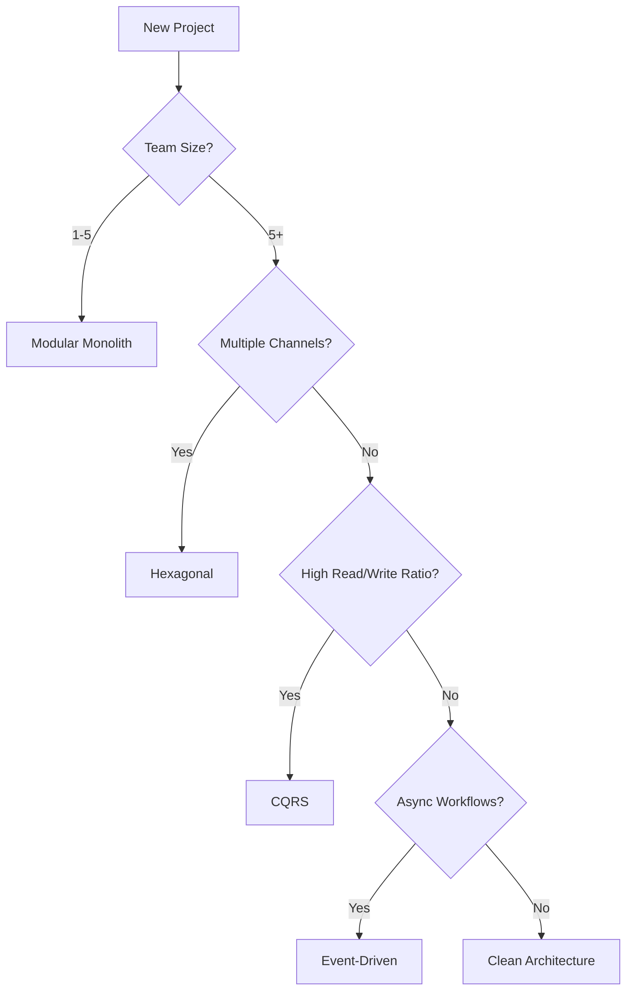

# Architecture Patterns Catalog

> Reference guide for selecting appropriate architecture patterns for Go backend systems.

## Quick Reference

| Pattern | Best For | Complexity | Team Size |
|---------|----------|------------|-----------|
| Clean Architecture | Most projects, CRUD APIs | Medium | 2-10 |
| Hexagonal | Multi-channel apps | Medium-High | 3-15 |
| Event-Driven | Async workflows, Microservices | High | 5-20 |
| CQRS | High-read systems, Complex queries | High | 5-15 |
| Modular Monolith | Startups, Small teams | Low-Medium | 1-5 |

---

## 1. Clean Architecture (Recommended Default)

### Overview
Separation of concerns through concentric layers. Inner layers cannot depend on outer layers.

```
┌─────────────────────────────────────────────┐
│              Controllers (HTTP)             │ ← Frameworks & Drivers
├─────────────────────────────────────────────┤
│              Services (Use Cases)           │ ← Application Layer
├─────────────────────────────────────────────┤
│         Domain (Entities, Rules)            │ ← Business Logic
├─────────────────────────────────────────────┤
│       Repositories (Data Access)            │ ← Interface Adapters
└─────────────────────────────────────────────┘
```

### Directory Structure

```
features/<feature>/
├── models/
│   ├── entity.go           # Domain entity
│   ├── request.go          # Input DTOs
│   ├── response.go         # Output DTOs
│   └── errors.go           # Domain-specific errors
├── services/
│   ├── interface.go        # Service interface
│   └── service_impl.go     # Implementation
├── repositories/
│   ├── interface.go        # Repository interface
│   └── mongo_repository.go # MongoDB implementation
├── controllers/
│   └── http_controller.go  # Echo handlers
├── adapters/
│   └── external.go         # External service wrappers
└── routers/
    └── router.go           # Route registration
```

### Key Principles

1. **Dependency Rule**: Dependencies point inward only
2. **Interface Segregation**: Define narrow interfaces
3. **Inversion of Control**: Services depend on repository interfaces

### When to Use
- Standard CRUD applications
- APIs with straightforward business logic
- Teams new to clean architecture
- Projects requiring clear separation of concerns

---

## 2. Hexagonal Architecture (Ports & Adapters)

### Overview
Business logic at the center, connected to external world through ports (interfaces) and adapters (implementations).

```
        ┌─────────────────┐
        │   HTTP Adapter  │
        └────────┬────────┘
                 │
    ┌────────────▼────────────┐
    │       Primary Port      │
    ├─────────────────────────┤
    │                         │
    │      DOMAIN CORE        │
    │   (Business Logic)      │
    │                         │
    ├─────────────────────────┤
    │     Secondary Port      │
    └────────────▲────────────┘
                 │
        ┌────────┴────────┐
        │   DB Adapter    │
        └─────────────────┘
```

### Directory Structure

```
<feature>/
├── domain/
│   ├── entities/
│   │   └── user.go
│   ├── services/
│   │   └── user_service.go
│   └── ports/
│       ├── input.go          # Primary ports (use cases)
│       └── output.go         # Secondary ports (repositories)
├── adapters/
│   ├── primary/
│   │   ├── http/
│   │   │   └── handler.go
│   │   └── grpc/
│   │       └── server.go
│   └── secondary/
│       ├── mongodb/
│       │   └── user_repo.go
│       └── redis/
│           └── cache.go
└── application/
    └── use_cases.go          # Orchestration
```

### When to Use
- Multiple input channels (HTTP, gRPC, CLI, Events)
- Multiple storage backends
- Heavy integration with external services
- Need for high testability

---

## 3. Event-Driven Architecture

### Overview
Components communicate through events. Enables loose coupling and async processing.

```
┌──────────┐    Event    ┌──────────────┐    Event    ┌──────────┐
│ Producer │───────────▶│  Event Bus   │───────────▶│ Consumer │
└──────────┘    (NATS)   └──────────────┘    (NATS)   └──────────┘
                              │
                              ▼
                    ┌─────────────────┐
                    │  Event Store    │
                    │   (MongoDB)     │
                    └─────────────────┘
```

### Directory Structure

```
<service>/
├── domain/
│   ├── entities/
│   └── events/
│       ├── user_created.go
│       └── user_updated.go
├── events/
│   ├── publisher.go          # Publishes domain events
│   ├── subscriber.go         # Subscribes to events
│   └── handlers/
│       ├── user_handler.go
│       └── notification_handler.go
├── projections/              # Read models (for CQRS)
│   └── user_view.go
└── sagas/                    # Long-running processes
    └── order_saga.go
```

### Event Patterns

| Pattern | Use Case |
|---------|----------|
| Pub/Sub | Broadcast notifications |
| Request-Reply | Synchronous queries |
| Event Sourcing | Full audit trail |
| Saga | Distributed transactions |

### When to Use
- Microservices communication
- Async workflows
- Audit/compliance requirements
- Decoupled systems

---

## 4. CQRS (Command Query Responsibility Segregation)

### Overview
Separate models for reading and writing data. Commands modify state; Queries read state.

```
        ┌─────────────────────────────────────┐
        │             API Gateway             │
        └──────────────┬──────────────────────┘
                       │
          ┌────────────┴────────────┐
          │                         │
    ┌─────▼─────┐             ┌─────▼─────┐
    │  Command  │             │   Query   │
    │  Handler  │             │  Handler  │
    └─────┬─────┘             └─────┬─────┘
          │                         │
    ┌─────▼─────┐             ┌─────▼─────┐
    │  Domain   │   Events    │Projection │
    │  Model    │───────────▶│  (Read)   │
    └─────┬─────┘             └───────────┘
          │
    ┌─────▼─────┐
    │  Write DB │
    │ (MongoDB) │
    └───────────┘
```

### Directory Structure

```
<feature>/
├── commands/
│   ├── create_user.go        # Command definition
│   ├── handlers/
│   │   └── create_user_handler.go
│   └── validators/
│       └── create_user_validator.go
├── queries/
│   ├── get_user.go           # Query definition
│   ├── handlers/
│   │   └── get_user_handler.go
│   └── projections/
│       └── user_view.go
├── events/
│   ├── user_created.go
│   └── handlers/
│       └── project_user_view.go
└── domain/
    └── user.go
```

### When to Use
- High read-to-write ratio
- Complex reporting requirements
- Need for optimized read models
- Event sourcing is beneficial

---

## 5. Modular Monolith

### Overview
Single deployable unit with well-defined module boundaries. Good stepping stone to microservices.

```
┌─────────────────────────────────────────────────┐
│                   Application                    │
├───────────────┬───────────────┬─────────────────┤
│   Module A    │   Module B    │    Module C     │
│  (Users)      │  (Orders)     │   (Payments)    │
├───────────────┼───────────────┼─────────────────┤
│  Public API   │  Public API   │   Public API    │
├───────────────┴───────────────┴─────────────────┤
│              Shared Kernel (Common)              │
└─────────────────────────────────────────────────┘
```

### Directory Structure

```
features/
├── users/                    # Module A
│   ├── api/                  # Public interface
│   │   └── user_service.go
│   ├── internal/             # Private implementation
│   │   ├── repository.go
│   │   └── domain.go
│   └── routes.go
├── orders/                   # Module B
│   ├── api/
│   └── internal/
├── shared/                   # Shared kernel
│   ├── events/
│   └── types/
└── main.go
```

### Rules

1. Modules communicate only through public APIs
2. No direct database access across modules
3. Shared kernel is minimal and stable

### When to Use
- Startups and MVPs
- Small teams (1-5 developers)
- Need to move fast
- Planning future microservices migration

---

## Pattern Selection Guide



## Best Practices Across All Patterns

1. **Interface First** - Define contracts before implementations
2. **Dependency Injection** - Wire dependencies at composition root
3. **Context Propagation** - Pass `context.Context` through all layers
4. **Error Wrapping** - Use `fmt.Errorf("%w", err)` for stack traces
5. **Multi-Tenancy** - Include `tenant_id` in all data operations
6. **Observability** - Structured logging, metrics, tracing
