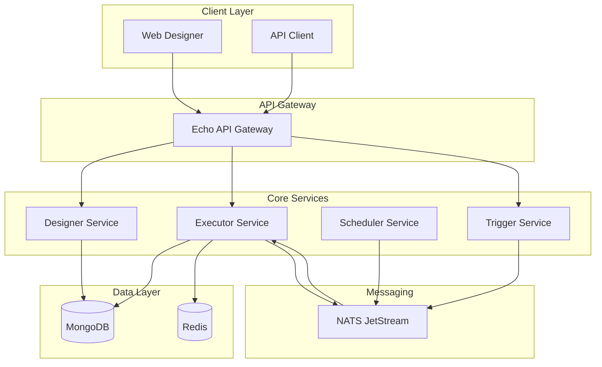
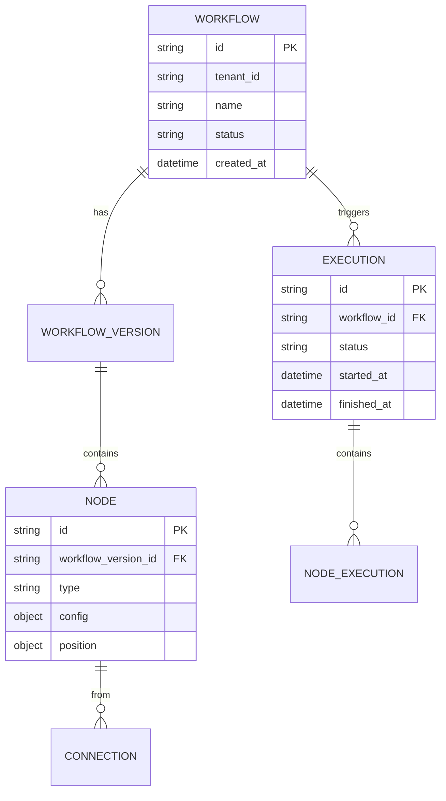
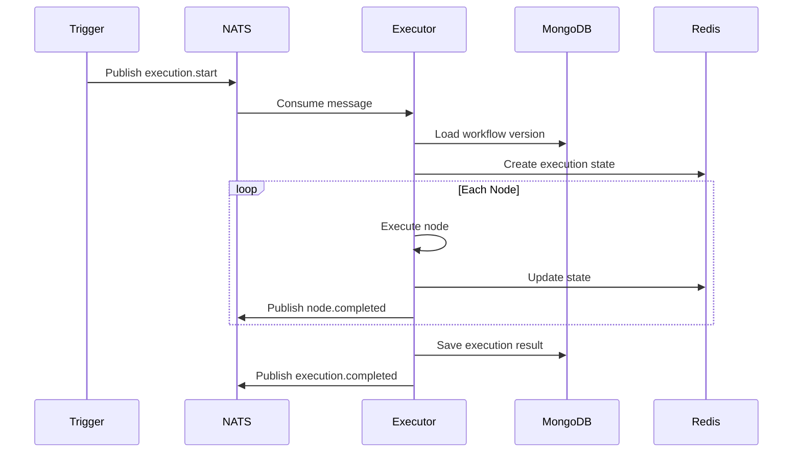
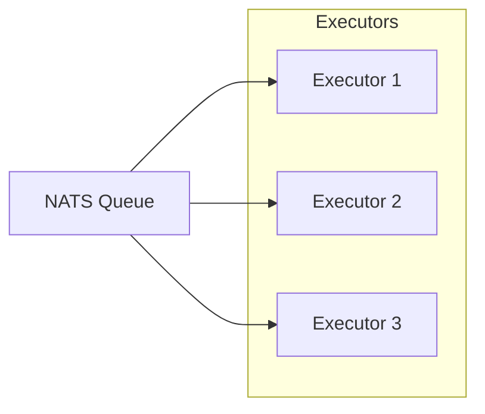

# Workflow Engine Architecture Example

> Example architecture design for a workflow/process automation engine

# Workflow Engine - System Architecture

**Date:** 2026-01-23
**Author:** Solutions Architect
**Status:** Reference Example

---

## 1. Overview

A workflow engine that allows users to design, execute, and monitor automated business processes. Similar to n8n, Temporal, or Airflow but designed for multi-tenant SaaS.

### Key Features
- Visual workflow designer (drag-and-drop)
- Multiple trigger types (webhook, schedule, event)
- Conditional branching and loops
- Parallel execution
- Error handling and retry
- Audit logging and history

---

## 2. High-Level Architecture



---

## 3. Domain Model

### 3.1 Core Entities



### 3.2 Go Domain Models

```go
// Workflow represents a workflow definition
type Workflow struct {
    ID          string    `json:"id" bson:"_id"`
    TenantID    string    `json:"tenant_id" bson:"tenant_id"`
    Name        string    `json:"name" bson:"name"`
    Description string    `json:"description,omitempty" bson:"description,omitempty"`
    Status      string    `json:"status" bson:"status"` // draft, active, archived
    Version     int       `json:"version" bson:"version"`
    CreatedBy   string    `json:"created_by" bson:"created_by"`
    CreatedAt   time.Time `json:"created_at" bson:"created_at"`
    UpdatedAt   time.Time `json:"updated_at" bson:"updated_at"`
}

// Node represents a node in the workflow
type Node struct {
    ID       string         `json:"id" bson:"id"`
    Type     string         `json:"type" bson:"type"` // trigger, action, condition, delay
    Name     string         `json:"name" bson:"name"`
    Config   map[string]any `json:"config" bson:"config"`
    Position Position       `json:"position" bson:"position"`
}

// Connection represents an edge between nodes
type Connection struct {
    ID         string `json:"id" bson:"id"`
    SourceNode string `json:"source_node" bson:"source_node"`
    TargetNode string `json:"target_node" bson:"target_node"`
    SourcePort string `json:"source_port" bson:"source_port"`
    TargetPort string `json:"target_port" bson:"target_port"`
}

// WorkflowVersion represents a specific version of workflow
type WorkflowVersion struct {
    ID          string       `json:"id" bson:"_id"`
    WorkflowID  string       `json:"workflow_id" bson:"workflow_id"`
    Version     int          `json:"version" bson:"version"`
    Nodes       []Node       `json:"nodes" bson:"nodes"`
    Connections []Connection `json:"connections" bson:"connections"`
    CreatedAt   time.Time    `json:"created_at" bson:"created_at"`
}

// Execution represents a workflow execution instance
type Execution struct {
    ID           string                  `json:"id" bson:"_id"`
    TenantID     string                  `json:"tenant_id" bson:"tenant_id"`
    WorkflowID   string                  `json:"workflow_id" bson:"workflow_id"`
    VersionID    string                  `json:"version_id" bson:"version_id"`
    Status       string                  `json:"status" bson:"status"` // pending, running, completed, failed
    TriggerType  string                  `json:"trigger_type" bson:"trigger_type"`
    TriggerData  map[string]any          `json:"trigger_data" bson:"trigger_data"`
    Context      map[string]any          `json:"context" bson:"context"`
    NodeResults  map[string]NodeResult   `json:"node_results" bson:"node_results"`
    StartedAt    time.Time               `json:"started_at" bson:"started_at"`
    FinishedAt   *time.Time              `json:"finished_at,omitempty" bson:"finished_at,omitempty"`
    Error        string                  `json:"error,omitempty" bson:"error,omitempty"`
}
```

---

## 4. Component Design

### 4.1 Designer Service

Handles workflow CRUD and version management.

```
features/workflow/
├── models/
│   ├── workflow.go
│   ├── node.go
│   ├── connection.go
│   └── version.go
├── services/
│   ├── interface.go
│   └── workflow_service.go
├── repositories/
│   └── mongo_repository.go
├── controllers/
│   └── http_controller.go
└── routers/
    └── router.go
```

**API Endpoints:**
| Method | Path | Description |
|--------|------|-------------|
| POST | /workflows | Create workflow |
| GET | /workflows | List workflows |
| GET | /workflows/:id | Get workflow |
| PUT | /workflows/:id | Update workflow |
| DELETE | /workflows/:id | Delete workflow |
| POST | /workflows/:id/versions | Create new version |
| GET | /workflows/:id/versions | List versions |
| POST | /workflows/:id/activate | Activate workflow |

### 4.2 Executor Service

Executes workflows and manages state.

```
features/executor/
├── models/
│   ├── execution.go
│   └── node_result.go
├── services/
│   ├── interface.go
│   ├── executor_service.go
│   └── node_executor.go
├── nodes/
│   ├── registry.go
│   ├── http_node.go
│   ├── condition_node.go
│   ├── delay_node.go
│   └── script_node.go
└── events/
    ├── publisher.go
    └── subscriber.go
```

**Execution Flow:**


### 4.3 Scheduler Service

Handles cron-based triggers.

```
features/scheduler/
├── models/
│   └── schedule.go
├── services/
│   └── scheduler_service.go
└── cron/
    └── cron_manager.go
```

### 4.4 Trigger Service

Handles webhook and event triggers.

```
features/trigger/
├── handlers/
│   ├── webhook_handler.go
│   └── event_handler.go
└── services/
    └── trigger_service.go
```

---

## 5. Node Type System

### 5.1 Node Registry

```go
type NodeExecutor interface {
    Execute(ctx context.Context, node Node, input map[string]any) (map[string]any, error)
    Validate(config map[string]any) error
}

var nodeRegistry = map[string]NodeExecutor{
    "http_request":  &HTTPRequestNode{},
    "condition":     &ConditionNode{},
    "delay":         &DelayNode{},
    "script":        &ScriptNode{},
    "email":         &EmailNode{},
    "database":      &DatabaseNode{},
    "transform":     &TransformNode{},
}
```

### 5.2 Built-in Node Types

| Type | Description | Config |
|------|-------------|--------|
| `trigger_webhook` | HTTP webhook trigger | method, path |
| `trigger_schedule` | Cron schedule trigger | cron expression |
| `http_request` | Make HTTP request | url, method, headers, body |
| `condition` | If/else branching | expression |
| `delay` | Wait for duration | duration |
| `transform` | Transform data | mapping |
| `email` | Send email | to, subject, body |

---

## 6. Data Flow

### 6.1 Execution Context

```go
// Context passed between nodes
type ExecutionContext struct {
    ExecutionID string                 `json:"execution_id"`
    WorkflowID  string                 `json:"workflow_id"`
    TenantID    string                 `json:"tenant_id"`
    Variables   map[string]any         `json:"variables"`
    TriggerData map[string]any         `json:"trigger_data"`
    NodeOutputs map[string]map[string]any `json:"node_outputs"`
}
```

### 6.2 Expression Evaluation

Nodes can reference previous outputs using expressions:

```
{{trigger.body.order_id}}
{{nodes.http_1.response.status}}
{{context.variables.api_key}}
```

---

## 7. Messaging Architecture

### 7.1 NATS Subjects

| Subject | Purpose |
|---------|---------|
| `workflow.execution.start` | Trigger new execution |
| `workflow.execution.completed` | Execution finished |
| `workflow.execution.failed` | Execution failed |
| `workflow.node.completed` | Node finished |
| `workflow.schedule.trigger` | Schedule fired |

### 7.2 Event Schema

```go
type ExecutionEvent struct {
    Type        string         `json:"type"`
    ExecutionID string         `json:"execution_id"`
    WorkflowID  string         `json:"workflow_id"`
    TenantID    string         `json:"tenant_id"`
    NodeID      string         `json:"node_id,omitempty"`
    Timestamp   time.Time      `json:"timestamp"`
    Data        map[string]any `json:"data,omitempty"`
}
```

---

## 8. Security Considerations

- [ ] **Sandbox Execution**: Script nodes run in sandboxed environment
- [ ] **Secret Management**: API keys stored encrypted
- [ ] **Rate Limiting**: Execution rate limits per tenant
- [ ] **Audit Logging**: All executions logged
- [ ] **Tenant Isolation**: Complete data isolation

---

## 9. Scalability

### 9.1 Horizontal Scaling

| Component | Strategy |
|-----------|----------|
| Designer Service | Stateless, scale via replicas |
| Executor Service | Stateless, work stealing via NATS |
| Scheduler | Single leader, failover |

### 9.2 Load Distribution



---

## 10. Implementation Phases

### Phase 1: Core (Week 1-2)
- [ ] Workflow CRUD
- [ ] Basic node types (HTTP, Transform)
- [ ] Simple execution engine

### Phase 2: Triggers (Week 3)
- [ ] Webhook triggers
- [ ] Cron scheduler

### Phase 3: Advanced Nodes (Week 4)
- [ ] Condition nodes
- [ ] Delay nodes
- [ ] Parallel execution

### Phase 4: UI & Polish (Week 5-6)
- [ ] Visual designer
- [ ] Execution monitoring
- [ ] Error handling UI
