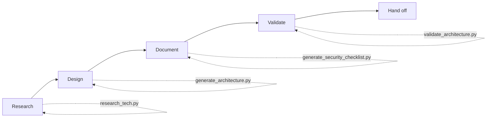

# Expert Solutions Architect Scripts

## Overview

Scripts for research, architecture design, documentation generation, and validation.

## Scripts Reference

| Script | Purpose | Key Features |
|--------|---------|--------------|
| `research_tech.py` | Search GitHub for projects | Search, analyze adoption |
| `generate_architecture.py` | Generate Mermaid diagrams | 7 diagram types |
| `validate_architecture.py` | Validate architecture docs | Best practices check |
| `validate_plan.py` | Validate implementation plans | Quality rules check |
| `generate_project.py` | Generate Go project skeleton | 7 lib drivers, Docker, CI |
| `generate_feature.py` | Scaffolding feature modules | Clean Arch, CRUD, Mongo |
| `generate_api_contract.py` | Generate API contracts | REST endpoints, interactive |
| `generate_security_checklist.py` | Security review checklists | 8 security areas |
| `analyze_stack.py` | Analyze project dependencies | go.mod, package.json |

---

## research_tech.py

Search GitHub for relevant projects and analyze adoption.

```bash
# Search for Go workflow engines
python scripts/research_tech.py search "workflow engine" --lang go

# Get details about a specific repo
python scripts/research_tech.py info n8n-io/n8n

# Search with adoption analysis
python scripts/research_tech.py search "redis cache" --lang go --analyze
```

**Options:**
- `--lang, -l`: Filter by programming language
- `--limit, -n`: Number of results (default: 10)
- `--analyze, -a`: Include adoption analysis

---

## generate_architecture.py

Generate Mermaid diagrams for architecture patterns.

```bash
# Generate component diagram
python scripts/generate_architecture.py --type component --name UserManagement

# Generate Clean Architecture diagram
python scripts/generate_architecture.py --type clean --feature orders

# Generate sequence diagram
python scripts/generate_architecture.py --type sequence --name CreateOrder

# Save to file
python scripts/generate_architecture.py --type hexagonal --feature payments -o diagram.md
```

**Diagram Types:**
- `component`: High-level component diagram
- `sequence`: Request/response sequence
- `clean`: Clean Architecture layers
- `hexagonal`: Ports & Adapters pattern
- `event`: Event-driven architecture
- `dataflow`: Request data flow
- `deployment`: Kubernetes deployment

---

## validate_architecture.py

Validate architecture documents against best practices.

```bash
# Validate a document
python scripts/validate_architecture.py spec.md

# Strict mode (warnings as errors)
python scripts/validate_architecture.py --strict spec.md

# Print validation checklist
python scripts/validate_architecture.py --checklist
```

**Checks:**
- Required sections
- Go struct definitions with JSON tags
- API endpoint documentation
- Database schema and indexes
- Clean Architecture patterns
- Security considerations
- Error handling

---

## validate_plan.py

Validate implementation plans for completeness.

```bash
# Validate a plan
python scripts/validate_plan.py implementation_plan.md

# Strict mode
python scripts/validate_plan.py --strict implementation_plan.md

# Show validation rules
python scripts/validate_plan.py --rules
```

**Quality Rules:**
1. No ambiguous types (object → map[string]any)
2. JSON tags on all struct fields
3. Complete use case coverage (happy path, errors, edge cases)
4. Matching BE/FE contracts
5. Atomic implementation steps
6. Multi-tenancy required (tenant_id)
7. Error responses documented

---

## generate_project.py

Generate a complete Go project skeleton with production-ready library drivers.

```bash
# Generate my_api project
python scripts/generate_project.py my_api

# Generate with module prefix
python scripts/generate_project.py my_api --module github.com/company

# Specify output directory
python scripts/generate_project.py my_api -o ./projects
```

**Features Included:**
- Clean Architecture structure
- 7 Production-ready drivers (MongoDB, Redis, NATS, Kafka, MQTT, S3, Postgres)
- Configuration management (Viper)
- Middleware (Logging, Panic Recovery)
- Health check feature
- Docker & Docker Compose setup
- `.gitignore` and `README.md` generation

---

## generate_feature.py

Generate a new feature module following Clean Architecture layers.

```bash
# Generate users feature
python scripts/generate_feature.py users

# Specify output path
python scripts/generate_feature.py orders --path ./features
```

**Layers Generated:**
- `models/`: Entity, DTOs, and errors
- `services/`: Interface and implementation
- `repositories/`: Interface and MongoDB implementation
- `controllers/`: HTTP Echo handlers
- `routers/`: Route registration

---

## generate_api_contract.py

Generate REST API contract documentation.

```bash
# Generate for specific resources
python scripts/generate_api_contract.py --name "Users API" --resource users

# Interactive mode
python scripts/generate_api_contract.py -i

# Multiple resources
python scripts/generate_api_contract.py -n "Order API" -r orders -r products -o api.md
```

**Features:**
- CRUD endpoint templates
- Go struct definitions
- Zod schema examples
- Error response documentation
- Query parameter documentation

---

## generate_security_checklist.py

Generate security review checklists.

```bash
# Full checklist for a feature
python scripts/generate_security_checklist.py "Payment Gateway" --types all

# Specific areas
python scripts/generate_security_checklist.py "User API" --types api auth data

# Save to file
python scripts/generate_security_checklist.py "Admin Panel" -o security_review.md
```

**Checklist Types:**
- `api`: API security (auth, rate limiting, CORS)
- `database`: Database security
- `auth`: Authentication & authorization
- `data`: Data protection & encryption
- `frontend`: XSS, CSRF, CSP
- `infrastructure`: Container, network security
- `thirdparty`: Dependency security
- `business`: Business logic security
- `all`: All of the above

---

## analyze_stack.py

Analyze project tech stack from dependency files.

```bash
# Analyze entire project
python scripts/analyze_stack.py .

# Analyze specific file
python scripts/analyze_stack.py --file go.mod

# JSON output
python scripts/analyze_stack.py --file package.json --format json
```

**Supported Files:**
- `go.mod`: Go modules
- `package.json`: Node.js/npm

**Categories Detected:**
- Web framework
- Database drivers
- Cache libraries
- Messaging systems
- Testing tools
- Config management

---

## Workflow Integration



### Recommended Workflow

1. **Research Phase**
   ```bash
   python scripts/research_tech.py search "workflow engine" --lang go --analyze
   python scripts/analyze_stack.py .
   ```

2. **Design Phase**
   ```bash
   python scripts/generate_architecture.py --type clean --feature workflow
   ```

3. **Documentation Phase**
   ```bash
   python scripts/generate_api_contract.py -n "Workflow API" -r workflows -r tasks
   python scripts/generate_security_checklist.py "Workflow Engine" --types all
   ```

4. **Generation Phase**
   ```bash
   python scripts/generate_project.py my_workflow_service
   cd my_workflow_service
   python ../scripts/generate_feature.py tasks
   ```

5. **Validation Phase**
   ```bash
   python scripts/validate_plan.py docs/implementation_plan.md --strict
   python scripts/validate_architecture.py docs/architecture.md
   ```

---

## Environment Variables

| Variable | Purpose |
|----------|---------|
| `GITHUB_TOKEN` | GitHub API token for higher rate limits |
