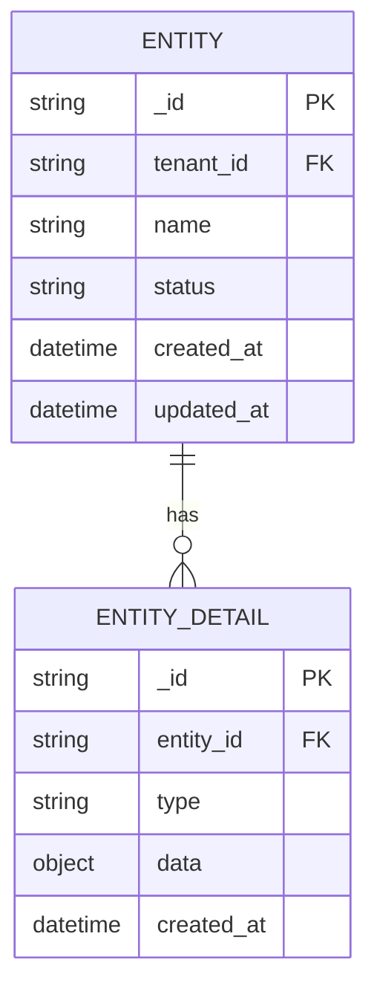

# Database Schema Template

> Database schema design for [Feature Name]

# Database Schema: [Feature Name]

**Database:** MongoDB / PostgreSQL
**Version:** 1.0
**Date:** YYYY-MM-DD

---

## 1. Schema Overview



---

## 2. Collections/Tables

### 2.1 `<collection_name>` (Primary)

**Description:** [What this collection stores]

#### Fields

| Field | Type | Required | Default | Description |
|-------|------|----------|---------|-------------|
| `_id` | ObjectID / string | Yes | auto | Primary key |
| `tenant_id` | string | Yes | - | Multi-tenancy key |
| `name` | string | Yes | - | Display name (1-100 chars) |
| `description` | string | No | "" | Optional description (max 500) |
| `status` | string | Yes | "active" | Enum: active, inactive, deleted |
| `type` | string | Yes | - | Enum: typeA, typeB |
| `metadata` | object | No | {} | Extensible key-value pairs |
| `settings` | object | No | {} | Configuration object |
| `tags` | array[string] | No | [] | Searchable tags |
| `created_by` | string | Yes | - | User ID who created |
| `updated_by` | string | No | - | User ID who last updated |
| `created_at` | datetime | Yes | now() | Creation timestamp |
| `updated_at` | datetime | Yes | now() | Last modification |
| `deleted_at` | datetime | No | null | Soft delete timestamp |

#### Indexes

```javascript
// MongoDB Index Definitions
db.<collection>.createIndex(
  { tenant_id: 1, status: 1 },
  { name: "idx_tenant_status" }
);

db.<collection>.createIndex(
  { tenant_id: 1, created_at: -1 },
  { name: "idx_tenant_created" }
);

db.<collection>.createIndex(
  { tenant_id: 1, name: 1 },
  { name: "idx_tenant_name", unique: true }
);

db.<collection>.createIndex(
  { tenant_id: 1, tags: 1 },
  { name: "idx_tenant_tags" }
);

// Text search index
db.<collection>.createIndex(
  { name: "text", description: "text" },
  { name: "idx_text_search" }
);
```

```sql
-- PostgreSQL Index Definitions
CREATE INDEX idx_tenant_status ON <table> (tenant_id, status);
CREATE INDEX idx_tenant_created ON <table> (tenant_id, created_at DESC);
CREATE UNIQUE INDEX idx_tenant_name ON <table> (tenant_id, name);
CREATE INDEX idx_tenant_tags ON <table> USING GIN (tags);
```

#### Sample Documents

```json
// Active entity
{
  "_id": "507f1f77bcf86cd799439011",
  "tenant_id": "tenant-123",
  "name": "Example Entity",
  "description": "This is an example",
  "status": "active",
  "type": "typeA",
  "metadata": {
    "priority": "high",
    "category": "important"
  },
  "settings": {
    "notifications_enabled": true
  },
  "tags": ["tag1", "tag2"],
  "created_by": "user-456",
  "updated_by": "user-456",
  "created_at": "2026-01-23T10:00:00Z",
  "updated_at": "2026-01-23T10:00:00Z",
  "deleted_at": null
}

// Soft-deleted entity
{
  "_id": "507f1f77bcf86cd799439012",
  "tenant_id": "tenant-123",
  "name": "Deleted Entity",
  "status": "deleted",
  ...
  "deleted_at": "2026-01-23T12:00:00Z"
}
```

---

### 2.2 `<related_collection>` (Related)

**Description:** [What this collection stores]
**Relationship:** Many-to-One with `<collection_name>`

#### Fields

| Field | Type | Required | Description |
|-------|------|----------|-------------|
| `_id` | ObjectID | Yes | Primary key |
| `entity_id` | string | Yes | FK to parent entity |
| `tenant_id` | string | Yes | Multi-tenancy key |
| `type` | string | Yes | Record type |
| `data` | object | Yes | Type-specific data |
| `created_at` | datetime | Yes | Creation timestamp |

#### Indexes

```javascript
db.<related_collection>.createIndex(
  { entity_id: 1, type: 1 },
  { name: "idx_entity_type" }
);

db.<related_collection>.createIndex(
  { tenant_id: 1, created_at: -1 },
  { name: "idx_tenant_created" }
);
```

---

## 3. Go Struct Definitions

```go
package models

import (
    "time"
)

// Entity represents the main domain entity.
type Entity struct {
    ID          string            `json:"id" bson:"_id"`
    TenantID    string            `json:"tenant_id" bson:"tenant_id"`
    Name        string            `json:"name" bson:"name"`
    Description string            `json:"description,omitempty" bson:"description,omitempty"`
    Status      EntityStatus      `json:"status" bson:"status"`
    Type        EntityType        `json:"type" bson:"type"`
    Metadata    map[string]any    `json:"metadata,omitempty" bson:"metadata,omitempty"`
    Settings    EntitySettings    `json:"settings,omitempty" bson:"settings,omitempty"`
    Tags        []string          `json:"tags,omitempty" bson:"tags,omitempty"`
    CreatedBy   string            `json:"created_by" bson:"created_by"`
    UpdatedBy   string            `json:"updated_by,omitempty" bson:"updated_by,omitempty"`
    CreatedAt   time.Time         `json:"created_at" bson:"created_at"`
    UpdatedAt   time.Time         `json:"updated_at" bson:"updated_at"`
    DeletedAt   *time.Time        `json:"deleted_at,omitempty" bson:"deleted_at,omitempty"`
}

// EntityStatus represents allowed status values.
type EntityStatus string

const (
    EntityStatusActive   EntityStatus = "active"
    EntityStatusInactive EntityStatus = "inactive"
    EntityStatusDeleted  EntityStatus = "deleted"
)

// EntityType represents allowed type values.
type EntityType string

const (
    EntityTypeA EntityType = "typeA"
    EntityTypeB EntityType = "typeB"
)

// EntitySettings holds configuration options.
type EntitySettings struct {
    NotificationsEnabled bool `json:"notifications_enabled" bson:"notifications_enabled"`
}

// EntityDetail represents related detail records.
type EntityDetail struct {
    ID        string    `json:"id" bson:"_id"`
    EntityID  string    `json:"entity_id" bson:"entity_id"`
    TenantID  string    `json:"tenant_id" bson:"tenant_id"`
    Type      string    `json:"type" bson:"type"`
    Data      any       `json:"data" bson:"data"`
    CreatedAt time.Time `json:"created_at" bson:"created_at"`
}
```

---

## 4. Migrations

### 4.1 Initial Migration

```javascript
// MongoDB - Create collection with validation
db.createCollection("<collection_name>", {
  validator: {
    $jsonSchema: {
      bsonType: "object",
      required: ["tenant_id", "name", "status", "type", "created_by", "created_at", "updated_at"],
      properties: {
        tenant_id: { bsonType: "string" },
        name: { bsonType: "string", minLength: 1, maxLength: 100 },
        status: { enum: ["active", "inactive", "deleted"] },
        type: { enum: ["typeA", "typeB"] }
      }
    }
  }
});

// Create indexes
db.<collection_name>.createIndex({ tenant_id: 1, status: 1 });
db.<collection_name>.createIndex({ tenant_id: 1, name: 1 }, { unique: true });
```

```sql
-- PostgreSQL - Create table
CREATE TABLE <table_name> (
    id UUID PRIMARY KEY DEFAULT gen_random_uuid(),
    tenant_id VARCHAR(50) NOT NULL,
    name VARCHAR(100) NOT NULL,
    description TEXT,
    status VARCHAR(20) NOT NULL DEFAULT 'active',
    type VARCHAR(20) NOT NULL,
    metadata JSONB DEFAULT '{}',
    settings JSONB DEFAULT '{}',
    tags TEXT[] DEFAULT '{}',
    created_by VARCHAR(50) NOT NULL,
    updated_by VARCHAR(50),
    created_at TIMESTAMPTZ NOT NULL DEFAULT NOW(),
    updated_at TIMESTAMPTZ NOT NULL DEFAULT NOW(),
    deleted_at TIMESTAMPTZ,
    
    CONSTRAINT chk_status CHECK (status IN ('active', 'inactive', 'deleted')),
    CONSTRAINT chk_type CHECK (type IN ('typeA', 'typeB')),
    CONSTRAINT uq_tenant_name UNIQUE (tenant_id, name)
);

-- Create indexes
CREATE INDEX idx_tenant_status ON <table_name> (tenant_id, status);
CREATE INDEX idx_tenant_created ON <table_name> (tenant_id, created_at DESC);
```

---

## 5. Query Patterns

### 5.1 Common Queries

```go
// List active entities for tenant
filter := bson.M{
    "tenant_id": tenantID,
    "status":    "active",
    "deleted_at": nil,
}
cursor, _ := collection.Find(ctx, filter)

// Search by name/description
filter := bson.M{
    "tenant_id": tenantID,
    "$text":     bson.M{"$search": searchTerm},
}

// Get by ID with tenant check
filter := bson.M{
    "_id":       id,
    "tenant_id": tenantID,
}

// Pagination
opts := options.Find().
    SetSkip(int64((page - 1) * limit)).
    SetLimit(int64(limit)).
    SetSort(bson.D{{"created_at", -1}})
```

### 5.2 Aggregation Examples

```javascript
// Count by status
db.<collection>.aggregate([
  { $match: { tenant_id: "tenant-123" } },
  { $group: { _id: "$status", count: { $sum: 1 } } }
]);

// Group by date
db.<collection>.aggregate([
  { $match: { tenant_id: "tenant-123" } },
  { $group: {
      _id: { $dateToString: { format: "%Y-%m-%d", date: "$created_at" } },
      count: { $sum: 1 }
  }},
  { $sort: { _id: -1 } }
]);
```

---

## 6. Data Integrity

### 6.1 Constraints
- `name` must be unique per tenant
- `status` transitions: active ↔ inactive, any → deleted
- `deleted_at` must be set when status = "deleted"

### 6.2 Cascade Rules
| Parent Action | Child Action |
|---------------|--------------|
| Delete Entity | Delete Details (cascade) |
| Update Tenant | Update Children |

---

## 7. Performance Considerations

- **Index Usage**: Ensure queries use covered indexes
- **Pagination**: Always paginate list queries
- **Projection**: Select only needed fields
- **TTL Index**: Consider for temporary data
- **Sharding Key**: `tenant_id` for multi-tenant sharding
