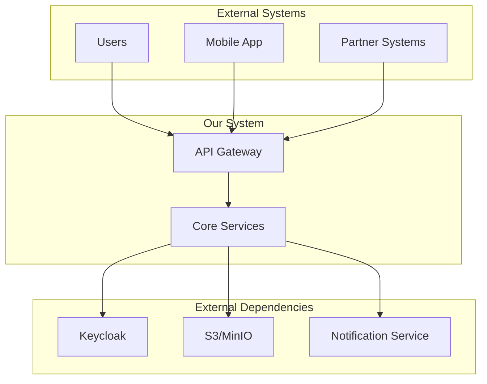
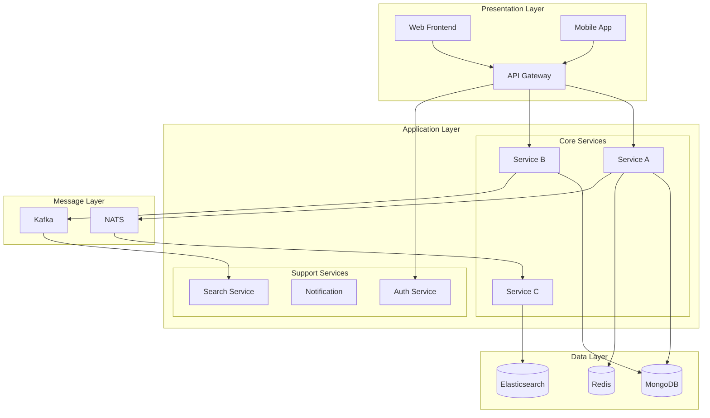
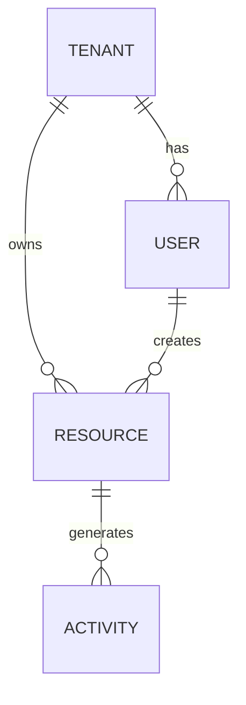
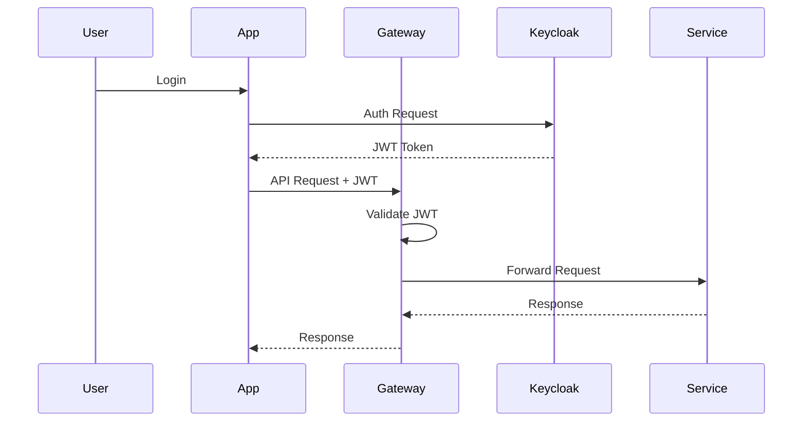

# System Design Template

> High-level system design for [System Name]

# System Design: [System Name]

**Version:** 1.0
**Author:** [Author]
**Date:** YYYY-MM-DD
**Status:** Draft | Review | Approved

---

## 1. System Overview

### 1.1 Purpose
[What is this system for? What problem does it solve?]

### 1.2 Goals
- **Primary Goal**: [Main objective]
- **Secondary Goals**:
  - [Goal 1]
  - [Goal 2]

### 1.3 Non-Goals
- [Explicitly out of scope]
- [Things this system will NOT do]

### 1.4 Key Metrics
| Metric | Target | Current |
|--------|--------|---------|
| Response Time (P95) | < 200ms | - |
| Availability | 99.9% | - |
| Throughput | 10K RPS | - |
| Error Rate | < 0.1% | - |

---

## 2. System Context

### 2.1 Context Diagram



### 2.2 Actors
| Actor | Description | Interaction |
|-------|-------------|-------------|
| End User | Primary user of the system | Web/Mobile UI |
| Admin | System administrator | Admin panel |
| Partner | External integration | API |
| Scheduler | Automated jobs | Internal triggers |

---

## 3. High-Level Architecture

### 3.1 Architecture Diagram



### 3.2 Component Responsibilities

| Component | Responsibility | Technology |
|-----------|---------------|------------|
| API Gateway | Routing, Rate Limiting, Auth | Echo/Kong |
| Service A | Core business logic | Go + Echo |
| Service B | Background processing | Go |
| Auth Service | Authentication | Keycloak |
| MongoDB | Primary data store | MongoDB 7 |
| Redis | Caching, Sessions | Redis 7 |
| NATS | Real-time messaging | NATS JetStream |
| Kafka | Event streaming | Kafka |

---

## 4. Detailed Design

### 4.1 Service A Design

#### Responsibilities
- [List primary responsibilities]
- [Core business functions]

#### API Endpoints
| Method | Path | Description |
|--------|------|-------------|
| POST | /api/v1/resource | Create resource |
| GET | /api/v1/resource | List resources |
| GET | /api/v1/resource/:id | Get by ID |
| PUT | /api/v1/resource/:id | Update resource |
| DELETE | /api/v1/resource/:id | Delete resource |

#### Internal Architecture
```
service-a/
├── models/
├── services/
├── repositories/
├── controllers/
├── adapters/
└── routers/
```

#### Dependencies
- MongoDB: Primary data storage
- Redis: Caching layer
- NATS: Event publishing

### 4.2 Service B Design

[Repeat structure for each service]

---

## 5. Data Design

### 5.1 Data Model Overview



### 5.2 Data Storage Strategy
| Data Type | Storage | Rationale |
|-----------|---------|-----------|
| Transactional | MongoDB | Flexible schema |
| Cache | Redis | Low latency |
| Search | Elasticsearch | Full-text search |
| Files | S3/MinIO | Object storage |
| Events | Kafka | Event log |

### 5.3 Data Partitioning
- **Strategy**: Partition by tenant_id
- **Sharding**: MongoDB sharded cluster
- **Replication**: 3-node replica set

---

## 6. API Design

### 6.1 API Standards
- **Format**: REST + JSON
- **Versioning**: URI prefix (/api/v1, /api/v2)
- **Authentication**: Bearer JWT
- **Pagination**: Cursor-based for large datasets

### 6.2 API Gateway
| Feature | Implementation |
|---------|----------------|
| Rate Limiting | 1000 req/min per user |
| Authentication | JWT validation |
| CORS | Configured for allowed origins |
| Request Logging | All requests logged |

---

## 7. Security Design

### 7.1 Authentication Flow



### 7.2 Authorization Model
| Role | Permissions |
|------|-------------|
| Admin | Full access |
| Manager | CRUD own tenant |
| User | Read + Create |
| Guest | Read only |

### 7.3 Data Protection
- Encryption at rest: AES-256
- Encryption in transit: TLS 1.3
- Secrets management: HashiCorp Vault

---

## 8. Reliability & Resilience

### 8.1 Failure Modes
| Failure | Impact | Mitigation |
|---------|--------|------------|
| MongoDB down | Data unavailable | Replica failover |
| Redis down | Slow responses | Fallback to DB |
| NATS down | Events delayed | Message persistence |

### 8.2 Resilience Patterns
- **Circuit Breaker**: For external calls
- **Retry with Backoff**: For transient failures
- **Timeout**: All external calls
- **Bulkhead**: Isolate critical paths

### 8.3 Disaster Recovery
| RPO | RTO | Strategy |
|-----|-----|----------|
| 1 hour | 4 hours | Automated backup + restore |

---

## 9. Scalability

### 9.1 Scaling Strategy
| Component | Horizontal | Vertical |
|-----------|------------|----------|
| API Gateway | ✅ Auto-scale | - |
| Services | ✅ Auto-scale | - |
| MongoDB | ✅ Sharding | ✅ |
| Redis | ✅ Cluster | - |

### 9.2 Capacity Planning
| Load | Services | MongoDB | Redis |
|------|----------|---------|-------|
| 1K RPS | 3 pods | 3 nodes | 3 nodes |
| 10K RPS | 10 pods | 6 nodes | 6 nodes |
| 100K RPS | 50 pods | 12 nodes | 9 nodes |

---

## 10. Operational Concerns

### 10.1 Monitoring
| Metric | Alert Threshold |
|--------|-----------------|
| Response Time P95 | > 500ms |
| Error Rate | > 1% |
| CPU Usage | > 80% |
| Memory Usage | > 85% |

### 10.2 Logging
- **Format**: JSON structured logs
- **Storage**: Elasticsearch
- **Retention**: 30 days

### 10.3 Deployment
- **Strategy**: Blue-Green / Canary
- **Rollback**: Automated on error spike

---

## 11. Trade-offs & Decisions

### 11.1 Key Decisions
| Decision | Chosen | Alternative | Rationale |
|----------|--------|-------------|-----------|
| Database | MongoDB | PostgreSQL | Flexible schema |
| Messaging | NATS | RabbitMQ | Simpler, JetStream |
| Cache | Redis | Memcached | Rich features |

### 11.2 Trade-offs
| Trade-off | Gained | Lost |
|-----------|--------|------|
| NoSQL over RDBMS | Flexibility | Strong consistency |
| Microservices | Scalability | Complexity |
| Event-driven | Decoupling | Debugging difficulty |

---

## 12. Implementation Phases

### Phase 1: Foundation (Week 1-2)
- [ ] Set up infrastructure
- [ ] Core service skeleton
- [ ] Basic auth integration

### Phase 2: Core Features (Week 3-4)
- [ ] Implement main business logic
- [ ] API development
- [ ] Database integration

### Phase 3: Integration (Week 5-6)
- [ ] Event publishing
- [ ] External integrations
- [ ] Performance optimization

### Phase 4: Production (Week 7-8)
- [ ] Security hardening
- [ ] Monitoring setup
- [ ] Production deployment

---

## Appendix

### A. Glossary
| Term | Definition |
|------|------------|
| [Term] | [Definition] |

### B. References
- [Link to related docs]
- [External resources]
