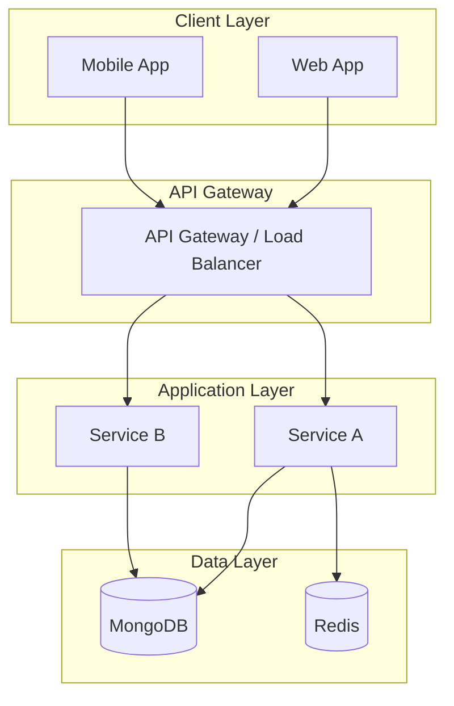
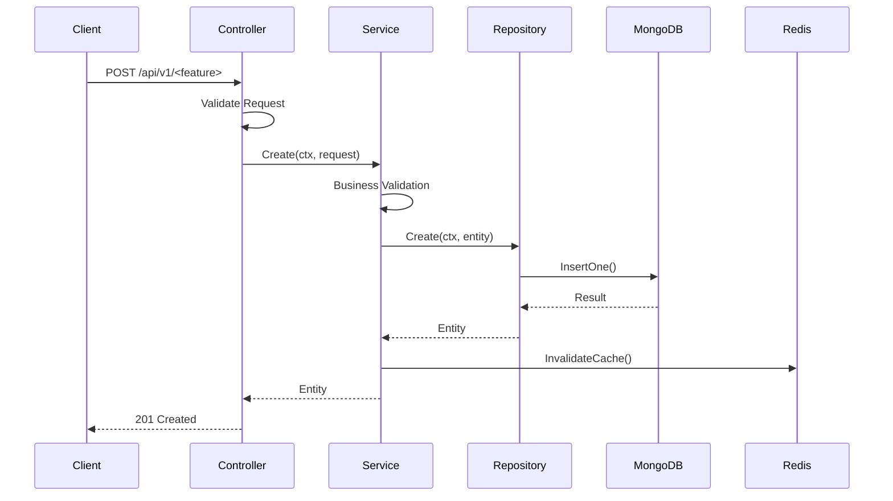

# Technical Specification Template

> Comprehensive technical specification for [Feature Name]

# [Feature Name] - Technical Specification

**Version:** 1.0
**Status:** Draft | Review | Approved
**Author:** [Author Name]
**Date:** YYYY-MM-DD
**Reviewers:** [Reviewer Names]

---

## 1. Executive Summary

### 1.1 Objective
[What are we building? Why is it needed? Business value?]

### 1.2 Scope

**In Scope:**
- [ ] [Feature/Capability 1]
- [ ] [Feature/Capability 2]
- [ ] [Feature/Capability 3]

**Out of Scope:**
- [ ] [Explicitly excluded item 1]
- [ ] [Explicitly excluded item 2]

### 1.3 Success Criteria
| Criteria | Target | Measurement |
|----------|--------|-------------|
| Performance | < 200ms P95 | Load testing |
| Availability | 99.9% uptime | Monitoring |
| User Adoption | 80% | Analytics |

### 1.4 Dependencies
| Dependency | Type | Owner | Status |
|------------|------|-------|--------|
| [Feature X] | Feature | Team A | Completed |
| [Service Y] | External | Vendor | In Progress |

---

## 2. Requirements

### 2.1 Functional Requirements

| ID | Requirement | Priority | Notes |
|----|-------------|----------|-------|
| FR-001 | [Description] | Must Have | |
| FR-002 | [Description] | Must Have | |
| FR-003 | [Description] | Should Have | |
| FR-004 | [Description] | Nice to Have | |

### 2.2 Non-Functional Requirements

| ID | Category | Requirement | Target |
|----|----------|-------------|--------|
| NFR-001 | Performance | Response time | < 200ms P95 |
| NFR-002 | Scalability | Concurrent users | 10,000 |
| NFR-003 | Availability | Uptime | 99.9% |
| NFR-004 | Security | Authentication | JWT/Keycloak |
| NFR-005 | Compliance | Data residency | Vietnam |

### 2.3 Constraints
- **Technical**: [Go 1.25+, MongoDB, Redis]
- **Business**: [Timeline, Budget]
- **Regulatory**: [GDPR, Data Protection]

---

## 3. Architecture Design

### 3.1 High-Level Architecture



### 3.2 Component Design

#### 3.2.1 Backend Module Structure
```
features/<feature>/
├── models/
│   ├── entity.go           # Domain entity with BSON tags
│   ├── request.go          # Input DTOs with validation
│   ├── response.go         # Output DTOs
│   └── errors.go           # Domain-specific errors
├── services/
│   ├── interface.go        # Service interface (contract)
│   └── service_impl.go     # Implementation
├── repositories/
│   ├── interface.go        # Repository interface
│   └── mongo_repository.go # MongoDB implementation
├── controllers/
│   └── http_controller.go  # HTTP handlers
├── adapters/
│   └── external.go         # External service wrappers
└── routers/
    └── router.go           # Route registration
```

#### 3.2.2 Core Interfaces

```go
// Service Interface
type I<Feature>Service interface {
    Create(ctx context.Context, req Create<Feature>Request) (*<Feature>, error)
    GetByID(ctx context.Context, id string) (*<Feature>, error)
    List(ctx context.Context, filter <Feature>Filter) ([]*<Feature>, int64, error)
    Update(ctx context.Context, id string, req Update<Feature>Request) (*<Feature>, error)
    Delete(ctx context.Context, id string) error
}

// Repository Interface
type I<Feature>Repository interface {
    Create(ctx context.Context, entity *<Feature>) error
    FindByID(ctx context.Context, id string) (*<Feature>, error)
    FindAll(ctx context.Context, filter <Feature>Filter) ([]*<Feature>, int64, error)
    Update(ctx context.Context, id string, entity *<Feature>) error
    Delete(ctx context.Context, id string) error
}
```

### 3.3 Data Flow



---

## 4. Data Models

### 4.1 Database Schema

**Collection:** `<collection_name>`

| Field | Type | Required | Index | Description |
|-------|------|----------|-------|-------------|
| `_id` | ObjectID | Yes | Primary | Primary key |
| `tenant_id` | string | Yes | Yes | Multi-tenancy key |
| `name` | string | Yes | No | Display name |
| `description` | string | No | No | Optional description |
| `status` | string | Yes | Yes | Enum: active, inactive, deleted |
| `metadata` | object | No | No | Extensible metadata |
| `created_by` | string | Yes | No | Creator user ID |
| `created_at` | datetime | Yes | No | Creation timestamp |
| `updated_at` | datetime | Yes | No | Last modification |

**Indexes:**
```javascript
// Query optimization indexes
{ tenant_id: 1, status: 1 }        // List by tenant and status
{ tenant_id: 1, created_at: -1 }   // Recent items
{ tenant_id: 1, name: 1 }          // Search by name

// Uniqueness constraints
{ tenant_id: 1, name: 1 }, { unique: true }  // Unique name per tenant
```

### 4.2 Go Struct Definitions

```go
// Domain Entity
type <Feature> struct {
    ID          string    `json:"id" bson:"_id"`
    TenantID    string    `json:"tenant_id" bson:"tenant_id"`
    Name        string    `json:"name" bson:"name"`
    Description string    `json:"description,omitempty" bson:"description,omitempty"`
    Status      string    `json:"status" bson:"status"`
    Metadata    Metadata  `json:"metadata,omitempty" bson:"metadata,omitempty"`
    CreatedBy   string    `json:"created_by" bson:"created_by"`
    CreatedAt   time.Time `json:"created_at" bson:"created_at"`
    UpdatedAt   time.Time `json:"updated_at" bson:"updated_at"`
}

// Request DTOs
type Create<Feature>Request struct {
    Name        string   `json:"name" validate:"required,min=1,max=100"`
    Description string   `json:"description,omitempty" validate:"max=500"`
    Metadata    Metadata `json:"metadata,omitempty"`
}

type Update<Feature>Request struct {
    Name        *string  `json:"name,omitempty" validate:"omitempty,min=1,max=100"`
    Description *string  `json:"description,omitempty" validate:"omitempty,max=500"`
    Status      *string  `json:"status,omitempty" validate:"omitempty,oneof=active inactive"`
    Metadata    Metadata `json:"metadata,omitempty"`
}

type <Feature>Filter struct {
    TenantID string
    Status   string
    Search   string
    Page     int
    Limit    int
}
```

---

## 5. API Contract

### 5.1 Endpoints Overview

| Method | Path | Description | Auth |
|--------|------|-------------|------|
| POST | `/api/v1/<feature>` | Create new entity | Required |
| GET | `/api/v1/<feature>` | List entities | Required |
| GET | `/api/v1/<feature>/:id` | Get by ID | Required |
| PUT | `/api/v1/<feature>/:id` | Update entity | Required |
| DELETE | `/api/v1/<feature>/:id` | Delete entity | Required |

### 5.2 Endpoint Details

#### POST /api/v1/<feature>

**Request Headers:**
```
Authorization: Bearer <jwt_token>
X-Tenant-ID: <tenant_id>
Content-Type: application/json
```

**Request Body:**
```json
{
  "name": "Entity Name",
  "description": "Optional description",
  "metadata": {
    "key": "value"
  }
}
```

**Response (201 Created):**
```json
{
  "success": true,
  "data": {
    "id": "uuid-here",
    "tenant_id": "tenant-123",
    "name": "Entity Name",
    "description": "Optional description",
    "status": "active",
    "metadata": { "key": "value" },
    "created_by": "user-456",
    "created_at": "2026-01-23T00:00:00Z",
    "updated_at": "2026-01-23T00:00:00Z"
  }
}
```

**Error Responses:**
| Code | Condition | Response |
|------|-----------|----------|
| 400 | Invalid input | `{"success": false, "error": {"code": "VALIDATION_ERROR", "message": "..."}}` |
| 401 | Missing token | `{"success": false, "error": {"code": "UNAUTHORIZED", "message": "..."}}` |
| 403 | Wrong tenant | `{"success": false, "error": {"code": "FORBIDDEN", "message": "..."}}` |
| 409 | Duplicate name | `{"success": false, "error": {"code": "CONFLICT", "message": "..."}}` |
| 500 | Server error | `{"success": false, "error": {"code": "INTERNAL_ERROR", "message": "..."}}` |

---

## 6. Use Cases & Edge Cases

### 6.1 Happy Paths
| Scenario | Steps | Expected Result |
|----------|-------|-----------------|
| Create entity | Submit valid data | 201 + entity returned |
| List entities | Request with filter | 200 + paginated list |
| Update entity | Submit changes | 200 + updated entity |
| Delete entity | Request delete | 204 No Content |

### 6.2 Validation Errors
| Scenario | Expected Response |
|----------|-------------------|
| Empty name | 400 + "name is required" |
| Name > 100 chars | 400 + "name must be less than 100 characters" |
| Invalid status | 400 + "status must be one of: active, inactive" |

### 6.3 Not Found Cases
| Scenario | Expected Response |
|----------|-------------------|
| Get non-existent ID | 404 + "entity not found" |
| Update deleted entity | 404 + "entity not found" |
| Delete already deleted | 404 + "entity not found" |

### 6.4 Authorization Cases
| Scenario | Expected Response |
|----------|-------------------|
| No token | 401 + redirect to login |
| Expired token | 401 + refresh flow |
| Wrong tenant | 403 + "forbidden" |
| Insufficient permissions | 403 + "forbidden" |

### 6.5 Edge Cases
| Scenario | Expected Behavior |
|----------|-------------------|
| Empty list | 200 + `{"items": [], "total": 0}` |
| Very long description | Truncate at 500 chars |
| Concurrent updates | Last write wins (optimistic) |
| Special characters in name | Sanitize and accept |
| Unicode in content | Fully supported |

---

## 7. Implementation Plan

### Phase 1: Backend Core
1. [ ] Scaffold feature: `python scripts/scaffold_feature.py <feature>`
2. [ ] Create domain models in `models/`
3. [ ] Create repository interface and implementation
4. [ ] Create service interface and implementation
5. [ ] Create HTTP controller
6. [ ] Register routes
7. [ ] Wire dependencies
8. [ ] Verify: `go build ./...`

### Phase 2: Integration
1. [ ] Add caching layer if needed
2. [ ] Add event publishing if needed
3. [ ] Integration tests

### Phase 3: Frontend (if applicable)
1. [ ] Generate Zod schemas from Go structs
2. [ ] Create API functions
3. [ ] Create Zustand store
4. [ ] Build UI components

---

## 8. Security Considerations

- [ ] **Authentication**: JWT required on all endpoints
- [ ] **Authorization**: Tenant isolation enforced
- [ ] **Input Validation**: All inputs validated and sanitized
- [ ] **SQL/NoSQL Injection**: Parameterized queries
- [ ] **Rate Limiting**: Applied at API gateway
- [ ] **Audit Logging**: All mutations logged

---

## 9. Testing Strategy

### 9.1 Unit Tests
- Service layer business logic
- Repository mocking

### 9.2 Integration Tests
- Full API flow with test database
- Error handling verification

### 9.3 Performance Tests
- Load testing at 1000 RPS
- Response time < 200ms P95

---

## 10. Rollout Plan

1. **Development**: Feature branch
2. **Testing**: Staging environment
3. **Canary**: 5% production traffic
4. **Full Rollout**: 100% production

---

## Appendix

### A. Glossary
| Term | Definition |
|------|------------|
| [Term] | [Definition] |

### B. References
- [Link to related documentation]
- [Link to design decisions]
