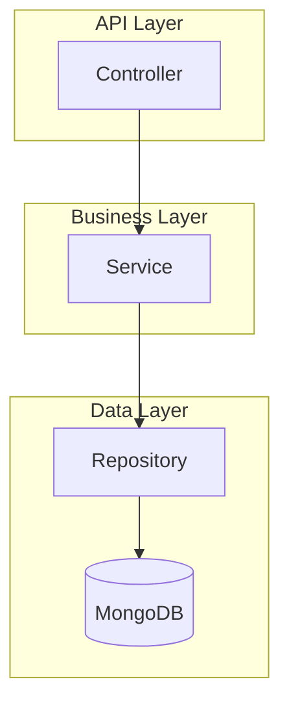

# Implementation Plan Template

> Use this template for detailed, actionable implementation plans.

# [Feature Name] - Implementation Plan

## 1. Executive Summary

### Objective
[What are we building? What business value does it provide?]

### Scope
**In Scope:**
- [Specific feature/endpoint 1]
- [Specific feature/endpoint 2]

**Out of Scope:**
- [What is NOT included]

### Dependencies
- [Feature/System this depends on]
- [External service dependency]

### Timeline
| Phase | Duration | Target Date |
|-------|----------|-------------|
| Phase 1: Core | X days | YYYY-MM-DD |
| Phase 2: Integration | X days | YYYY-MM-DD |
| Phase 3: Testing | X days | YYYY-MM-DD |

---

## 2. Technical Architecture

### 2.1 Component Diagram



### 2.2 Directory Structure

```
features/<feature>/
├── models/
│   ├── entity.go           # Domain entity
│   ├── request.go          # Input DTOs
│   └── errors.go           # Domain errors
├── services/
│   ├── interface.go        # Service interface
│   └── service_impl.go     # Implementation
├── repositories/
│   ├── interface.go        # Repository interface
│   └── mongo_repository.go # MongoDB implementation
├── controllers/
│   └── http_controller.go  # HTTP handlers
└── routers/
    └── router.go           # Route registration
```

### 2.3 Dependencies
| Dependency | Purpose | Version |
|------------|---------|---------|
| MongoDB | Primary storage | v1.17+ |
| Redis | Caching | v9+ |
| [Other] | [Purpose] | [Version] |

---

## 3. Data Models

### 3.1 Database Schema

**Collection:** `<collection_name>`

| Field | Type | Required | Description |
|-------|------|----------|-------------|
| `_id` | ObjectID | Yes | Primary key |
| `tenant_id` | string | Yes | Multi-tenancy key |
| `name` | string | Yes | Display name |
| `status` | string | Yes | Enum: active, inactive |
| `created_at` | datetime | Yes | Creation timestamp |
| `updated_at` | datetime | Yes | Last modification |

**Indexes:**
```javascript
{ tenant_id: 1, status: 1 }  // For list queries
{ tenant_id: 1, _id: 1 }     // Unique per tenant
```

### 3.2 Go Structs

```go
// Entity
type Entity struct {
    ID        string    `json:"id" bson:"_id"`
    TenantID  string    `json:"tenant_id" bson:"tenant_id"`
    Name      string    `json:"name" bson:"name"`
    Status    string    `json:"status" bson:"status"`
    CreatedAt time.Time `json:"created_at" bson:"created_at"`
    UpdatedAt time.Time `json:"updated_at" bson:"updated_at"`
}

// Request DTOs
type CreateRequest struct {
    Name string `json:"name" validate:"required,min=3,max=100"`
}

type UpdateRequest struct {
    Name   string `json:"name,omitempty"`
    Status string `json:"status,omitempty" validate:"omitempty,oneof=active inactive"`
}
```

---

## 4. API Contracts

### 4.1 Endpoints

| Method | Path | Description | Auth |
|--------|------|-------------|------|
| POST | `/api/v1/<feature>` | Create entity | Required |
| GET | `/api/v1/<feature>` | List entities | Required |
| GET | `/api/v1/<feature>/:id` | Get by ID | Required |
| PUT | `/api/v1/<feature>/:id` | Update entity | Required |
| DELETE | `/api/v1/<feature>/:id` | Delete entity | Required |

### 4.2 Request/Response Examples

**POST /api/v1/<feature>**

Request:
```json
{
  "name": "Example Entity"
}
```

Response (201 Created):
```json
{
  "id": "uuid-here",
  "name": "Example Entity",
  "status": "active",
  "created_at": "2026-01-23T00:00:00Z"
}
```

**Error Responses:**

| Code | Condition | Body |
|------|-----------|------|
| 400 | Invalid input | `{"error": "name is required"}` |
| 401 | No auth token | `{"error": "unauthorized"}` |
| 403 | Wrong tenant | `{"error": "forbidden"}` |
| 404 | Not found | `{"error": "entity not found"}` |
| 500 | Server error | `{"error": "internal server error"}` |

---

## 5. Implementation Steps

### Phase 1: Core Backend

#### Step 1: Scaffold Feature Structure
```bash
python .github/skills/go-project-generator/scripts/generate_feature.py <feature>
```
**Result:** Directory structure created

#### Step 2: Define Models
- [ ] Create `models/entity.go` with domain struct
- [ ] Create `models/request.go` with DTOs
- [ ] Create `models/errors.go` with domain errors

#### Step 3: Implement Repository
- [ ] Create `repositories/interface.go` with CRUD contract
- [ ] Create `repositories/mongo_repository.go` with MongoDB implementation
- [ ] Add context timeout handling
- [ ] Add tenant filtering

#### Step 4: Implement Service
- [ ] Create `services/interface.go` with business operations
- [ ] Create `services/service_impl.go` with logic
- [ ] Add input validation
- [ ] Add error wrapping

#### Step 5: Implement Controller
- [ ] Create `controllers/http_controller.go`
- [ ] Add request binding and validation
- [ ] Add error mapping to HTTP status codes
- [ ] Add response serialization

#### Step 6: Register Routes
- [ ] Create `routers/router.go`
- [ ] Apply auth middleware
- [ ] Register with main router

#### Step 7: Wire Dependencies
- [ ] Update `routers/constant.go` with DI wiring

### Phase 2: Integration

#### Step 8: Add Caching (if needed)
- [ ] Implement cache-aside pattern
- [ ] Add cache invalidation

#### Step 9: Add Events (if needed)
- [ ] Publish domain events to NATS

### Phase 3: Verification

#### Step 10: Build & Test
```bash
go build ./...
go test ./features/<feature>/...
```

#### Step 11: Integration Test
- [ ] Test all endpoints with Postman/curl
- [ ] Verify error responses
- [ ] Verify multi-tenancy isolation

---

## 6. Verification Checklist

### Build Verification
- [ ] `go build ./...` passes
- [ ] No lint errors
- [ ] No unused imports

### Functional Verification
- [ ] Create entity works
- [ ] List entities returns correct data
- [ ] Get by ID returns single entity
- [ ] Update modifies entity
- [ ] Delete removes entity
- [ ] Not found returns 404
- [ ] Invalid input returns 400

### Security Verification
- [ ] Auth required on all endpoints
- [ ] Tenant isolation enforced
- [ ] Input validation prevents injection

### Performance Verification
- [ ] Database indexes created
- [ ] Response time < 200ms

---

## 7. Risks & Mitigation

| Risk | Probability | Impact | Mitigation |
|------|-------------|--------|------------|
| [Risk 1] | Medium | High | [Strategy] |
| [Risk 2] | Low | Medium | [Strategy] |

---

## 8. Rollback Plan

If issues are discovered:
1. [Rollback step 1]
2. [Rollback step 2]
3. [Communication plan]
