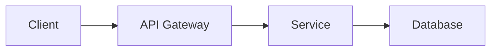
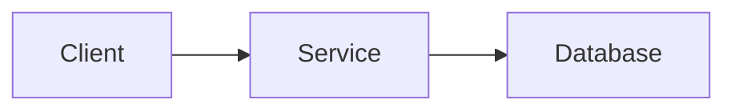

# Solution Proposal Template

> Use this template when comparing multiple approaches to solve a problem.

# Solution Proposal: [Feature/Problem Name]

## 1. Problem Statement

### Business Context
[What is the business problem we're solving?]

### Technical Context
[What technical challenges or constraints exist?]

### Success Criteria
- [ ] [Measurable outcome 1]
- [ ] [Measurable outcome 2]

---

## 2. Requirements

### Functional Requirements
| ID | Requirement | Priority |
|----|-------------|----------|
| FR-1 | [Description] | Must Have |
| FR-2 | [Description] | Should Have |
| FR-3 | [Description] | Nice to Have |

### Non-Functional Requirements
| ID | Category | Requirement | Target |
|----|----------|-------------|--------|
| NFR-1 | Performance | Response time | < 200ms P95 |
| NFR-2 | Scalability | Concurrent users | 10,000 |
| NFR-3 | Availability | Uptime | 99.9% |
| NFR-4 | Security | Authentication | JWT with Keycloak |

### Constraints
- [Technology constraint]
- [Budget/Timeline constraint]
- [Team skill constraint]

---

## 3. Proposed Solutions

### Option A: [Solution Name]

**Overview:**
[Brief description of the approach]

**Architecture Diagram:**

**Technical Stack:**
- [Technology 1]
- [Technology 2]

| Pros | Cons |
|------|------|
| + [Advantage 1] | - [Disadvantage 1] |
| + [Advantage 2] | - [Disadvantage 2] |
| + [Advantage 3] | - [Disadvantage 3] |

**Effort Estimate:** [Low / Medium / High] - [X weeks]
**Risk Level:** [Low / Medium / High]
**Maintenance Complexity:** [Low / Medium / High]

---

### Option B: [Solution Name]

**Overview:**
[Brief description of the approach]

**Architecture Diagram:**

**Technical Stack:**
- [Technology 1]
- [Technology 2]

| Pros | Cons |
|------|------|
| + [Advantage 1] | - [Disadvantage 1] |
| + [Advantage 2] | - [Disadvantage 2] |

**Effort Estimate:** [Low / Medium / High] - [X weeks]
**Risk Level:** [Low / Medium / High]
**Maintenance Complexity:** [Low / Medium / High]

---

## 4. Comparison Matrix

| Criteria | Weight | Option A | Option B |
|----------|--------|----------|----------|
| Development Effort | 20% | 3/5 | 4/5 |
| Performance | 25% | 4/5 | 3/5 |
| Scalability | 20% | 5/5 | 3/5 |
| Maintainability | 15% | 4/5 | 4/5 |
| Team Familiarity | 10% | 3/5 | 5/5 |
| Risk | 10% | 3/5 | 4/5 |
| **Total Score** | 100% | **3.85** | **3.65** |

---

## 5. Recommendation

### Selected Approach: Option [A/B]

**Justification:**
[Clear reasoning why this option is recommended]

**Key Trade-offs Accepted:**
1. [Trade-off 1 and why it's acceptable]
2. [Trade-off 2 and why it's acceptable]

**Risk Mitigation:**
- [Risk 1]: [Mitigation strategy]
- [Risk 2]: [Mitigation strategy]

---

## 6. Next Steps

| Step | Owner | Timeline |
|------|-------|----------|
| 1. [Action item] | [Team/Person] | [Date] |
| 2. [Action item] | [Team/Person] | [Date] |
| 3. [Action item] | [Team/Person] | [Date] |

---

## Appendix

### A. Research References
- [Link to relevant documentation]
- [Link to similar implementations]

### B. Glossary
| Term | Definition |
|------|------------|
| [Term] | [Definition] |
