# ARCHITECTURE SPECIFICATION
## VNPT AV Platform — Services Provider Group

**Document Version**: 1.0.0
**Status**: Draft
**Based on**: `project-documentation/PRD.md` v1.0.0
**Architect**: Expert Solutions Architect (Phase 2 — `/link-arch`)
**Date**: 2026-03-06

---

## Table of Contents

1. [Executive Architecture Summary](#1-executive-architecture-summary)
2. [System Context Diagram (C4 Level 1)](#2-system-context-diagram-c4-level-1)
3. [Container Architecture (C4 Level 2)](#3-container-architecture-c4-level-2)
4. [Architecture Decision Records](#4-architecture-decision-records)
5. [Service Architecture — RHS](#5-rhs-service-architecture)
6. [Service Architecture — FPE](#6-fpe-service-architecture)
7. [Service Architecture — BMS](#7-bms-service-architecture)
8. [Service Architecture — PAY](#8-pay-service-architecture)
9. [Service Architecture — TMS](#9-tms-service-architecture)
10. [Service Architecture — NCS](#10-ncs-service-architecture)
11. [Service Architecture — ABI](#11-abi-service-architecture)
12. [Service Architecture — MKP](#12-mkp-service-architecture)
13. [Cross-Cutting Concerns](#13-cross-cutting-concerns)
14. [Infrastructure Topology](#14-infrastructure-topology)
15. [Event Streaming Architecture](#15-event-streaming-architecture)
16. [Security Architecture](#16-security-architecture)
17. [Observability Architecture](#17-observability-architecture)
18. [Traceability Matrix](#18-traceability-matrix)

---

## 1. Executive Architecture Summary

The VNPT AV Platform Services Provider group is a **polyglot microservices platform** composed of 8 independent services, each owning its domain and data. All services are built with **Java 17+ / Spring Boot 3.x** following a uniform **Clean Architecture** pattern.

### Architectural Principles
| Principle | Implementation |
|-----------|----------------|
| **Service Autonomy** | Each service has its own MongoDB collection namespace; no direct cross-service DB joins |
| **Event-Driven First** | All inter-service state changes propagate via Kafka; synchronous calls only for critical path |
| **Multi-tenancy by Design** | `tenant_id` is a first-class field on every entity, indexed on every query |
| **Fail-Safe Payment** | Escrow model (pre-authorize → capture) prevents financial loss |
| **Defense in Depth** | JWT at gateway → RBAC at service → tenant filter at repository layer |

### Service Portfolio

| Service | Code | Responsibility | Primary DB | Cache | Events |
|---------|------|---------------|------------|-------|--------|
| Ride-Hailing Service | RHS | Trip lifecycle, AV matching, ETA | MongoDB | Redis | Kafka + NATS |
| Fare & Pricing Engine | FPE | Dynamic pricing, surge, promotions | MongoDB | Redis | Kafka |
| Billing & Subscription Mgmt | BMS | Subscriptions, metering, invoicing | MongoDB + InfluxDB | Redis | Kafka |
| Payment Processing | PAY | Escrow, multi-gateway, wallet | MongoDB | Redis | Kafka |
| Tenant & Org Management | TMS | B2B onboarding, RBAC, white-label | MongoDB + S3/MinIO | Redis | Kafka |
| Notification & Communication | NCS | Push/SMS/Email/Webhook routing | MongoDB | Redis | Kafka |
| Analytics & BI | ABI | Dashboards, ETL, reporting | ES + InfluxDB + MongoDB | — | Kafka (consumer) |
| Marketplace & Integration Hub | MKP | Plugin catalog, partner mgmt | MongoDB + S3/MinIO | Redis | — |

---

## 2. System Context Diagram (C4 Level 1)

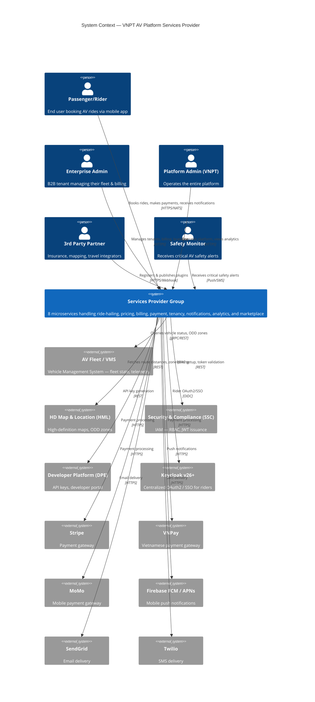

---

## 3. Container Architecture (C4 Level 2)

```mermaid
C4Container
    title Container Diagram — Services Provider Microservices

    Container(apiGateway, "API Gateway", "Kong / AWS ALB", "TLS termination, JWT validation, rate limiting, routing")
    Container(rhs, "RHS Service", "Java 17 / Spring Boot 3", "Trip lifecycle, AV-aware matching, ETA engine, pooling")
    Container(fpe, "FPE Service", "Java 17 / Spring Boot 3", "Fare calculation, surge pricing, promotions, rate cards")
    Container(bms, "BMS Service", "Java 17 / Spring Boot 3", "Subscriptions, metering, invoicing, quota enforcement")
    Container(pay, "PAY Service", "Java 17 / Spring Boot 3", "Payment gateway routing, escrow, wallet, fraud detection")
    Container(tms, "TMS Service", "Java 17 / Spring Boot 3", "Tenant onboarding, white-label, RBAC, rider identity")
    Container(ncs, "NCS Service", "Java 17 / Spring Boot 3", "Multi-channel notification routing, template engine, webhooks")
    Container(abi, "ABI Service", "Java 17 / Spring Boot 3", "Dashboards, KPI monitoring, ETL, regulatory reports")
    Container(mkp, "MKP Service", "Java 17 / Spring Boot 3", "Plugin catalog, partner lifecycle, revenue share")

    ContainerDb(mongo, "MongoDB", "MongoDB 7.x", "Primary store — trips, fares, tenants, payments, notifications, plugins")
    ContainerDb(redis, "Redis Cluster", "Redis 7.x", "Cache, idempotency keys, quota counters, session")
    ContainerDb(influx, "InfluxDB", "InfluxDB 2.x", "Time-series metering (BMS) and telemetry analytics (ABI)")
    ContainerDb(elastic, "Elasticsearch", "ES 8.x", "Full-text search and aggregation queries (ABI)")
    ContainerDb(minio, "S3 / MinIO", "MinIO / AWS S3", "Object storage — branding assets (TMS), reports (ABI), plugin packages (MKP)")
    Container(kafka, "Kafka Cluster", "Apache Kafka 3.x", "Async event streaming — ride, fare, payment, billing, tenant events")
    Container(nats, "NATS Server", "NATS 2.x", "Real-time push to mobile — ETA updates, trip state changes")

    Rel(apiGateway, rhs, "Routes ride requests", "HTTP/2")
    Rel(apiGateway, fpe, "Routes pricing requests", "HTTP/2")
    Rel(apiGateway, bms, "Routes billing requests", "HTTP/2")
    Rel(apiGateway, pay, "Routes payment requests", "HTTP/2")
    Rel(apiGateway, tms, "Routes tenant requests", "HTTP/2")
    Rel(apiGateway, ncs, "Routes notification requests", "HTTP/2")
    Rel(apiGateway, abi, "Routes analytics requests", "HTTP/2")
    Rel(apiGateway, mkp, "Routes marketplace requests", "HTTP/2")

    Rel(rhs, mongo, "Trips collection", "MongoDB driver")
    Rel(rhs, redis, "Match cache, ETA cache", "Jedis/Lettuce")
    Rel(rhs, kafka, "Publishes ride-events", "Kafka producer")
    Rel(rhs, nats, "Pushes ETA & state to mobile", "NATS client")

    Rel(fpe, mongo, "Fare & rate cards", "MongoDB driver")
    Rel(fpe, redis, "Fare cache", "Jedis/Lettuce")
    Rel(fpe, kafka, "Publishes fare-events", "Kafka producer")

    Rel(bms, mongo, "Subscriptions, invoices", "MongoDB driver")
    Rel(bms, influx, "Usage metering counters", "InfluxDB client")
    Rel(bms, redis, "Quota counters cache", "Jedis/Lettuce")
    Rel(bms, kafka, "Publishes billing/metering events", "Kafka producer")

    Rel(pay, mongo, "Transactions, audit logs, wallets", "MongoDB driver")
    Rel(pay, redis, "Idempotency keys (24h TTL)", "Jedis/Lettuce")
    Rel(pay, kafka, "Publishes payment-events", "Kafka producer")

    Rel(tms, mongo, "Tenants, configs, rider profiles", "MongoDB driver")
    Rel(tms, minio, "Branding assets", "S3 client")
    Rel(tms, redis, "Tenant context cache", "Jedis/Lettuce")
    Rel(tms, kafka, "Publishes tenant-events", "Kafka producer")

    Rel(ncs, mongo, "Templates, delivery logs", "MongoDB driver")
    Rel(ncs, redis, "Deduplication, rate limit", "Jedis/Lettuce")
    Rel(ncs, kafka, "Consumes all events", "Kafka consumer group")

    Rel(abi, elastic, "Aggregation queries", "ES client")
    Rel(abi, influx, "Time-series analytics", "InfluxDB client")
    Rel(abi, mongo, "Trip & revenue data", "MongoDB driver")
    Rel(abi, minio, "Stores reports (PDF/CSV)", "S3 client")
    Rel(abi, kafka, "Consumes ride/payment/billing events", "Kafka consumer group")

    Rel(mkp, mongo, "Plugins, partners, payouts", "MongoDB driver")
    Rel(mkp, minio, "Plugin packages", "S3 client")
    Rel(mkp, redis, "Catalog cache", "Jedis/Lettuce")
```

---

## 4. Architecture Decision Records

### ADR-001: Microservices with Separate MongoDB Namespaces
**Status**: Accepted
**Decision**: Each service uses its own MongoDB database (`rhs_db`, `fpe_db`, etc.). No cross-service joins.
**Rationale**: Enforces service autonomy; enables independent scaling; prevents cascading failures across service boundaries.
**Consequences**: Cross-service data queries must go through API calls or Kafka projections.

### ADR-002: Kafka for Async Events, NATS for Real-Time Push
**Status**: Accepted
**Decision**: Kafka handles all durable, high-throughput inter-service events. NATS handles real-time sub-second push to mobile (ETA, trip status).
**Rationale**: Kafka provides durability/replay (replication factor ≥ 3); NATS provides ultra-low latency (<5ms) for mobile experience. Mixing both optimizes for each use case.

### ADR-003: Escrow Payment Model
**Status**: Accepted
**Decision**: PAY Service pre-authorizes on ride booking; captures only when trip reaches `Completed` state; releases escrow on `Cancelled`.
**Rationale**: Prevents charging riders for failed or cancelled trips. Required by BL-003.

### ADR-004: Redis Idempotency Keys (24h TTL)
**Status**: Accepted
**Decision**: Every PAY mutation stores `idempotency_key → {response}` in Redis with 24h TTL. Duplicate requests return stored response without re-processing.
**Rationale**: Payment duplicate prevention (BL-004). 24h covers any network retry window.

### ADR-005: Transactional Tenant Onboarding with Saga Pattern
**Status**: Accepted
**Decision**: TMS implements an **Orchestration-based Saga** calling SSC → BMS → DPE → VMS sequentially. On any failure, a compensating transaction rolls back all previous steps.
**Rationale**: BL-011 requires atomic onboarding. Distributed transaction via saga avoids 2PC complexity.

### ADR-006: tenant_id at Every Layer (Mandatory Filter)
**Status**: Accepted
**Decision**: All MongoDB repositories include `{ tenant_id: <value> }` in every query. A Spring interceptor validates `tenant_id` presence on every authenticated request.
**Rationale**: BL-001 — cross-tenant data leakage is a critical security violation.

### ADR-007: API Gateway as the Single Entry Point
**Status**: Accepted
**Decision**: Kong API Gateway handles TLS termination, JWT validation (via Keycloak JWKS), rate limiting, and request routing. No service exposes its port publicly.
**Rationale**: Centralizes security enforcement; enables observability; simplifies certificate management.

### ADR-008: Java 17+ Spring Boot 3.x for All Services
**Status**: Accepted
**Decision**: All 8 services use Java 17+ with Spring Boot 3.x, Spring Data MongoDB, Spring Kafka, and Spring Security.
**Rationale**: Team proficiency, ecosystem maturity, Spring Boot 3's native image support for lower startup time.

---

## 5. RHS Service Architecture

### 5.1 Responsibilities
Manages the complete ride lifecycle from booking to completion, AV-aware vehicle matching, real-time ETA computation, ride pooling, and post-trip ratings.

### 5.2 Component Diagram

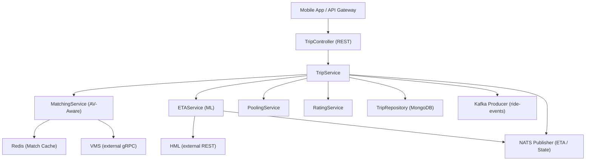

### 5.3 Clean Architecture Layers

| Layer | Class | Responsibility |
|-------|-------|----------------|
| Controller | `TripController` | REST endpoints, request validation, HTTP response mapping |
| Service | `TripService` | Trip state machine transitions, business rule enforcement |
| Service | `MatchingService` | AV-Aware matching: proximity + battery + ODD + vehicle type |
| Service | `ETAService` | ML-based ETA (LSTM/GBM) computation and continuous updates |
| Service | `PoolingService` | Multi-passenger route optimization (minimize detour) |
| Service | `RatingService` | Post-trip rating collection and aggregation |
| Repository | `TripRepository` | MongoDB CRUD with `tenant_id` filter on all operations |
| Event | `RideEventPublisher` | Publishes `ride.requested`, `ride.matched`, `ride.completed`, etc. to Kafka |
| Event | `EtaNatsPublisher` | Pushes ETA and state updates to NATS subject `rhs.{tenant_id}.trips.{trip_id}` |

### 5.4 Trip State Machine

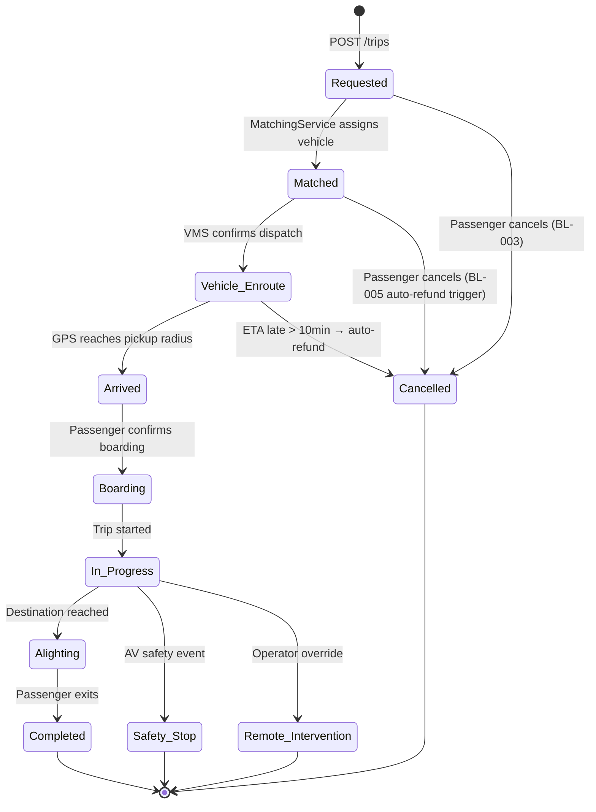

### 5.5 API Contracts

| Method | Endpoint | Auth | Request | Response |
|--------|----------|------|---------|----------|
| `POST` | `/api/v1/trips` | JWT (Rider) | `{ pickup_lat, pickup_lng, dropoff_lat, dropoff_lng, vehicle_type?, scheduled_at? }` | `{ trip_id, status, eta_minutes, matched_vehicle_id, upfront_fare }` |
| `GET` | `/api/v1/trips/{trip_id}` | JWT | — | `{ trip_id, status, eta_minutes, current_location, fare }` |
| `GET` | `/api/v1/trips?page&size` | JWT (Rider) | — | `{ trips[], total, page }` (ride history) |
| `POST` | `/api/v1/trips/{trip_id}/cancel` | JWT (Rider) | `{ reason }` | `{ trip_id, status: "Cancelled", refund_amount? }` |
| `POST` | `/api/v1/trips/{trip_id}/rating` | JWT (Rider) | `{ cleanliness, safety, comfort, comment? }` | `{ rating_id, average_score }` |

**Error Codes**: 400 (validation), 401 (unauthenticated), 403 (wrong tenant), 404 (trip not found), 409 (concurrent booking conflict), 422 (business rule — no vehicle available), 503 (no ODD-compatible vehicle).

### 5.6 MongoDB Schema — `trips` Collection

```json
{
  "_id": "ObjectId",
  "trip_id": "uuid-v4",
  "tenant_id": "string (indexed)",
  "rider_id": "string",
  "vehicle_id": "string",
  "status": "enum[Requested|Matched|Vehicle_Enroute|Arrived|Boarding|In_Progress|Alighting|Completed|Cancelled|Safety_Stop|Remote_Intervention]",
  "pickup": { "lat": "double", "lng": "double", "address": "string" },
  "dropoff": { "lat": "double", "lng": "double", "address": "string" },
  "upfront_fare": "decimal128",
  "final_fare": "decimal128",
  "vehicle_type": "string",
  "scheduled_at": "ISODate?",
  "matched_at": "ISODate",
  "completed_at": "ISODate",
  "eta_minutes": "int32",
  "pool_group_id": "string?",
  "ratings": [{ "cleanliness": "int", "safety": "int", "comfort": "int", "comment": "string?" }],
  "created_at": "ISODate",
  "updated_at": "ISODate"
}
```

**Indexes**: `{ tenant_id: 1, rider_id: 1 }`, `{ tenant_id: 1, status: 1 }`, `{ tenant_id: 1, vehicle_id: 1 }`, `{ scheduled_at: 1 }` (sparse).

### 5.7 Kafka Events Published

| Topic | Event Key | Payload |
|-------|-----------|---------|
| `ride-events` | `ride.requested` | `{ trip_id, tenant_id, rider_id, pickup, dropoff, timestamp }` |
| `ride-events` | `ride.matched` | `{ trip_id, tenant_id, vehicle_id, eta_minutes, timestamp }` |
| `ride-events` | `ride.completed` | `{ trip_id, tenant_id, rider_id, final_fare, duration_sec, distance_km, timestamp }` |
| `ride-events` | `ride.cancelled` | `{ trip_id, tenant_id, reason, refund_eligible, timestamp }` |
| `ride-events` | `ride.safety_stop` | `{ trip_id, tenant_id, vehicle_id, location, timestamp }` |

---

## 6. FPE Service Architecture

### 6.1 Responsibilities
Real-time fare estimation, upfront pricing (locked fare), dynamic surge pricing (1.0x–3.0x), enterprise rate cards, promotion management, and revenue share computation.

### 6.2 Component Diagram

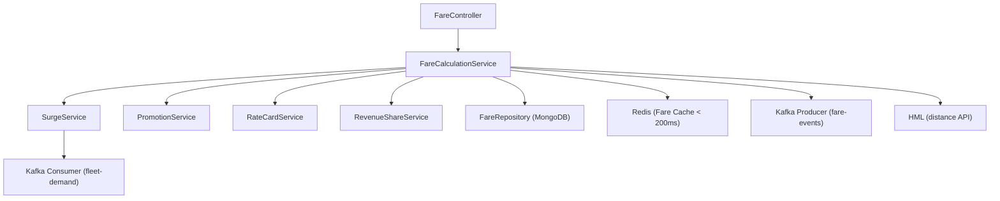

### 6.3 Fare Calculation Formula

```
Fare = (Base_Fee + Distance_Rate × km + Time_Rate × minutes) × Surge_Multiplier × Vehicle_Tier_Factor
     - Promotion_Discount
     + Platform_Fee_Percentage

Surge_Multiplier ∈ [1.0, min(3.0, tenant_surge_cap)]
```

**Upfront Pricing Rule**: Fare is locked at booking time. System absorbs actual route deviation variance.

### 6.4 API Contracts

| Method | Endpoint | Auth | Request | Response |
|--------|----------|------|---------|----------|
| `POST` | `/api/v1/fares/estimate` | JWT | `{ tenant_id, pickup, dropoff, vehicle_type, scheduled_at? }` | `{ estimated_fare, currency, surge_multiplier, distance_km, eta_minutes }` |
| `POST` | `/api/v1/fares/confirm` | JWT (internal) | `{ trip_id, upfront_fare }` | `{ fare_id, locked_amount, expires_at }` |
| `POST` | `/api/v1/fares/finalize` | JWT (internal, from RHS) | `{ trip_id, actual_distance_km, actual_duration_min }` | `{ final_fare, revenue_share }` |
| `GET/POST/PUT/DELETE` | `/api/v1/rate-cards` | JWT (Tenant Admin) | Rate card config | Rate card entity |
| `GET/POST/PUT/DELETE` | `/api/v1/promotions` | JWT (Platform Admin) | Promotion config | Promotion entity |

### 6.5 MongoDB Schema — `fares` Collection

```json
{
  "_id": "ObjectId",
  "fare_id": "uuid-v4",
  "tenant_id": "string (indexed)",
  "trip_id": "string (indexed)",
  "estimated_fare": "decimal128",
  "locked_fare": "decimal128",
  "final_fare": "decimal128",
  "currency": "string (ISO 4217)",
  "surge_multiplier": "double",
  "base_fee": "decimal128",
  "distance_rate": "decimal128",
  "time_rate": "decimal128",
  "distance_km": "double",
  "duration_min": "int32",
  "vehicle_tier": "string",
  "promotion_id": "string?",
  "promotion_discount": "decimal128",
  "platform_revenue_share": "decimal128",
  "tenant_revenue_share": "decimal128",
  "status": "enum[estimated|locked|finalized]",
  "created_at": "ISODate",
  "finalized_at": "ISODate?"
}
```

---

## 7. BMS Service Architecture

### 7.1 Responsibilities
Manages the full lifecycle of tenant subscriptions (plans, trials, renewals), measures API/ride/storage usage, enforces quota limits, generates invoices with tax calculation, and manages credits.

### 7.2 Quota Enforcement Flow

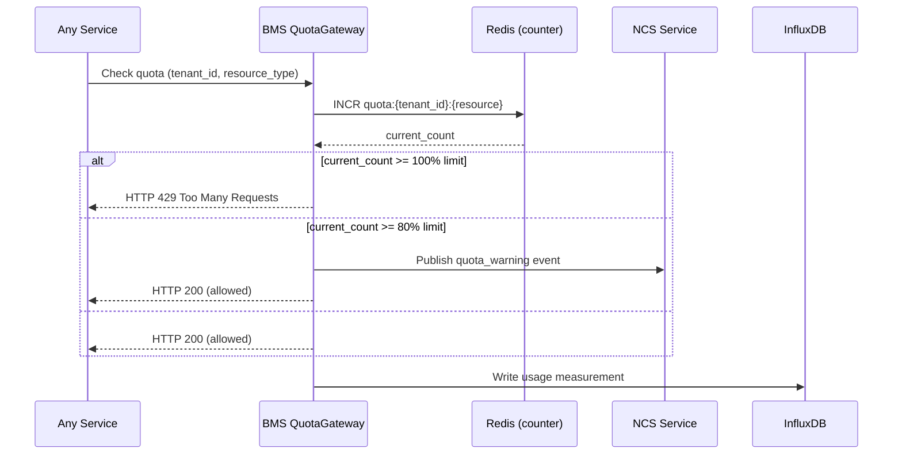

### 7.3 API Contracts

| Method | Endpoint | Auth | Description |
|--------|----------|------|-------------|
| `GET/POST` | `/api/v1/subscriptions` | JWT (Tenant Admin) | Get or create subscription |
| `PUT` | `/api/v1/subscriptions/{id}/plan` | JWT (Platform Admin) | Change subscription plan |
| `GET` | `/api/v1/usage?from&to` | JWT (Tenant Admin) | Usage metrics by period |
| `GET` | `/api/v1/invoices` | JWT (Tenant Admin) | List invoices |
| `GET` | `/api/v1/invoices/{id}/pdf` | JWT (Tenant Admin) | Download invoice PDF |
| `POST` | `/api/v1/credits` | JWT (Platform Admin) | Issue promotional credits |
| `GET` | `/api/v1/quota/check` | JWT (internal) | Real-time quota check (< 10ms) |

### 7.4 MongoDB Schema — `subscriptions` Collection

```json
{
  "_id": "ObjectId",
  "subscription_id": "uuid-v4",
  "tenant_id": "string (unique index)",
  "plan_id": "string",
  "plan_name": "string",
  "status": "enum[trial|active|expired|suspended]",
  "billing_cycle": "enum[monthly|annual]",
  "trial_ends_at": "ISODate?",
  "current_period_start": "ISODate",
  "current_period_end": "ISODate",
  "feature_flags": ["string"],
  "quota": {
    "api_calls_per_month": "int64",
    "rides_per_month": "int64",
    "storage_gb": "int32",
    "max_vehicles": "int32"
  },
  "credits_balance": "decimal128",
  "created_at": "ISODate",
  "updated_at": "ISODate"
}
```

---

## 8. PAY Service Architecture

### 8.1 Responsibilities
Routes payment transactions across 5 gateways, implements the escrow model, manages rider wallets, processes refunds and partner payouts, detects fraud via rule-based + ML scoring, and maintains an immutable audit trail.

### 8.2 Payment Gateway Adapter Pattern

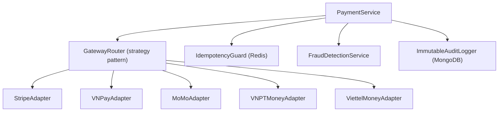

### 8.3 Escrow Lifecycle

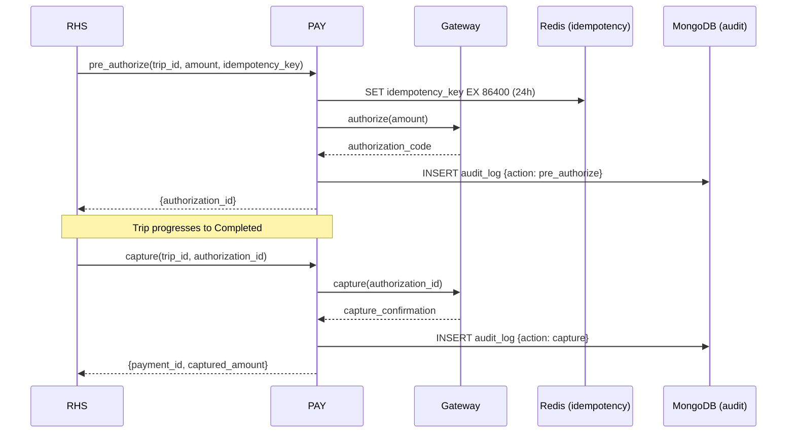

### 8.4 API Contracts

| Method | Endpoint | Auth | Description |
|--------|----------|------|-------------|
| `POST` | `/api/v1/payments/authorize` | JWT (internal) | Pre-authorize (escrow) |
| `POST` | `/api/v1/payments/{id}/capture` | JWT (internal) | Capture authorized payment |
| `POST` | `/api/v1/payments/{id}/void` | JWT (internal) | Release escrow (cancel) |
| `POST` | `/api/v1/payments/{id}/refund` | JWT (internal/Admin) | Full or partial refund |
| `GET` | `/api/v1/wallets/{rider_id}` | JWT (Rider) | Get wallet balance |
| `POST` | `/api/v1/wallets/topup` | JWT (Rider) | Top up wallet |
| `GET` | `/api/v1/payouts` | JWT (Admin) | List scheduled payouts |

### 8.5 MongoDB Schema — `payment_transactions` Collection

```json
{
  "_id": "ObjectId",
  "transaction_id": "uuid-v4",
  "tenant_id": "string (indexed)",
  "trip_id": "string?",
  "invoice_id": "string?",
  "rider_id": "string (indexed)",
  "amount": "decimal128",
  "currency": "string",
  "gateway": "enum[stripe|vnpay|momo|vnpt_money|viettel_money|wallet]",
  "gateway_transaction_id": "string",
  "authorization_id": "string?",
  "status": "enum[pending|authorized|captured|voided|refunded|failed]",
  "idempotency_key": "string (unique index)",
  "fraud_score": "double?",
  "fraud_action": "enum[allow|hold|reject]?",
  "audit_immutable": true,
  "created_at": "ISODate",
  "captured_at": "ISODate?",
  "refunded_at": "ISODate?",
  "actor_id": "string",
  "actor_role": "string"
}
```

**Critical**: `audit_immutable: true` — this field triggers a MongoDB validator that rejects any `update` or `delete` operations on this collection. Inserts only.

---

## 9. TMS Service Architecture

### 9.1 Responsibilities
Orchestrates enterprise onboarding (Saga pattern), manages tenant configurations, white-label branding, data isolation enforcement, rider identity management (with optional Keycloak SSO), and feature flags.

### 9.2 Onboarding Saga — Sequence Diagram

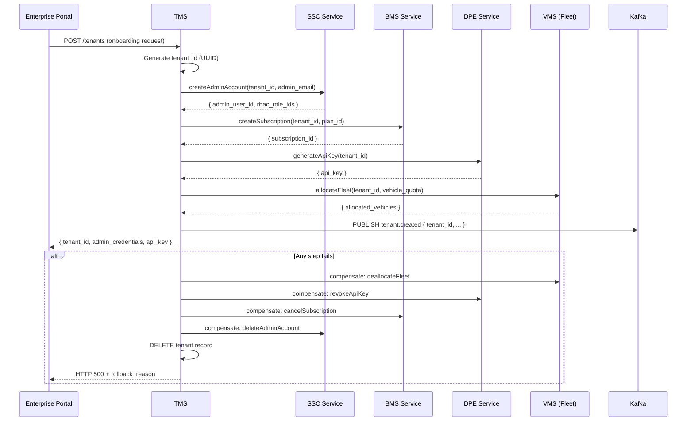

### 9.3 API Contracts

| Method | Endpoint | Auth | Description |
|--------|----------|------|-------------|
| `POST` | `/api/v1/tenants` | JWT (Platform Admin) | Create new tenant (triggers Saga) |
| `GET` | `/api/v1/tenants/{tenant_id}` | JWT (Admin) | Get tenant details |
| `PUT` | `/api/v1/tenants/{tenant_id}/branding` | JWT (Tenant Admin) | Update logo, colors, domain |
| `POST` | `/api/v1/tenants/{tenant_id}/branding/logo` | JWT (Tenant Admin) | Upload logo to S3/MinIO |
| `GET/PUT` | `/api/v1/tenants/{tenant_id}/config` | JWT (Tenant Admin) | Get/update feature flags & config |
| `POST` | `/api/v1/riders/register` | Public (Keycloak) | Rider signup (Google/Apple/Phone OTP) |
| `GET` | `/api/v1/riders/{rider_id}` | JWT (Rider) | Get rider profile |

---

## 10. NCS Service Architecture

### 10.1 Responsibilities
Consumes events from all Kafka topics and routes notifications to the appropriate channel (Push/SMS/Email/In-app/Webhook) based on event priority. Manages templates, user preferences, quiet hours, retry with DLQ, and enterprise webhooks with HMAC.

### 10.2 Notification Routing Rules

| Priority | Trigger Example | Channels | SLA |
|----------|----------------|----------|-----|
| **Critical** | `ride.safety_stop`, AV emergency | Push + SMS (simultaneous) | < 5 seconds (BL-007) |
| **High** | `Vehicle_Arrived`, booking confirmed | Push only | < 10 seconds |
| **Medium** | `Invoice generated`, `ride.completed` | Email + Push | < 60 seconds |
| **Low** | Promotions, newsletters | Email or In-app | Best effort |

### 10.3 Channel Adapter Pattern

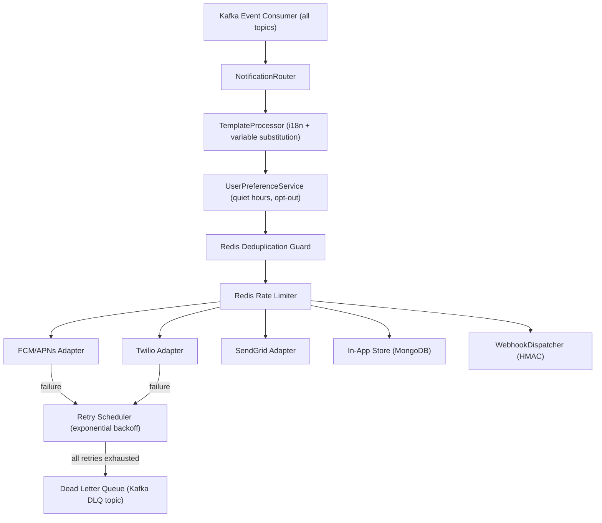

### 10.4 MongoDB Schema — `notification_logs` Collection

```json
{
  "_id": "ObjectId",
  "notification_id": "uuid-v4",
  "tenant_id": "string (indexed)",
  "user_id": "string",
  "event_type": "string",
  "priority": "enum[critical|high|medium|low]",
  "channels": ["push|sms|email|inapp|webhook"],
  "template_id": "string",
  "rendered_content": { "title": "string", "body": "string" },
  "delivery_status": {
    "push": "enum[sent|failed|skipped]",
    "sms": "enum[sent|failed|skipped]",
    "email": "enum[sent|failed|skipped]"
  },
  "retry_count": "int32",
  "in_dlq": "boolean",
  "dedup_key": "string (Redis TTL reference)",
  "created_at": "ISODate",
  "delivered_at": "ISODate?"
}
```

---

## 11. ABI Service Architecture

### 11.1 Responsibilities
Consumes events from Kafka (ride, payment, billing), transforms and loads into Elasticsearch and InfluxDB, serves real-time KPI dashboards, generates demand heatmaps, detects seasonal patterns, and produces regulatory compliance reports stored in MinIO.

### 11.2 ETL Pipeline

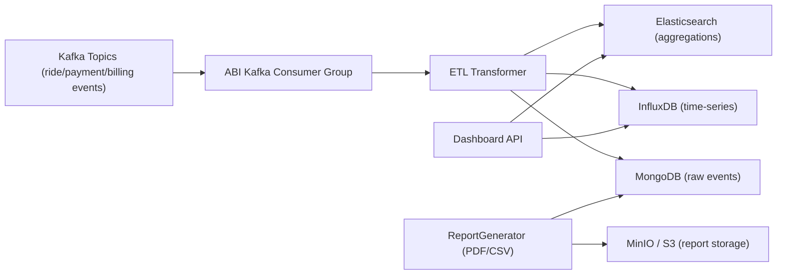

### 11.3 API Contracts

| Method | Endpoint | Auth | Description |
|--------|----------|------|-------------|
| `GET` | `/api/v1/dashboards/kpi` | JWT (Admin) | Real-time KPI metrics |
| `GET` | `/api/v1/dashboards/heatmap?date=` | JWT (Admin) | Demand heatmap data |
| `GET` | `/api/v1/analytics/revenue?from&to&group_by=` | JWT (Admin) | Revenue trend analysis |
| `POST` | `/api/v1/reports/regulatory` | JWT (Platform Admin) | Trigger regulatory report generation |
| `GET` | `/api/v1/reports/{report_id}` | JWT (Admin) | Download report (PDF/CSV) |
| `POST` | `/api/v1/reports/schedule` | JWT (Admin) | Create scheduled report |

---

## 12. MKP Service Architecture

### 12.1 Responsibilities
Manages the plugin marketplace: partner registration and lifecycle, security audit gate, plugin catalog (cached on Redis), tenant plugin activation, and automated revenue share payouts.

### 12.2 Partner Certification Flow

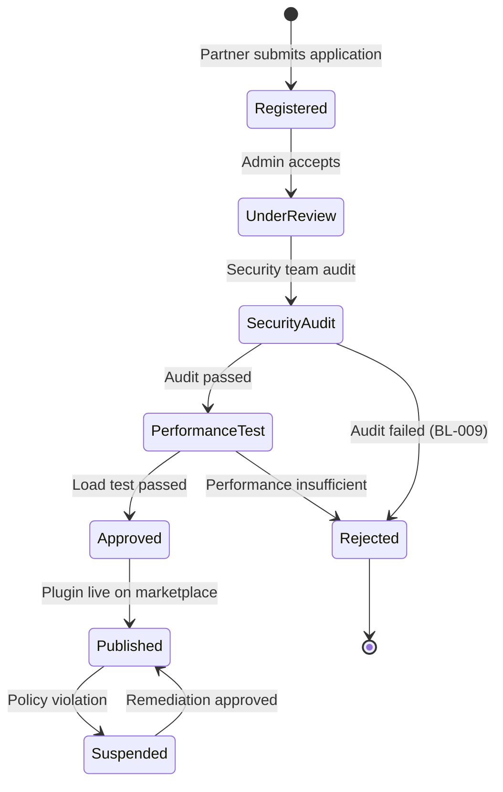

### 12.3 API Contracts

| Method | Endpoint | Auth | Description |
|--------|----------|------|-------------|
| `GET` | `/api/v1/plugins` | JWT | List available plugins (Redis-cached) |
| `POST` | `/api/v1/plugins/{id}/install` | JWT (Tenant Admin) | Install plugin for tenant |
| `DELETE` | `/api/v1/plugins/{id}/install` | JWT (Tenant Admin) | Uninstall plugin |
| `POST` | `/api/v1/partners` | Public | Partner registration |
| `PUT` | `/api/v1/partners/{id}/status` | JWT (Platform Admin) | Approve/reject/suspend partner |
| `GET` | `/api/v1/partners/{id}/analytics` | JWT (Partner) | Partner performance metrics |
| `POST` | `/api/v1/payouts` | JWT (internal, scheduler) | Trigger partner payout via PAY |

---

## 13. Cross-Cutting Concerns

### 13.1 Multi-Tenancy Pattern

Every request carries `tenant_id` extracted from the JWT. A Spring `OncePerRequestFilter` validates and binds it to the request context.

```java
// TenantContextHolder — thread-local per request
public class TenantContext {
    private static final ThreadLocal<String> TENANT_ID = new ThreadLocal<>();
    public static void setTenantId(String tenantId) { TENANT_ID.set(tenantId); }
    public static String getTenantId() { return TENANT_ID.get(); }
    public static void clear() { TENANT_ID.remove(); }
}

// All repositories extend BaseMongoRepository
public abstract class BaseMongoRepository {
    protected Criteria withTenant(Criteria criteria) {
        return criteria.and("tenant_id").is(TenantContext.getTenantId());
    }
}
```

**Rule**: If `TenantContext.getTenantId()` returns null on any authenticated endpoint → throw `403 Forbidden`.

### 13.2 Standard Service Layer Structure

Each service follows identical package organization:

```
com.vnpt.avplatform.<service>/
├── controllers/          # @RestController, @RequestMapping
│   └── <Resource>Controller.java
├── services/
│   ├── <Resource>Service.java          # Interface
│   └── impl/<Resource>ServiceImpl.java  # Implementation
├── repositories/
│   ├── <Resource>Repository.java       # Interface (extends MongoRepository)
│   └── impl/<Resource>RepositoryImpl.java # Custom queries
├── models/
│   ├── entity/<Resource>.java          # MongoDB @Document
│   ├── request/<Action>Request.java    # Input DTOs
│   └── response/<Action>Response.java  # Output DTOs
├── events/
│   ├── publisher/<Event>Publisher.java # Kafka/NATS publishing
│   └── consumer/<Event>Consumer.java   # Kafka consuming
├── adapters/                           # External service wrappers
└── config/                             # Spring config beans
```

### 13.3 Standard Error Response Format

```json
{
  "error_code": "TRIP_NOT_FOUND",
  "message": "Trip with id '{trip_id}' not found for tenant '{tenant_id}'",
  "http_status": 404,
  "timestamp": "2026-03-06T03:35:00Z",
  "trace_id": "jaeger-trace-uuid"
}
```

---

## 14. Infrastructure Topology

### 14.1 Kubernetes Deployment

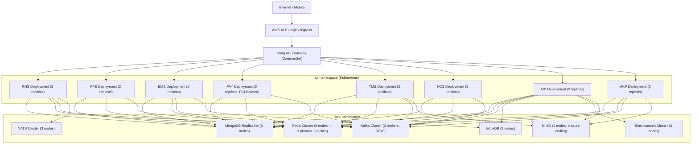

### 14.2 Resource Requirements (Per Service, Per Replica)

| Service | CPU Request | CPU Limit | Memory Request | Memory Limit | Replicas |
|---------|-------------|-----------|----------------|--------------|----------|
| RHS | 500m | 2000m | 512Mi | 2Gi | 3 (HPA: 3–10) |
| FPE | 250m | 1000m | 256Mi | 1Gi | 2 (HPA: 2–6) |
| BMS | 250m | 1000m | 256Mi | 1Gi | 2 |
| PAY | 500m | 2000m | 512Mi | 2Gi | 3 (HPA: 3–8) |
| TMS | 250m | 1000m | 256Mi | 1Gi | 2 |
| NCS | 500m | 2000m | 512Mi | 2Gi | 3 (HPA: 3–10) |
| ABI | 1000m | 4000m | 1Gi | 4Gi | 2 |
| MKP | 250m | 1000m | 256Mi | 1Gi | 2 |

**HPA Trigger**: CPU utilization > 70% OR custom Kafka consumer lag metric > 10,000.

---

## 15. Event Streaming Architecture

### 15.1 Kafka Topic Topology

| Topic | Partitions | Retention | Producers | Consumers |
|-------|-----------|-----------|-----------|-----------|
| `ride-events` | 24 | 7 days | RHS | PAY, ABI, NCS |
| `fare-events` | 12 | 7 days | FPE | RHS, ABI |
| `payment-events` | 24 | 30 days | PAY | BMS, ABI, NCS |
| `billing-events` | 12 | 30 days | BMS | ABI, NCS |
| `metering-events` | 12 | 7 days | BMS | ABI |
| `tenant-events` | 6 | 30 days | TMS | NCS, BMS, ABI |
| `notification-dlq` | 6 | 14 days | NCS | NCS (retry worker) |

**Partition Key Strategy**: All topics use `tenant_id` as the partition key to ensure ordering within a tenant.

**Replication Factor**: 3 across all topics (ADR-002).

**Consumer Groups**:
- `pay-ride-consumer` (PAY consuming `ride-events`)
- `abi-aggregator` (ABI consuming all event topics)
- `ncs-dispatcher` (NCS consuming all event topics)
- `bms-meter-consumer` (BMS consuming `ride-events` for metering)

### 15.2 NATS Subject Hierarchy (RHS Real-Time)

```
rhs.{tenant_id}.trips.{trip_id}.state    # Trip state transitions
rhs.{tenant_id}.trips.{trip_id}.eta      # ETA updates (every 30s)
rhs.{tenant_id}.vehicles.{vehicle_id}.location  # Vehicle GPS
```

---

## 16. Security Architecture

### 16.1 Defense in Depth Layers

```
Layer 1: TLS 1.3 (in transit) + AES-256 (at rest)
Layer 2: API Gateway — JWT signature validation (Keycloak JWKS endpoint)
Layer 3: Service — Spring Security RBAC filter
Layer 4: Repository — TenantContext filter (BL-001)
Layer 5: Database — MongoDB field-level encryption for PCI-DSS sensitive data
```

### 16.2 RBAC Role Matrix

| Role | RHS | FPE | BMS | PAY | TMS | NCS | ABI | MKP |
|------|-----|-----|-----|-----|-----|-----|-----|-----|
| `platform_admin` | Full | Full | Full | Full | Full | Full | Full | Full |
| `tenant_admin` | Own tenant | Read | Full | Read | Own config | Read | Own tenant | Manage |
| `rider` | Own trips | Estimate | — | Own wallet | Own profile | Prefs | — | — |
| `safety_monitor` | Read + Safety alert | — | — | — | — | Receive | Read | — |
| `partner` | — | — | — | Payout read | — | — | Own analytics | Own plugins |
| `service_account` | Internal API | Internal API | Internal API | Internal API | Internal API | Internal API | — | — |

### 16.3 PCI-DSS Controls (PAY Service)

- Card data is **never stored** — tokenization delegated to Stripe/VNPay vaults
- `wallet.encrypted_card_token` stored as AES-256-GCM encrypted string
- PAY Service deployed in dedicated Kubernetes namespace `pay-namespace` with NetworkPolicy blocking direct access from non-authorized services
- All PAY operations write immutable audit log (INSERT only, no UPDATE/DELETE permitted by MongoDB validator)
- Quarterly penetration testing required per PCI-DSS SAQ-D

### 16.4 Webhook HMAC Verification (NCS)

```
HMAC-SHA256(payload_bytes, webhook_secret_key)
Header: X-VNPT-Signature: sha256={hmac_hex}
Timestamp tolerance: ± 5 minutes (X-VNPT-Timestamp header required)
```

---

## 17. Observability Architecture

### 17.1 Distributed Tracing
- **Agent**: OpenTelemetry Java Agent (auto-instrumentation via `-javaagent`)
- **Backend**: Jaeger (trace storage + UI)
- **Propagation**: W3C Trace Context headers across all HTTP and Kafka calls
- **Sampling**: 100% for errors + Critical path; 10% for normal traffic

### 17.2 Metrics
- **Exposition**: Micrometer → Prometheus scrape (`/actuator/prometheus`)
- **Dashboards**: Grafana with pre-built dashboards per service
- **Key Metrics per Service**:
  - `rhs_trip_state_transitions_total{state,tenant_id}`
  - `pay_payment_gateway_latency_ms{gateway}`
  - `bms_quota_enforcement_total{tenant_id,action=allowed|blocked}`
  - `ncs_notification_delivery_total{channel,status}`
  - `fpe_fare_estimation_latency_ms{cache=hit|miss}`

### 17.3 Alerting Rules (PagerDuty / OpsGenie)

| Alert | Condition | Severity |
|-------|-----------|----------|
| High Trip Failure Rate | `rhs_trip_completion_rate < 0.95` for 5min | P1 |
| Payment Gateway Down | `pay_gateway_error_rate > 0.01` for 2min | P1 |
| Critical Notification Breach | `ncs_critical_delivery_p95 > 5s` for 1min | P1 |
| Kafka Consumer Lag | `kafka_consumer_lag > 50000` for 10min | P2 |
| Quota Enforcement Bypass | Any request succeeds with quota > 100% | P1 |
| API P95 Latency Breach | `http_request_duration_p95 > 500ms` for 5min | P2 |

---

## 18. Traceability Matrix

Every PRD requirement mapped to a concrete architecture component.

### Functional Requirements

| FR ID | Requirement Summary | Service | Component | Design Decision |
|-------|--------------------|---------|-----------|-----------------| 
| FR-RHS-001 | On-demand & scheduled rides | RHS | `TripController.createTrip()` | `scheduled_at` field + scheduler job |
| FR-RHS-002 | Trip State Machine | RHS | `TripService` + MongoDB `status` field | 11-state machine, state transitions validated in service |
| FR-RHS-003 | Passenger cancellation | RHS | `TripController.cancelTrip()` | Cancel policy fetched from TMS tenant config |
| FR-RHS-004 | Ride history API | RHS | `TripRepository.findByRiderIdAndTenantId()` | Paginated query with compound index |
| FR-RHS-005 | Kafka + NATS publish on state change | RHS | `RideEventPublisher` + `EtaNatsPublisher` | Publish in `TripService` after successful DB write |
| FR-RHS-010 | AV-Aware matching (proximity+battery+ODD+type) | RHS | `MatchingService` | Weighted scoring algorithm; VMS gRPC call for ODD check |
| FR-RHS-011 | Cache matching results on Redis | RHS | `MatchingService` → Redis | TTL 30s per match result |
| FR-RHS-020 | ML-based ETA (LSTM/GBM) | RHS | `ETAService` | ML model call (external Python microservice via REST); fallback to rule-based (EC-004) |
| FR-RHS-021 | Continuous ETA push via NATS | RHS | `EtaNatsPublisher` | NATS subject `rhs.{tenant}.trips.{id}.eta`, interval 30s |
| FR-RHS-030 | Ride Pooling | RHS | `PoolingService` | Detour minimization algorithm; `pool_group_id` on trip |
| FR-RHS-031 | Pooling optimizer (minimize detour) | RHS | `PoolingService` | Greedy TSP approximation; max 2 passengers v1.0 |
| FR-RHS-040 | Post-trip rating collection | RHS | `RatingService` | Rating stored in `trips.ratings[]` array |
| FR-RHS-041 | Rating aggregation to VMS | RHS | `RatingService` → VMS REST | Async update via Kafka `ride-events{action:rated}` |
| FR-FPE-001 | Fare calculation formula | FPE | `FareCalculationService` | Formula: Base + Distance×km + Time×min + Tier × Surge |
| FR-FPE-002 | Upfront Pricing (locked fare) | FPE | `FareCalculationService.lockFare()` | `locked_fare` persisted; `finalize()` uses locked fare |
| FR-FPE-003 | Redis fare cache < 200ms | FPE | `FareCalculationService` → Redis | Cache key: `fare:{tenant_id}:{pickup_hash}:{dropoff_hash}:{type}`, TTL 60s |
| FR-FPE-010 | Surge multiplier 1.0x–3.0x | FPE | `SurgeService` | Demand/supply ratio from VMS + Fleet Optimization Kafka |
| FR-FPE-011 | Demand prediction integration | FPE | `SurgeService` → Kafka consumer | Consumes `fleet-demand` topic |
| FR-FPE-012 | Configurable surge cap per tenant | FPE | `SurgeService` + TMS tenant config | `tenant.surge_cap` from Redis cached tenant config |
| FR-FPE-020 | Enterprise rate cards | FPE | `RateCardService` | CRUD rate cards linked to `tenant_id` |
| FR-FPE-030 | Promotion management | FPE | `PromotionService` | CRUD campaigns; code redemption on `FareCalculationService.estimate()` |
| FR-FPE-040 | Fare split (ride pooling) | FPE | `FareCalculationService.splitFare()` | Pro-rata by distance fraction |
| FR-FPE-041 | Revenue share computation | FPE | `RevenueShareService` | Platform % from rate card; tenant % = remainder |
| FR-FPE-042 | Publish fare events to Kafka | FPE | `FareEventPublisher` | Topic `fare-events` on estimate + finalize |
| FR-BMS-001 | Subscription lifecycle | BMS | `SubscriptionService` | States: trial→active→expired→suspended; scheduler for renewals |
| FR-BMS-002 | Feature flags per plan | BMS | `PlanService` | `plan.feature_flags[]` enforced at API Gateway via Kong plugin |
| FR-BMS-010 | Metering (API calls, rides, km, storage) | BMS | `MeteringService` | INCR in Redis + async write to InfluxDB |
| FR-BMS-011 | Quota enforcement (block at 100%) | BMS | `QuotaEnforcementService` | Redis INCR + compare to quota limit; HTTP 429 if exceeded |
| FR-BMS-012 | Quota cache < 10ms | BMS | `MeteringService` → Redis | Atomic INCR on `quota:{tenant_id}:{resource}`, no DB call on hot path |
| FR-BMS-013 | Metering to InfluxDB + MongoDB | BMS | `MeteringService` | Dual-write: InfluxDB (time-series) + MongoDB (billing records) |
| FR-BMS-020 | Automated invoicing | BMS | `InvoiceService` (scheduled) | Cron: end-of-period; line-item breakdown from usage records |
| FR-BMS-021 | Tax calculation | BMS | `TaxCalculationService` | Tax rule table by tenant region (VAT/GST) |
| FR-BMS-022 | Invoice → NCS alert | BMS | `InvoiceService` → Kafka `billing-events` | NCS consumes and routes to email/webhook |
| FR-BMS-030 | Cost explorer dashboard | BMS | `CostExplorerService` | Aggregates InfluxDB data; forecast via linear regression |
| FR-BMS-031 | Credits wallet | BMS | `CreditService` | Types: prepaid, promotional, trial; atomic Redis DECR on use |
| FR-BMS-032 | BMS calls PAY for deduction | BMS | `InvoiceService` → PAY REST | POST /api/v1/payments/authorize with invoice_id |
| FR-BMS-033 | Publish billing/metering events to Kafka | BMS | `BillingEventPublisher` | Topics: `billing-events`, `metering-events` |
| FR-PAY-001 | Multi-gateway transaction routing | PAY | `GatewayRouter` | Strategy pattern; primary gateway per tenant config |
| FR-PAY-002 | 5 gateway adapters | PAY | `StripeAdapter`, `VNPayAdapter`, `MoMoAdapter`, `VNPTMoneyAdapter`, `ViettelMoneyAdapter` | Adapter pattern; unified `PaymentGatewayPort` interface |
| FR-PAY-003 | Escrow model | PAY | `EscrowService` | pre_authorize → capture on `ride.completed` |
| FR-PAY-004 | Idempotency key on Redis (24h) | PAY | `IdempotencyGuard` | Redis SET NX EX 86400 before any mutation |
| FR-PAY-010 | Rider wallet | PAY | `WalletService` | MongoDB `wallets` collection; tokenized card in encrypted field |
| FR-PAY-020 | Refund processing | PAY | `RefundService` | Auto-refund trigger on `ride.cancelled{late_eta: true}` (BL-005) |
| FR-PAY-021 | Scheduled payouts | PAY | `PayoutScheduler` | Weekly cron; revenue share from FPE → PAY payout to partner bank |
| FR-PAY-030 | Fraud detection (rule + ML) | PAY | `FraudDetectionService` | Rules: blacklist + velocity; ML: external scoring service REST |
| FR-PAY-040 | Multi-currency | PAY | `CurrencyConversionService` | Exchange rates cached from external FX API (1h TTL in Redis) |
| FR-PAY-041 | Publish payment events | PAY | `PaymentEventPublisher` | Topic `payment-events` on every transaction mutation |
| FR-TMS-001 | Multi-step provisioning | TMS | `OnboardingService` (Saga) | Generates `tenant_id` (UUID); creates tenant record before calling downstream services |
| FR-TMS-002 | TMS orchestrates SSC+BMS+DPE+VMS | TMS | `OnboardingService` | Sequential REST calls with compensating transactions on failure (BL-011) |
| FR-TMS-010 | White-label branding | TMS | `BrandingService` | Logo → MinIO; color_scheme, email_template, custom_domain stored in `tenant.branding` |
| FR-TMS-020 | Cross-tenant data isolation | TMS + All | `TenantContextFilter` + `BaseMongoRepository.withTenant()` | Applied at every repository query; validated by integration tests |
| FR-TMS-021 | Resource quota enforcement | TMS + BMS | `TMS` sets quota; `BMS.QuotaEnforcementService` enforces | Quota definition in TMS; enforcement in BMS per BL-006 |
| FR-TMS-030 | Tenant feature flags | TMS | `TenantConfigService` | Stored in MongoDB; cached in Redis; overrides platform defaults (BL-010) |
| FR-TMS-040 | Rider identity (social login, OTP) | TMS | `RiderIdentityService` | Keycloak integration for Google/Apple OAuth; Twilio for OTP |
| FR-TMS-041 | Keycloak v26+ integration | TMS | `KeycloakAdapter` | OIDC/OAuth2 PKCE flow; rider tokens issued by Keycloak |
| FR-TMS-043 | Publish tenant lifecycle events | TMS | `TenantEventPublisher` | Topic `tenant-events`: `tenant.created`, `tenant.suspended` |
| FR-NCS-001 | Multi-channel notification | NCS | Channel adapters (FCM, Twilio, SendGrid, In-app, Webhook) | All implement `NotificationChannelPort` |
| FR-NCS-002 | Priority-based channel routing | NCS | `NotificationRouter` | Priority enum → routing decision table |
| FR-NCS-010 | CRUD notification templates (i18n) | NCS | `TemplateService` | MongoDB `notification_templates` with `locale` field |
| FR-NCS-011 | Variable substitution | NCS | `TemplateProcessor` | Mustache/Handlebars templating engine |
| FR-NCS-030 | Exponential backoff retry | NCS | `RetryScheduler` | Spring Retry: backoff 2s, 4s, 8s (3 attempts) |
| FR-NCS-031 | Dead Letter Queue | NCS | Kafka topic `notification-dlq` | After all retries exhausted, publish to DLQ |
| FR-NCS-032 | Redis deduplication + rate limiting | NCS | `NotificationDeduplicator` + `RateLimiter` | Dedup key TTL 1h; frequency cap per user per channel |
| FR-NCS-040 | Enterprise webhooks | NCS | `WebhookDispatcher` | Tenant-registered URL + event subscription |
| FR-NCS-041 | HMAC webhook signature | NCS | `WebhookDispatcher` | HMAC-SHA256 per Section 16.4 |
| FR-ABI-001 | Real-time KPI dashboards | ABI | `DashboardService` → Elasticsearch | Widget-level aggregation queries; per-tenant filter |
| FR-ABI-002 | Threshold KPI alerts | ABI | `KpiAlertService` | Rule-based check on Elasticsearch query results; → NCS Kafka event |
| FR-ABI-010 | Demand heatmaps | ABI | `HeatmapService` | Geo-aggregation on Elasticsearch `pickup` geo_point field |
| FR-ABI-020 | Regulatory reports | ABI | `RegulatoryReportService` | Scheduled PDF/CSV generation; stored in MinIO |
| FR-ABI-030 | ETL pipeline | ABI | `EtlPipeline` (Kafka consumer) | Transform raw events → normalized documents in ES + InfluxDB |
| FR-ABI-032 | Consume Kafka events | ABI | `AbiKafkaConsumerGroup` | Topics: `ride-events`, `payment-events`, `billing-events` |
| FR-MKP-001 | Plugin marketplace | MKP | `PluginCatalogController` | Paginated plugin list; Redis-cached catalog |
| FR-MKP-002 | Tenant plugin toggle | MKP | `PluginInstallationService` | `installed_plugins` collection per tenant |
| FR-MKP-010 | Partner lifecycle management | MKP | `PartnerService` | States per Section 12.2 state machine |
| FR-MKP-011 | Security + performance audit gate | MKP | `CertificationService` | Manual audit + automated load test before `Published` state (BL-009) |
| FR-MKP-020 | Pre-built connectors | MKP | `ConnectorRegistry` | Insurance, Accessibility, Corporate Travel, Mapping adapters |
| FR-MKP-030 | Revenue share computation | MKP | `RevenueShareService` | Platform commission % from partner contract |
| FR-MKP-031 | Payouts via PAY | MKP | `PartnerPayoutScheduler` → PAY REST | Weekly cron calls PAY `/api/v1/payouts` |

### Business Logic Rules

| BL ID | Rule | Architecture Enforcement |
|-------|------|--------------------------|
| BL-001 | `tenant_id` mandatory on all DB queries | `BaseMongoRepository.withTenant()` + integration tests |
| BL-002 | Surge cap 1.0x–3.0x, configurable per tenant | `SurgeService.apply()` clamps to `min(3.0, tenant_surge_cap)` |
| BL-003 | Escrow: pre-authorize only, capture on Completed | `EscrowService` — capture only triggered by `ride.completed` Kafka event |
| BL-004 | Idempotency key in Redis ≥ 24h | `IdempotencyGuard` — SET NX EX 86400 before any PAY mutation |
| BL-005 | Auto-refund if ETA late > 10min | `RefundService` listens for `ride.cancelled{late_eta: true}` event from RHS |
| BL-006 | Warning at 80% quota; HTTP 429 at 100% | `QuotaEnforcementService` — Redis INCR comparison + NCS event at 80% |
| BL-007 | Critical alert < 5s end-to-end | NCS Critical path: synchronous FCM + SMS dispatch; no queue buffering |
| BL-008 | Immutable financial audit log | MongoDB validator rejects UPDATE/DELETE on `payment_transactions` collection |
| BL-009 | Plugin security gate before publish | `CertificationService` — state machine blocks `Published` without audit pass |
| BL-010 | Tenant feature flags override platform defaults | `TenantConfigService` — merge logic: tenant flags take precedence |
| BL-011 | Transactional onboarding with rollback | `OnboardingService` Saga — compensating transactions on any step failure |

---

*Architecture Specification v1.0.0 — VNPT AV Platform Services Provider Group*
*Generated by: expert-solutions-architect | Phase 2: /link-arch*

> ARCHITECTURE_COMPLETED | TRANSITIONING CONTROL: expert-pm-ba-orchestrator
