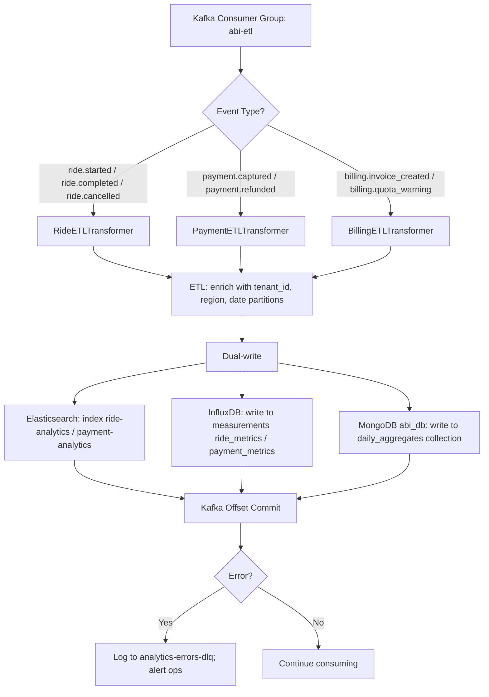
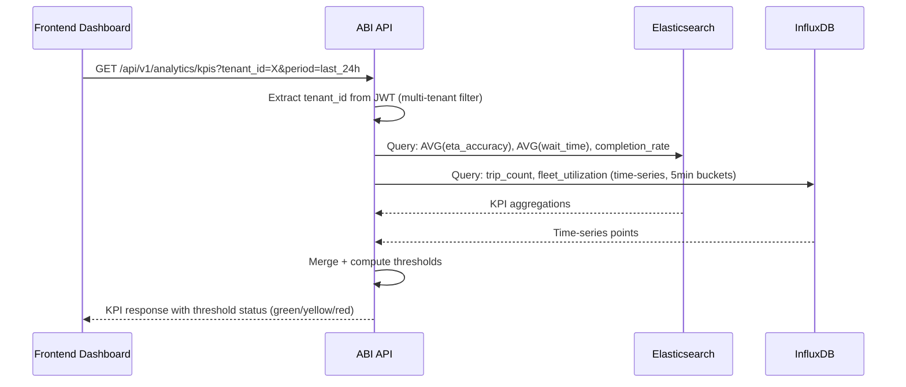

# Software Requirements Specification (SRS)
# ABI — Analytics & Business Intelligence Service

**Module**: ABI — Analytics & Business Intelligence Service  
**Parent Work Package**: WP-TBD (to be assigned in MASTER_PLAN)  
**Source**: Derived from `PRD.md` §4.7, §5, §8 and `ARCHITECTURE_SPEC.md` §11  
**Technology**: Java 17+ / Spring Boot 3.x  
**Database**: Elasticsearch (analytics) + InfluxDB (time-series) + MongoDB (`abi_db`) + MinIO (reports)  
**Cache**: None (query results cached internally in Elasticsearch)  
**Events**: Kafka (consumer: `ride-events`, `payment-events`, `billing-events`)  
**Version**: 1.0.0 | **Date**: 2026-03-06  

---

## 1. Introduction

ABI is the data intelligence backbone of the platform. It provides real-time and historical analytics for fleet operators, business managers, and regulators. The service implements an ETL pipeline — consuming events from Kafka, transforming them, and storing them in multiple stores optimized for different query patterns. Reports are generated on-demand or on schedule and exported to MinIO as PDF or CSV.

### 1.1 Scope

| In Scope | Out of Scope |
|----------|-------------|
| Real-time KPI dashboards (ETA, Completion Rate, Wait Time, Fleet Utilization) | Payment processing |
| Demand heatmaps via Elasticsearch geo-aggregations | Fare computation |
| Revenue analytics (gross revenue, commission, net payouts) | Event production (done by source services) |
| ETL pipeline: Kafka → Transform → ES + InfluxDB + MongoDB | User authentication |
| Scheduled reports (daily, weekly, monthly) | |
| On-demand report generation (PDF, CSV) | |
| Regulatory compliance reporting | |
| Trend analysis and demand forecasting | |

---

## 2. Functional Flow Diagrams

### 2.1 ETL Pipeline



### 2.2 KPI Dashboard Query



### 2.3 Report Generation Flow

```mermaid
flowchart TD
    A[Trigger: Manual request or Scheduled Job] --> B[ReportScheduler identifies report spec]
    B --> C[QueryBuilder builds Elasticsearch DSL + InfluxDB Flux]
    C --> D[Execute queries in parallel]
    D --> E[DataAggregator merges results]
    E --> F{Format requested?}
    F -->|PDF| G[JasperReports engine: render PDF]
    F -->|CSV| H[Apache Commons CSV: serialize]
    G & H --> I[Upload to MinIO: {tenant_id}/reports/{type}/{date}.{pdf|csv}]
    I --> J[INSERT report_jobs: status=completed, minio_key=...]
    J --> K{Triggered by?}
    K -->|Scheduled| L[Publish report.ready event to Kafka → NCS sends email]
    K -->|Manual| M[API response: download URL with presigned link]
```

---

## 3. Detailed Requirement Specifications

### 3.1 Feature: Real-Time KPI Dashboard (FR-ABI-001, FR-ABI-002)

**Description**: Provide near real-time KPIs with threshold alerting for operational monitoring.

#### 3.1.1 KPI Definitions and Thresholds

| KPI | Description | Green Threshold | Yellow | Red |
|-----|-------------|----------------|--------|-----|
| ETA Accuracy | Diff between predicted and actual pickup time | < 2 min avg | 2–5 min | > 5 min |
| Trip Completion Rate | Completed / (Completed + Cancelled) | ≥ 95% | 90–95% | < 90% |
| Average Wait Time | Booking to vehicle arrival | < 5 min | 5–8 min | > 8 min |
| Fleet Utilization | Active trips / Available vehicles | ≥ 70% | 50–70% | < 50% |
| Safety Intervention Rate | Safety stops per 1,000 trips | < 1 / 1,000 | 1–3 / 1,000 | > 3 / 1,000 |

**Update frequency**: InfluxDB writes every event → dashboard refresh every 30 seconds.

#### 3.1.2 API: KPI Query

`GET /api/v1/analytics/kpis`

**Query parameters**:
| Param | Type | Validation | Description |
|-------|------|-----------|-------------|
| `tenant_id` | string | Required (auto-extracted from JWT; admin can override) | Tenant scope |
| `period` | enum | `last_1h|last_24h|last_7d|last_30d|custom` | Time window |
| `start_date` | ISO8601 | Required if period=custom | |
| `end_date` | ISO8601 | Required if period=custom; max range 1 year | |
| `vehicle_type` | enum | Optional: `sedan|suv|van` | Filter by vehicle type |
| `region_code` | string | Optional; max 50 chars | Geographic filter |

**Response (HTTP 200)**:
```json
{
  "tenant_id": "string",
  "period": "string",
  "computed_at": "ISO8601",
  "kpis": {
    "eta_accuracy_avg_minutes": 1.7,
    "eta_accuracy_status": "green",
    "completion_rate_pct": 97.3,
    "completion_rate_status": "green",
    "avg_wait_time_minutes": 4.2,
    "wait_time_status": "green",
    "fleet_utilization_pct": 72.1,
    "fleet_utilization_status": "green",
    "safety_intervention_rate_per_1000": 0.4,
    "safety_status": "green"
  },
  "trend": {
    "completion_rate_delta_pct": 1.2,
    "wait_time_delta_minutes": -0.3
  }
}
```

**Error codes**:
| Code | HTTP | Condition |
|------|------|-----------|
| `INVALID_PERIOD` | 400 | `period=custom` without `start_date`/`end_date` |
| `DATE_RANGE_TOO_LARGE` | 400 | Range > 1 year |
| `TENANT_NOT_FOUND` | 404 | Tenant ID not in TMS |
| `ELASTICSEARCH_UNAVAILABLE` | 503 | ES cluster unreachable |

---

### 3.2 Feature: Demand Heatmap (FR-ABI-010)

**Description**: Geographic visualization of trip demand using Elasticsearch geo-aggregations.

#### 3.2.1 Geo-Aggregation Implementation

Elasticsearch index: `ride-analytics`
Geo-field: `pickup_location: { type: "geo_point" }`

Query type: `geotile_grid` aggregation (Elasticsearch 8.x) with precision levels:
- Zoom 10 (city level): `precision = 6`
- Zoom 13 (neighborhood): `precision = 8`
- Zoom 15 (block level): `precision = 10`

**Response contains**: Grid cells with trip count and centroid coordinates.

#### 3.2.2 API: Heatmap Data

`GET /api/v1/analytics/heatmap`

| Param | Type | Validation |
|-------|------|-----------|
| `tenant_id` | string | Auto from JWT |
| `period` | enum | `last_1h|last_24h|last_7d` |
| `bbox` | string | `{sw_lat},{sw_lng},{ne_lat},{ne_lng}` — 4 floats, comma-separated |
| `precision` | int | 1–12; default 8 |

**Response (HTTP 200)**:
```json
{
  "period": "last_24h",
  "bbox": "-10.0,-10.0,10.0,10.0",
  "cells": [
    { "key": "6/12/23", "doc_count": 342, "center_lat": 10.77, "center_lng": 106.69 }
  ],
  "max_count": 342
}
```

---

### 3.3 Feature: Revenue Analytics (FR-ABI-020)

**Description**: Financial analytics showing gross revenue, platform commission, net payouts, and trends.

#### 3.3.1 Revenue Metrics

| Metric | Source | Calculation |
|--------|--------|-------------|
| Gross Revenue | `payment-events` (captured amounts) | SUM of captured amounts |
| Platform Commission | `payment-events` (commission_amount field) | SUM of commission_amount |
| Net Payouts to Drivers | Gross - Commission | Computed |
| Refund Rate | Refunded amount / Gross Revenue | percentage |
| Average Transaction Value | Gross Revenue / Transaction Count | computed |

#### 3.3.2 Revenue Report API

`GET /api/v1/analytics/revenue`

| Param | Type | Validation |
|-------|------|-----------|
| `tenant_id` | string | Auto from JWT |
| `period` | enum | `last_7d|last_30d|last_90d|custom` |
| `group_by` | enum | `day|week|month` |
| `currency` | string | ISO 4217; default `VND` |

**Response**:
```json
{
  "currency": "VND",
  "total_gross_revenue": 1250000000,
  "total_commission": 125000000,
  "total_net_payouts": 1125000000,
  "refund_rate_pct": 2.1,
  "avg_transaction_value": 85000,
  "time_series": [
    { "date": "2026-03-01", "gross": 50000000, "commission": 5000000 }
  ]
}
```

---

### 3.4 Feature: ETL Pipeline (FR-ABI-030, FR-ABI-031)

**Description**: Extract, transform, and load events from Kafka into analytics stores.

#### 3.4.1 Ride Event Transform (RideETLTransformer)

Input Kafka topic: `ride-events`
Relevant event types: `ride.started`, `ride.completed`, `ride.cancelled`, `ride.safety_stop`

**Transform Logic for `ride.completed`**:
```
output = {
  trip_id: event.trip_id,
  tenant_id: event.tenant_id,              // BL-001: Always present
  driver_id: event.driver_id,
  rider_id: event.rider_id,
  vehicle_id: event.vehicle_id,
  pickup_location: { lat: event.pickup_lat, lon: event.pickup_lng },
  dropoff_location: { lat: event.dropoff_lat, lon: event.dropoff_lng },
  distance_km: event.distance_km,
  duration_minutes: event.duration_minutes,
  final_fare_vnd: event.final_fare,
  eta_predicted_minutes: event.eta_predicted,
  eta_actual_minutes: (event.pickup_actual_ts - event.booking_ts).toMinutes(),
  eta_accuracy_minutes: |eta_actual - eta_predicted|,
  wait_time_minutes: (event.pickup_actual_ts - event.booking_ts).toMinutes(),
  completed_at: event.completed_at,
  date_partition: event.completed_at formatted as "YYYY-MM-DD",
  region_code: GeocodingService.reverseGeocode(pickup_location)
}
```

**Elasticsearch index target**: `ride-analytics` (index lifecycle: hot 7d, warm 30d, cold 1yr)

**InfluxDB measurement**: `ride_metrics`
```
measurement: ride_metrics
tags: tenant_id, vehicle_type, region_code, status
fields: fare_vnd, distance_km, wait_time_minutes, eta_accuracy_minutes, duration_minutes
timestamp: event.completed_at
```

**MongoDB collection**: `daily_aggregates`
```json
{
  "date": "2026-03-01",
  "tenant_id": "string",
  "region_code": "string",
  "metrics": {
    "total_trips": 1250,
    "completed_trips": 1188,
    "cancelled_trips": 62,
    "total_revenue_vnd": 106200000,
    "avg_wait_minutes": 4.2,
    "avg_eta_accuracy_minutes": 1.7,
    "fleet_utilization_pct": 72.1
  }
}
```

---

### 3.5 Feature: Report Generation (FR-ABI-040, FR-ABI-041)

**Description**: Generate downloadable reports in PDF and CSV formats.

#### 3.5.1 Report Types

| Report Type | Frequency | Scope | Format |
|------------|-----------|-------|--------|
| Operations Summary | Daily | Trip KPIs, completion rate, safety | PDF + CSV |
| Revenue Report | Weekly | Revenue, commission, payouts, refunds | PDF |
| Fleet Performance | Weekly | Utilization, vehicle-level stats | CSV |
| Demand Analysis | Monthly | Heatmap, peak hours, region breakdown | PDF |
| Regulatory Compliance | Monthly | Safety incidents, complaint resolution | PDF |
| Custom Ad-hoc | On-demand | Any metric, any period | PDF or CSV |

#### 3.5.2 Report Jobs Schema (MongoDB `report_jobs`)

```json
{
  "job_id": "uuid-v4",
  "tenant_id": "string (indexed)",
  "report_type": "enum",
  "params": { "period": "...", "group_by": "..." },
  "status": "enum[queued|running|completed|failed]",
  "format": "enum[pdf|csv]",
  "minio_key": "string (path to file in MinIO)",
  "presigned_url": "string (expires 1h)",
  "created_by": "string",
  "created_at": "ISODate",
  "completed_at": "ISODate",
  "error_message": "string (on failure)"
}
```

#### 3.5.3 Scheduled Report Delivery

- **Daily reports**: Triggered at 01:00 AM tenant timezone (CRON: tenant-specific)
- **Weekly reports**: Monday 01:00 AM
- **Monthly reports**: 1st of month 01:00 AM
- On completion: Publish `report.ready` event to Kafka → NCS sends email with download link.
- Presigned MinIO URL in email: expires 7 days.

#### 3.5.4 API: Report Generation

`POST /api/v1/analytics/reports`

Request body:
```json
{
  "report_type": "operations_summary|revenue|fleet_performance|demand|compliance|custom",
  "period": "last_7d|last_30d|custom",
  "start_date": "ISO8601",
  "end_date": "ISO8601",
  "format": "pdf|csv",
  "filters": {
    "vehicle_type": "sedan|suv|van",
    "region_code": "string"
  }
}
```

**Validation**:
| Field | Rule | Error |
|-------|------|-------|
| `report_type` | Must be in enum | HTTP 400 `INVALID_REPORT_TYPE` |
| `period=custom` | `start_date` and `end_date` required | HTTP 400 `MISSING_DATE_RANGE` |
| Date range | Max 1 year | HTTP 400 `DATE_RANGE_TOO_LARGE` |
| `format` | `pdf` or `csv` only | HTTP 400 `INVALID_FORMAT` |

**Response (HTTP 202 Accepted)**:
```json
{
  "job_id": "string",
  "status": "queued",
  "estimated_wait_seconds": 30
}
```

**Retrieve result**: `GET /api/v1/analytics/reports/{job_id}`

```json
{
  "job_id": "string",
  "status": "completed",
  "download_url": "https://minio.vnpt-av.com/presigned/...",
  "expires_at": "ISO8601"
}
```

---

## 4. Data Model

### 4.1 Elasticsearch Indices

| Index | Fields | Retention |
|-------|--------|-----------|
| `ride-analytics` | trip_id, tenant_id, status, pickup_location(geo), dropoff_location(geo), fare, distance, duration, wait_time, eta_accuracy, completed_at | 7d hot, 30d warm, 1y cold |
| `payment-analytics` | payment_id, tenant_id, amount, commission, gateway, status, captured_at | 7d hot, 30d warm, 1y cold |
| `billing-analytics` | invoice_id, tenant_id, total, status, issued_at | 30d hot, 1y warm |

### 4.2 InfluxDB Measurements

| Measurement | Tags | Fields |
|-------------|------|--------|
| `ride_metrics` | tenant_id, vehicle_type, region_code, status | fare_vnd, distance_km, wait_minutes, eta_accuracy_min |
| `payment_metrics` | tenant_id, gateway, currency | amount, commission, processing_time_ms |
| `system_kpis` | tenant_id, kpi_name | value (float) |

### 4.3 MongoDB (abi_db)

| Collection | Purpose |
|-----------|---------|
| `daily_aggregates` | Pre-computed daily roll-ups per tenant/region |
| `report_jobs` | Report generation queue and status |
| `etl_checkpoints` | Kafka consumer offset checkpointing |

---

## 5. Kafka Consumers

| Topic | Consumer Group | Transformer |
|-------|---------------|-------------|
| `ride-events` | `abi-etl` | `RideETLTransformer` |
| `payment-events` | `abi-etl` | `PaymentETLTransformer` |
| `billing-events` | `abi-etl` | `BillingETLTransformer` |

**Consumer configuration**:
- `max.poll.records = 500`
- `enable.auto.commit = false`
- Manual commit after successful dual-write to ES + InfluxDB
- Error handling: log and skip individual records; publish to `analytics-errors-dlq` after 3 failures

---

## 6. Non-Functional Requirements

| NFR | Requirement |
|-----|-------------|
| KPI dashboard latency | P95 < 500ms (ES query) |
| Heatmap query | P95 < 1 second (with geo-aggregation) |
| Kafka consumer lag | < 30 seconds (95th percentile) |
| ETL throughput | ≥ 10,000 events/second |
| Report generation | < 60 seconds for 30-day report |
| Elasticsearch availability | 99.9% (3-node cluster) |
| Data retention | Raw events: 1 year; Aggregates: 5 years |

---

## 7. Acceptance Criteria

| # | Criterion | Test Type |
|---|-----------|-----------|
| AC-ABI-001 | KPI dashboard returns correct ETA accuracy and completion rate | Integration test |
| AC-ABI-002 | Heatmap returns non-empty cells for known trip regions | Integration test |
| AC-ABI-003 | ETL pipeline writes to both Elasticsearch AND InfluxDB for each event | Integration test |
| AC-ABI-004 | Daily aggregate correctly computed for 1,000 synthetic trips | Unit test |
| AC-ABI-005 | Report generation (PDF) completes within 60 seconds | Performance test |
| AC-ABI-006 | Report file available in MinIO with presigned URL | Integration test |
| AC-ABI-007 | Scheduled daily report email sent within 5 minutes of 01:00 AM | E2E test |
| AC-ABI-008 | KPI threshold statuses (green/yellow/red) match defined thresholds | Unit test |
| AC-ABI-009 | Multi-tenant data isolation: tenant A cannot see tenant B's data | Security test (BL-001) |
| AC-ABI-010 | Consumer lag stays < 30 seconds under 10,000 events/sec load | Load test |

---

*SRS v1.0.0 — ABI Analytics & Business Intelligence Service | VNPT AV Platform Services Provider Group*
