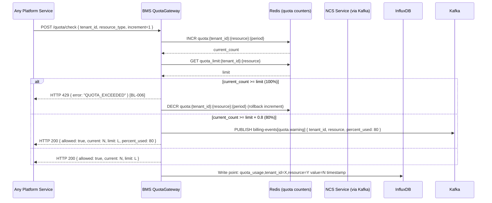
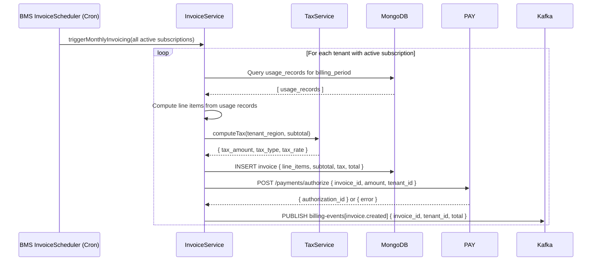
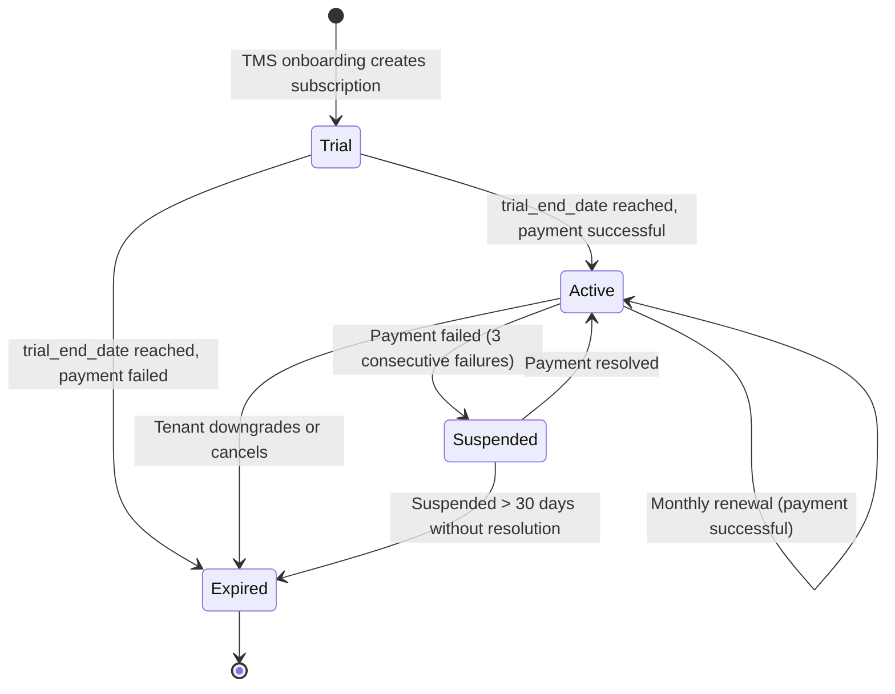

# Software Requirements Specification (SRS)
# BMS — Billing & Subscription Management (Quản Lý Thanh Toán & Gói Dịch Vụ)

**Module**: BMS — Billing & Subscription Management  
**Parent Work Package**: WP-TBD (to be assigned in MASTER_PLAN)  
**Source**: Derived from `PRD.md` §4.3, §4.9 and `ARCHITECTURE_SPEC.md` §7  
**Technology**: Java 17+ / Spring Boot 3.x  
**Database**: MongoDB (`bms_db`) + InfluxDB | Cache: Redis | Events: Kafka  
**Version**: 1.0.0 | **Date**: 2026-03-06  

---

## 1. Introduction

BMS manages the commercial relationship between the platform and enterprise tenants. It controls subscription plan lifecycle, measures resource usage in real-time, enforces quota limits, generates itemized invoices, calculates tax, manages credits, and provides cost analytics.

### 1.1 Scope

| In Scope | Out of Scope |
|----------|-------------|
| Subscription plan lifecycle management | Payment processing (delegated to PAY) |
| API/ride/km/storage usage metering | Tenant provisioning (delegated to TMS) |
| Quota enforcement (< 10ms) | Notification sending (delegated to NCS) |
| Invoice generation with line items | UI/mobile apps |
| Tax calculation (VAT/GST by region) | Platform fee computation (delegated to FPE) |
| Credits system (prepaid, promo, trial) | |
| Cost explorer dashboard API | |

---

## 2. Functional Flow Diagrams

### 2.1 Quota Enforcement Flow (FR-BMS-010, FR-BMS-011, FR-BMS-012)



### 2.2 Invoice Generation Flow (FR-BMS-020, FR-BMS-021, FR-BMS-022)



### 2.3 Subscription Lifecycle



---

## 3. Detailed Requirement Specifications

### 3.1 Feature: Subscription Plan Management (FR-BMS-001, FR-BMS-002)

**Description**: Manage lifecycle of subscription plans for enterprise tenants.

#### 3.1.1 Subscription Plan Schema

```json
{
  "plan_id": "uuid-v4",
  "plan_name": "enum[Starter|Growth|Enterprise|Custom]",
  "billing_cycle": "enum[monthly|annual]",
  "price_monthly": "Decimal128",
  "price_annual": "Decimal128",
  "currency": "string",
  "trial_duration_days": "int32 (0 = no trial)",
  "feature_flags": ["string"],
  "quota": {
    "api_calls_per_month": "int64",
    "rides_per_month": "int64",
    "storage_gb": "int32",
    "max_vehicles": "int32",
    "max_users": "int32"
  },
  "status": "enum[active|inactive]"
}
```

#### 3.1.2 Default Plan Tiers

| Plan | Monthly Price | API Calls/mo | Rides/mo | Storage | Max Vehicles |
|------|-------------|-------------|---------|---------|-------------|
| Starter | $99 | 100,000 | 1,000 | 10 GB | 10 |
| Growth | $499 | 1,000,000 | 20,000 | 100 GB | 100 |
| Enterprise | Custom | Unlimited | Unlimited | Custom | Custom |

#### 3.1.3 Subscription Entity (per tenant)

```json
{
  "subscription_id": "uuid-v4",
  "tenant_id": "string (unique index)",
  "plan_id": "string",
  "plan_name": "string",
  "status": "enum[trial|active|suspended|expired]",
  "billing_cycle": "enum[monthly|annual]",
  "trial_ends_at": "ISODate",
  "current_period_start": "ISODate",
  "current_period_end": "ISODate",
  "feature_flags": ["string"],
  "quota": { ... },
  "credits_balance": "Decimal128",
  "consecutive_payment_failures": "int32",
  "created_at": "ISODate",
  "updated_at": "ISODate"
}
```

#### 3.1.4 Business Logic

1. Trial → Active transition: triggered by `InvoiceScheduler` at `trial_ends_at`. If PAY returns error → transition to `Expired`.
2. Payment failure: after 3 consecutive PAY failures → transition to `Suspended`; publish `billing-events[subscription.suspended]`.
3. Feature Flags: loaded from plan definition; stored in subscription; cached in Redis key `tenant_feature_flags:{tenant_id}` TTL 5 minutes.
4. **BL-010**: Tenant-level feature flag overrides platform default. Merge logic: `effective_flags = platform_flags.merge(tenant_flags, tenant_wins_on_conflict)`.

---

### 3.2 Feature: Usage Metering (FR-BMS-010, FR-BMS-011, FR-BMS-012, FR-BMS-013)

**Description**: BMS measures four resource dimensions per tenant. Quota checks must complete in < 10ms.

#### 3.2.1 Metered Resources

| Resource Type | Unit | Measurement Trigger | Kafka Event Source |
|--------------|------|-------------------|-------------------|
| `api_calls` | count | Every API Gateway request | Kong telemetry → BMS |
| `rides` | count | `ride.completed` event | `ride-events` |
| `distance_km` | km | `ride.completed` event | `ride-events` |
| `storage_gb` | GB | File upload events | TMS/MKP → BMS |

#### 3.2.2 Metering Implementation

```
Redis Atomic Operations:
  INCR quota:{tenant_id}:api_calls:{YYYY-MM} → current_count (< 1ms)
  INCR quota:{tenant_id}:rides:{YYYY-MM} → current_count
  INCRBYFLOAT quota:{tenant_id}:distance_km:{YYYY-MM} → current_total
  SET quota_limit:{tenant_id}:api_calls → limit (refreshed on subscription change)

InfluxDB (async, non-blocking):
  Measurement: quota_usage
  Tags: tenant_id, resource_type
  Field: value (current count/amount)
  Timestamp: now()
  Written via async Reactor pipeline after Redis INCR

MongoDB (daily aggregation):
  usage_records collection: { tenant_id, period, resource_type, daily_counts[] }
  Updated via scheduled job (midnight UTC)
```

#### 3.2.3 Quota Enforcement Rules (BL-006)

| Threshold | Action | Response |
|-----------|--------|---------|
| `current >= limit × 0.8` | Warning via NCS | HTTP 200 + publish `quota.warning` event |
| `current >= limit × 1.0` | Block request | HTTP 429 `QUOTA_EXCEEDED` |
| `current < limit × 0.8` | Allow | HTTP 200 |

**Performance Requirement**: Quota check (Redis INCR + compare) MUST complete in < 10ms P99 (FR-BMS-012).

---

### 3.3 Feature: Invoice Generation (FR-BMS-020, FR-BMS-021)

**Description**: Automated invoice generation at end of each billing period with itemized line items and tax.

#### 3.3.1 Invoice MongoDB Schema

```json
{
  "invoice_id": "uuid-v4",
  "tenant_id": "string (indexed)",
  "subscription_id": "string",
  "billing_period": {
    "start": "ISODate",
    "end": "ISODate"
  },
  "line_items": [
    {
      "description": "string (e.g., 'API Calls — March 2026')",
      "quantity": "double",
      "unit": "string (calls|rides|km|GB)",
      "unit_price": "Decimal128",
      "amount": "Decimal128"
    }
  ],
  "subtotal": "Decimal128",
  "tax_type": "enum[VAT|GST|none]",
  "tax_rate": "double",
  "tax_amount": "Decimal128",
  "total_amount": "Decimal128",
  "currency": "string",
  "status": "enum[draft|pending|paid|overdue|cancelled]",
  "payment_transaction_id": "string (null until paid)",
  "due_date": "ISODate",
  "pdf_url": "string (MinIO URL, null until generated)",
  "created_at": "ISODate",
  "paid_at": "ISODate"
}
```

#### 3.3.2 Tax Calculation Rules (FR-BMS-021)

| Region | Tax Type | Rate | Threshold |
|--------|---------|------|-----------|
| Vietnam | VAT | 10% | All taxable services |
| Singapore | GST | 9% | Revenue > SGD 1M/year |
| USA | None | 0% | SaaS exemption (varies by state) |
| EU | VAT | Local rate (15-27%) | B2B with valid VAT number: 0% (reverse charge) |

**Implementation**: `TaxCalculationService.compute(tenant_region, subtotal, tenant_vat_number?)`
- Tax rules stored in MongoDB collection `tax_rules` keyed by `country_code`.
- If `tenant.vat_number` is valid EU VAT → apply reverse charge (tax = 0).

#### 3.3.3 Invoice Generation Trigger

- **Cron schedule**: First day of each month, 00:00 UTC.
- **Scope**: All subscriptions with `status = active` AND `current_period_end <= now`.
- **Retry**: If PAY returns error on authorization → retry 3 times (exponential backoff 5min, 15min, 1h). After 3 failures → invoice stays `pending`; increment `consecutive_payment_failures`.

---

### 3.4 Feature: Cost Explorer & Credit System (FR-BMS-030, FR-BMS-031)

**Description**: Provide spending dashboard and manage prepaid/promotional/trial credits.

#### 3.4.1 Cost Explorer API

- **Endpoint**: `GET /api/v1/cost-explorer?from=&to=&breakdown=service|resource`
- **Data Source**: InfluxDB aggregation for time-series; MongoDB for historical invoices
- **Response**: `{ total_spend: X, forecast_this_month: Y, breakdown: [{ dimension: Z, amount: A }], budget_alerts: [...] }`

**Forecast Algorithm**: Linear regression on last 3 months of usage data.

**Budget Alerts**: If `forecast_this_month > tenant.monthly_budget_alert_threshold` → publish `billing-events[budget.forecast_alert]`.

#### 3.4.2 Credit Types & Rules

| Credit Type | Source | Expiry | Usage Priority |
|------------|--------|--------|---------------|
| `trial` | Auto-assigned on trial subscription | `trial_ends_at` | Used last |
| `promotional` | Platform Admin grant | `promo_expiry_date` | Used second |
| `prepaid` | Purchased by tenant | No expiry | Used first |

**Credit Application Order**: prepaid → promotional → trial → charge invoice.

**Credit Schema**:
```json
{
  "credit_id": "uuid-v4",
  "tenant_id": "string (indexed)",
  "type": "enum[trial|promotional|prepaid]",
  "amount_original": "Decimal128",
  "amount_remaining": "Decimal128",
  "currency": "string",
  "issued_by": "string (admin user id or 'system')",
  "expires_at": "ISODate (null for prepaid)",
  "issued_at": "ISODate",
  "consumed_at": "ISODate (null until depleted)"
}
```

**Atomic Deduction**: Credit deduction uses MongoDB transactions (find credit with `amount_remaining > 0` → decrement in transaction → create usage record).

---

## 4. API Contracts (Complete)

### 4.1 Subscription APIs

| Method | Endpoint | Auth | Description |
|--------|----------|------|-------------|
| `GET` | `/api/v1/subscriptions` | JWT (Tenant Admin) | Get active subscription |
| `POST` | `/api/v1/subscriptions` | JWT (internal — TMS) | Create subscription on onboarding |
| `PUT` | `/api/v1/subscriptions/{id}/plan` | JWT (Platform Admin) | Upgrade/downgrade plan |
| `POST` | `/api/v1/subscriptions/{id}/cancel` | JWT (Platform Admin) | Cancel subscription |

**POST /api/v1/subscriptions Request**:
```json
{
  "tenant_id": "string",
  "plan_id": "string",
  "billing_cycle": "monthly",
  "trial_duration_days": 14
}
```

**Response 201**: `{ subscription_id, status: "trial", trial_ends_at, quota, feature_flags }`

### 4.2 Usage & Quota APIs

| Method | Endpoint | Auth | Description |
|--------|----------|------|-------------|
| `GET` | `/api/v1/usage` | JWT (Tenant Admin) | Usage metrics for period |
| `POST` | `/api/v1/quota/check` | JWT (service-account) | Real-time quota check (< 10ms) |
| `GET` | `/api/v1/quota/status` | JWT (Tenant Admin) | Current quota usage percentages |

**GET /api/v1/usage Response**:
```json
{
  "tenant_id": "...",
  "period": { "start": "2026-03-01", "end": "2026-03-31" },
  "usage": {
    "api_calls": { "used": 45000, "limit": 100000, "percent": 45 },
    "rides": { "used": 320, "limit": 1000, "percent": 32 },
    "storage_gb": { "used": 3.2, "limit": 10, "percent": 32 }
  }
}
```

### 4.3 Invoice APIs

| Method | Endpoint | Auth | Description |
|--------|----------|------|-------------|
| `GET` | `/api/v1/invoices` | JWT (Tenant Admin) | List invoices |
| `GET` | `/api/v1/invoices/{id}` | JWT (Tenant Admin) | Get invoice details |
| `GET` | `/api/v1/invoices/{id}/pdf` | JWT (Tenant Admin) | Download PDF (MinIO redirect) |
| `POST` | `/api/v1/invoices/{id}/retry-payment` | JWT (Platform Admin) | Manually retry payment |

### 4.4 Credits API

| Method | Endpoint | Auth | Description |
|--------|----------|------|-------------|
| `GET` | `/api/v1/credits` | JWT (Tenant Admin) | List credits and balance |
| `POST` | `/api/v1/credits` | JWT (Platform Admin) | Issue new credit |

---

## 5. Data Model

### 5.1 MongoDB Collections (bms_db)

| Collection | Key Indexes | Description |
|-----------|-------------|-------------|
| `subscriptions` | `{ tenant_id: 1 }` unique | One subscription per tenant |
| `usage_records` | `{ tenant_id: 1, period: 1, resource_type: 1 }` | Daily aggregated usage |
| `invoices` | `{ tenant_id: 1, status: 1, created_at: -1 }` | Invoice history |
| `credits` | `{ tenant_id: 1, type: 1, expires_at: 1 }` | Credit balance tracking |
| `plans` | `{ plan_id: 1 }` unique | Available subscription plans |

### 5.2 InfluxDB Measurement: `quota_usage`

```
Measurement: quota_usage
Tags: tenant_id, resource_type (api_calls|rides|km|storage_gb)
Fields: value (double), limit (double), percent (double)
Retention policy: 90 days
```

---

## 6. Kafka Events

| Topic | Event Key | Payload | Consumers |
|-------|-----------|---------|-----------|
| `billing-events` | `invoice.created` | `invoice_id, tenant_id, total, due_date, timestamp` | NCS, ABI |
| `billing-events` | `subscription.created` | `subscription_id, tenant_id, plan_name, trial_ends_at` | ABI |
| `billing-events` | `subscription.suspended` | `subscription_id, tenant_id, reason, timestamp` | NCS, ABI |
| `billing-events` | `quota.warning` | `tenant_id, resource, percent_used, current, limit` | NCS |
| `billing-events` | `budget.forecast_alert` | `tenant_id, forecast_amount, budget_threshold` | NCS |
| `metering-events` | `usage.recorded` | `tenant_id, resource_type, value, period, timestamp` | ABI |

---

## 7. Non-Functional Requirements

| NFR | Requirement | Implementation |
|-----|-------------|----------------|
| Quota check latency | < 10ms P99 | Redis INCR atomic (no DB on hot path) |
| Invoice generation | < 5 min for 1000 tenants | Batch processing with thread pool |
| Metering accuracy | 100% — no lost increments | Redis INCR + async InfluxDB write |
| InfluxDB write latency | < 50ms (async) | Non-blocking Reactor pipeline |

---

## 8. Acceptance Criteria

| # | Criterion | Test Type |
|---|-----------|-----------|
| AC-BMS-001 | Quota check returns in < 10ms P99 using Redis INCR | Performance test |
| AC-BMS-002 | HTTP 429 returned exactly when quota reaches 100% | Integration test (BL-006) |
| AC-BMS-003 | `quota.warning` Kafka event published at 80% threshold | Integration test |
| AC-BMS-004 | Invoice generated with correct line items (api_calls, rides, storage) | Unit test |
| AC-BMS-005 | VAT 10% applied correctly for Vietnam region tenant | Unit test |
| AC-BMS-006 | Subscription transitions: trial → active → suspended → expired | Integration test |
| AC-BMS-007 | Credits applied in order: prepaid → promotional → trial | Unit test |
| AC-BMS-008 | Billing events published to Kafka for all state changes | Integration test |
| AC-BMS-009 | Usage metering increments correctly from Kafka ride.completed events | Integration test |
| AC-BMS-010 | Invoice PDF downloadable from MinIO URL | E2E test |

---

*SRS v1.0.0 — BMS Billing & Subscription Management | VNPT AV Platform Services Provider Group*
