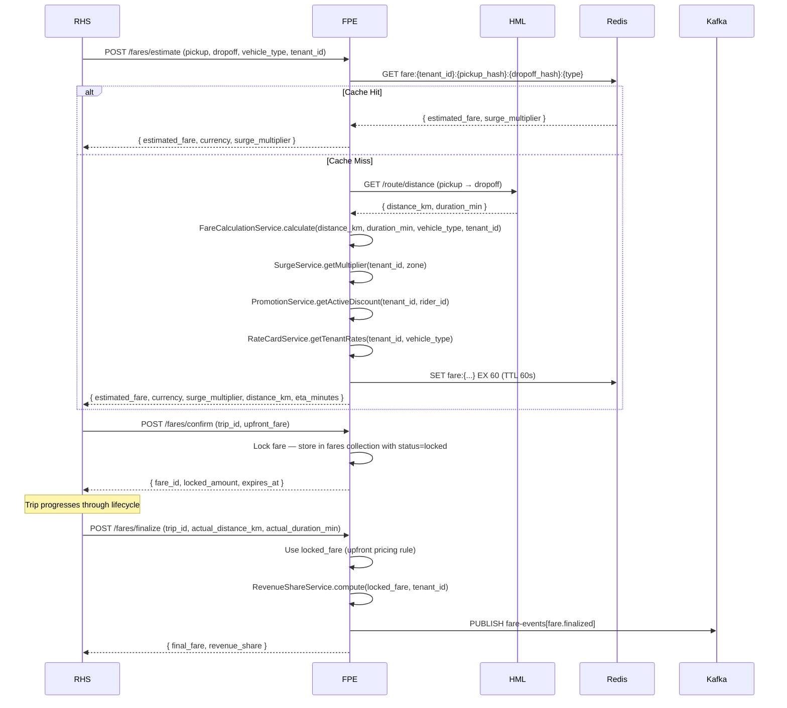
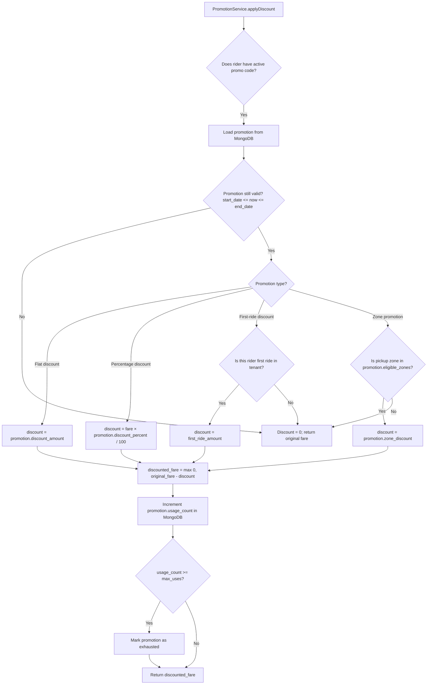

# Software Requirements Specification (SRS)
# FPE — Fare & Pricing Engine (Hệ Thống Định Giá & Cước Phí)

**Module**: FPE — Fare & Pricing Engine  
**Parent Work Package**: WP-TBD (to be assigned in MASTER_PLAN)  
**Source**: Derived from `PRD.md` §4.2, §4.9 and `ARCHITECTURE_SPEC.md` §6  
**Technology**: Java 17+ / Spring Boot 3.x  
**Database**: MongoDB (`fpe_db`) | Cache: Redis | Events: Kafka  
**Version**: 1.0.0 | **Date**: 2026-03-06  

---

## 1. Introduction

FPE is the pricing brain of the platform. It computes accurate fares before a trip begins (estimate), locks them at booking time (upfront pricing), finalizes them upon completion, and manages all pricing-related business logic including surge pricing, tenant rate cards, promotions, fare split, and revenue share.

### 1.1 Scope

| In Scope | Out of Scope |
|----------|-------------|
| Fare estimation (estimate API) | Route computation (delegated to HML) |
| Upfront pricing (locked fare) | Payment processing (delegated to PAY) |
| Surge pricing (1.0x–3.0x) | Subscription billing (delegated to BMS) |
| Enterprise rate cards | Mobile UI |
| Promotion/coupon management | Fleet routing optimization |
| Fare split for pooled rides | |
| Revenue share computation | |

### 1.2 User Personas

| Persona | Interaction |
|---------|-------------|
| **Rider** | Sees upfront fare before confirming booking |
| **Tenant Admin** | Configures rate cards, surge caps, promotion campaigns |
| **Platform Admin** | Creates promotions, views platform-wide revenue share |
| **RHS Service (internal)** | Calls estimate, confirm, and finalize fare APIs |

---

## 2. Functional Flow Diagrams

### 2.1 Fare Estimation & Locking Flow



### 2.2 Surge Pricing Flow

```mermaid
flowchart TD
    A[SurgeService.getMultiplier] --> B[Get demand data from Kafka consumer fare-demand topic]
    B --> C[Get supply data from VMS via gRPC]
    C --> D[Compute ratio: demand / supply per zone]
    D --> E{ratio > surge_threshold?}
    E -->|Yes| F[Compute multiplier = min ratio_factor, 3.0, tenant_surge_cap]
    E -->|No| G[multiplier = 1.0]
    F --> H[Cache multiplier: surge:{tenant_id}:{zone_id} TTL 30s]
    G --> H
    H --> I[Return multiplier to FareCalculationService]
```

### 2.3 Promotion Application Flow



---

## 3. Detailed Requirement Specifications

### 3.1 Feature: Fare Calculation (FR-FPE-001)

**Description**: Core fare calculation applying the formula: Base Fee + Distance Rate × km + Time Rate × minutes, then multiplied by surge and vehicle tier factor.

**User Story**: As a Rider, I want to see the exact fare before confirming my booking, so that I can make an informed decision.

#### 3.1.1 Fare Formula

```
Base Calculation:
  raw_fare = Base_Fee + (Distance_Rate × actual_km) + (Time_Rate × duration_min)

Apply tier:
  tiered_fare = raw_fare × Vehicle_Tier_Factor

Apply surge:
  surged_fare = tiered_fare × Surge_Multiplier
  where Surge_Multiplier ∈ [1.0, min(3.0, tenant_surge_cap)]   [BL-002]

Apply promotion:
  discounted_fare = max(minimum_fare, surged_fare - promotion_discount)

Add platform fee:
  final_estimated_fare = discounted_fare + (discounted_fare × platform_fee_percent)

Revenue share:
  platform_revenue = final_estimated_fare × platform_share_percent
  tenant_revenue = final_estimated_fare × (1 - platform_share_percent)
```

#### 3.1.2 Default Rate Card Values (Overrideable per Tenant)

| Parameter | Default Value | Type | Configurable |
|-----------|--------------|------|-------------|
| `base_fee` | 10,000 VND | Decimal128 | Yes (per tenant, per vehicle_type) |
| `distance_rate` | 5,000 VND/km | Decimal128 | Yes |
| `time_rate` | 300 VND/min | Decimal128 | Yes |
| `vehicle_tier_factor.standard` | 1.0 | double | Yes |
| `vehicle_tier_factor.premium` | 1.5 | double | Yes |
| `vehicle_tier_factor.accessible` | 1.0 | double | Yes |
| `platform_fee_percent` | 5% | double | Yes |
| `minimum_fare` | 20,000 VND | Decimal128 | Yes |

#### 3.1.3 Business Logic & Rules

1. **BL-001**: All rate card lookups MUST include `tenant_id` filter.
2. Distance and duration values come from HML Service REST call — FPE does NOT compute routes itself.
3. HML call timeout: 2 seconds. If HML is unavailable → HTTP 503 `ROUTE_SERVICE_UNAVAILABLE`.
4. All monetary values MUST use `Decimal128` to avoid floating-point precision errors.
5. `minimum_fare` is enforced: if calculated fare < minimum_fare → return minimum_fare.
6. Currency: stored per tenant config (default: "VND"); returned as ISO 4217 string.

#### 3.1.4 Edge Cases

| Scenario | Behavior |
|----------|---------|
| HML returns `distance_km = 0` | HTTP 422 `INVALID_ROUTE`: "Pickup and dropoff cannot be at the same location" |
| Tenant has no rate card configured | Use platform default rate card |
| Promotion discount > fare amount | `discounted_fare = minimum_fare` (cannot be negative) |
| Multiple promotions applicable | Apply only highest-value promotion |

---

### 3.2 Feature: Redis Cache for Fare Estimation (FR-FPE-003)

**Description**: Fare estimates MUST be cached in Redis to achieve < 200ms response time.

#### 3.2.1 Cache Key Design

```
Key: fare:{tenant_id}:{pickup_zone_hash}:{dropoff_zone_hash}:{vehicle_type}:{surge_bucket}
Value: JSON { estimated_fare, currency, surge_multiplier, distance_km, eta_minutes }
TTL: 60 seconds

surge_bucket: floor(current_surge × 10) / 10  // Quantize to 0.1 increments
pickup_zone_hash: MD5(round(lat, 3) + "," + round(lng, 3))   // 111m precision
```

**Cache Invalidation**: On tenant rate card update → delete `fare:{tenant_id}:*` from Redis.

#### 3.2.2 Cache-Aside Pattern

1. Check Redis for existing key.
2. **Cache Hit**: Return cached value immediately (target: < 20ms).
3. **Cache Miss**: Compute fare → store in Redis → return result (target: < 200ms total including HML call).

---

### 3.3 Feature: Upfront Pricing (FR-FPE-002)

**Description**: Fare is locked at booking time. The locked fare does NOT change regardless of actual route deviation.

#### 3.3.1 Business Logic

1. After `POST /fares/estimate`, RHS calls `POST /fares/confirm` with `trip_id` + `upfront_fare`.
2. FPE persists the fare with `status = locked`, `locked_fare = upfront_fare`.
3. At trip completion, FPE calls `POST /fares/finalize`. The `final_fare = locked_fare` (upfront pricing rule).
4. The platform absorbs variance between locked fare and actual route cost.
5. Exception: If actual distance > 150% of estimated distance → override to actual-based calculation (anti-fraud rule).

---

### 3.4 Feature: Surge Pricing (FR-FPE-010, FR-FPE-011, FR-FPE-012)

**Description**: Dynamic surge multiplier applied based on real-time demand/supply ratio.

#### 3.4.1 Surge Calculation

```
demand = count of trip requests in zone in last 10 minutes
supply = count of available vehicles in zone (from VMS gRPC)
ratio = demand / max(supply, 1)  // prevent division by zero

surge_multiplier:
  if ratio < 1.2:  multiplier = 1.0
  if ratio 1.2–1.5: multiplier = 1.2
  if ratio 1.5–2.0: multiplier = 1.5
  if ratio 2.0–2.5: multiplier = 2.0
  if ratio 2.5–3.0: multiplier = 2.5
  if ratio > 3.0:  multiplier = 3.0  (hard cap)

Apply tenant cap:
  final_multiplier = min(multiplier, tenant_config.surge_cap)  // BL-002
  default tenant_surge_cap = 3.0
```

#### 3.4.2 Demand Data Integration (FR-FPE-011)

- SurgeService consumes Kafka topic `fleet-demand` produced by Fleet Optimization Service.
- Event payload: `{ zone_id, demand_index, supply_index, timestamp }`
- SurgeService maintains in-memory map: `{ zone_id → surge_multiplier }` updated per event.
- If Kafka lag > 5 minutes (data stale) → fallback to last known surge value.

#### 3.4.3 Configurable Surge Cap (FR-FPE-012)

- `tenant_config.surge_cap` stored in TMS, cached in Redis key `tenant_config:{tenant_id}`.
- FPE reads cap from Redis (< 5ms); if cache miss → call TMS REST API.
- Cap range: 1.0 (no surge allowed) to 3.0 (maximum surge).

---

### 3.5 Feature: Enterprise Rate Cards (FR-FPE-020)

**Description**: Platform Admins can create custom rate cards for enterprise tenants.

#### 3.5.1 Rate Card Data Model

```json
{
  "rate_card_id": "uuid-v4",
  "tenant_id": "string",
  "name": "string (max 100 chars)",
  "type": "enum[flat_rate|volume_discount|monthly_cap|custom]",
  "vehicle_type": "string",
  "base_fee": "Decimal128",
  "distance_rate": "Decimal128",
  "time_rate": "Decimal128",
  "vehicle_tier_factor": "double",
  "platform_fee_percent": "double (0.0 – 100.0)",
  "minimum_fare": "Decimal128",
  "volume_discount_tiers": [
    { "min_rides": 100, "discount_percent": 5.0 },
    { "min_rides": 500, "discount_percent": 10.0 }
  ],
  "monthly_cap_amount": "Decimal128 (null if not applicable)",
  "currency": "string (ISO 4217)",
  "effective_from": "ISODate",
  "effective_to": "ISODate (null = indefinite)",
  "status": "enum[active|inactive|archived]",
  "created_by": "string",
  "created_at": "ISODate",
  "updated_at": "ISODate"
}
```

#### 3.5.2 API Operations

| Method | Endpoint | Auth | Description |
|--------|----------|------|-------------|
| `GET` | `/api/v1/rate-cards` | JWT (Tenant Admin) | List rate cards for tenant |
| `POST` | `/api/v1/rate-cards` | JWT (Platform Admin) | Create rate card |
| `PUT` | `/api/v1/rate-cards/{id}` | JWT (Platform Admin) | Update rate card |
| `DELETE` | `/api/v1/rate-cards/{id}` | JWT (Platform Admin) | Archive rate card (soft delete) |

**Validation**:
- `base_fee` ≥ 0 VND
- `distance_rate` ≥ 0 VND/km
- `platform_fee_percent` ∈ [0.0, 100.0]
- `effective_from` < `effective_to` (if to is specified)
- On update: new effective dates cannot overlap existing active rate card for same tenant + vehicle_type

---

### 3.6 Feature: Promotion Management (FR-FPE-030)

**Description**: CRUD for promotion campaigns including coupons, first-ride discounts, zone promotions, and referral credits.

#### 3.6.1 Promotion Types & Validation

| Type | Required Fields | Validation |
|------|----------------|------------|
| `coupon` | `code`, `discount_amount` or `discount_percent` | Code: alphanumeric, 4–20 chars, case-insensitive |
| `first_ride` | `discount_amount` | Applied only to rider's first completed trip in tenant |
| `zone_promotion` | `eligible_zones[]`, `discount_amount` or `discount_percent` | Zone IDs from HML |
| `referral_credit` | `credit_amount` | Credited to referrer's wallet after referred user completes first ride |

**Common Validation**:
- `start_date` < `end_date`
- `max_uses` ≥ 1 (set to null for unlimited)
- `discount_percent` ∈ [0.1, 100.0]
- `discount_amount` > 0
- Cannot activate promotion if `start_date` already passed

#### 3.6.2 Promotion MongoDB Schema

```json
{
  "promotion_id": "uuid-v4",
  "tenant_id": "string (indexed)",
  "type": "enum[coupon|first_ride|zone_promotion|referral_credit]",
  "code": "string (unique per tenant, uppercased, indexed)",
  "name": "string",
  "discount_type": "enum[flat|percentage]",
  "discount_amount": "Decimal128",
  "discount_percent": "double",
  "eligible_zones": ["string"],
  "max_uses": "int64 (null = unlimited)",
  "usage_count": "int64",
  "per_user_limit": "int32 (default 1)",
  "start_date": "ISODate",
  "end_date": "ISODate",
  "status": "enum[active|inactive|exhausted|expired]",
  "created_at": "ISODate"
}
```

---

### 3.7 Feature: Fare Split for Pooled Rides (FR-FPE-040)

**Description**: For pooled rides, fare is split proportionally between passengers based on distance fraction.

#### 3.7.1 Split Algorithm

```
total_route_km = sum of all stops in pooled route

For each passenger i:
  passenger_km[i] = distance from their pickup to their dropoff (along the shared route)
  fare_fraction[i] = passenger_km[i] / total_route_km
  passenger_fare[i] = max(minimum_fare, total_pooled_fare × fare_fraction[i])

Adjustment: If sum(passenger_fare[i]) != total_pooled_fare due to rounding:
  Add/subtract remainder from highest-fare passenger
```

**API**: `POST /api/v1/fares/split`  
**Request**: `{ pool_group_id, trip_ids: [A, B], route_segments: [{trip_id, distance_km}] }`  
**Response**: `{ fares: [{ trip_id, fare, currency }] }`

---

### 3.8 Feature: Revenue Share (FR-FPE-041)

**Description**: FPE computes how each finalized fare is split between the platform (VNPT) and the tenant.

#### 3.8.1 Revenue Share Computation

```
From rate card:
  platform_share_percent = rate_card.platform_fee_percent (default 5%)
  tenant_share_percent = 100% - platform_share_percent

Platform revenue = final_fare × platform_share_percent / 100
Tenant revenue = final_fare - platform_revenue

Stored in fare record:
  platform_revenue_share: Decimal128
  tenant_revenue_share: Decimal128
```

**Published to Kafka**: `fare-events[fare.finalized]` includes `{ platform_revenue, tenant_revenue, tenant_id }` for PAY payout scheduling.

---

## 4. API Contracts (Complete)

### 4.1 POST /api/v1/fares/estimate

**Auth**: JWT Bearer (internal — called by RHS; also available to Rider for quote)

**Request**:
```json
{
  "tenant_id": "string",
  "pickup": { "lat": -6.2088, "lng": 106.8456, "zone_id": "ZONE-JKT-01" },
  "dropoff": { "lat": -6.1751, "lng": 106.8272 },
  "vehicle_type": "standard",
  "scheduled_at": null,
  "rider_id": "optional — for promotion check",
  "promo_code": "FIRST10"
}
```

**Response 200**:
```json
{
  "estimated_fare": 45000,
  "currency": "VND",
  "surge_multiplier": 1.2,
  "distance_km": 3.7,
  "eta_minutes": 8,
  "fare_breakdown": {
    "base_fee": 10000,
    "distance_charge": 18500,
    "time_charge": 2400,
    "surge_adjustment": 6180,
    "promotion_discount": 4500,
    "platform_fee": 2420
  },
  "promo_applied": "FIRST10",
  "cache_hit": true,
  "expires_in_seconds": 60
}
```

**Error Responses**:
| HTTP | Error Code | Scenario |
|------|-----------|---------|
| 400 | `INVALID_COORDINATES` | Invalid lat/lng values |
| 400 | `INVALID_VEHICLE_TYPE` | Unknown vehicle type |
| 422 | `INVALID_ROUTE` | Distance = 0 (same location) |
| 503 | `ROUTE_SERVICE_UNAVAILABLE` | HML timeout |

### 4.2 POST /api/v1/fares/confirm

**Auth**: JWT (internal, service-account role)

**Request**: `{ "trip_id": "uuid", "upfront_fare": 45000, "currency": "VND" }`

**Response 201**:
```json
{
  "fare_id": "uuid-v4",
  "trip_id": "uuid",
  "locked_amount": 45000,
  "currency": "VND",
  "status": "locked",
  "expires_at": "2026-03-06T05:00:00Z"
}
```

### 4.3 POST /api/v1/fares/finalize

**Auth**: JWT (internal, service-account role — called by RHS on Completed)

**Request**: `{ "trip_id": "uuid", "actual_distance_km": 3.9, "actual_duration_min": 14 }`

**Response 200**:
```json
{
  "fare_id": "uuid",
  "final_fare": 45000,
  "currency": "VND",
  "platform_revenue": 2250,
  "tenant_revenue": 42750,
  "status": "finalized"
}
```

---

## 5. Data Model

### 5.1 MongoDB Collection: `fares` (fpe_db)

```json
{
  "_id": "ObjectId",
  "fare_id": "uuid-v4 (unique index)",
  "tenant_id": "string (indexed)",
  "trip_id": "string (indexed, unique)",
  "estimated_fare": "Decimal128",
  "locked_fare": "Decimal128 (null until confirm)",
  "final_fare": "Decimal128 (null until finalized)",
  "currency": "string",
  "surge_multiplier": "double",
  "base_fee": "Decimal128",
  "distance_rate_applied": "Decimal128",
  "time_rate_applied": "Decimal128",
  "distance_km": "double",
  "duration_min": "int32",
  "vehicle_tier": "string",
  "vehicle_tier_factor": "double",
  "promotion_id": "string (null if no promo)",
  "promotion_code": "string",
  "promotion_discount": "Decimal128",
  "platform_fee_percent": "double",
  "platform_revenue_share": "Decimal128 (null until finalized)",
  "tenant_revenue_share": "Decimal128 (null until finalized)",
  "rate_card_id": "string",
  "status": "enum[estimated|locked|finalized|voided]",
  "pool_group_id": "string (null if not pooled)",
  "created_at": "ISODate",
  "locked_at": "ISODate",
  "finalized_at": "ISODate"
}
```

**Indexes**:
- `{ tenant_id: 1, trip_id: 1 }` unique
- `{ tenant_id: 1, status: 1, created_at: -1 }` — analytics queries

---

## 6. Kafka Events

| Topic | Event Key | Payload | Consumers |
|-------|-----------|---------|-----------|
| `fare-events` | `fare.estimated` | `fare_id, trip_id, tenant_id, estimated_fare, surge_multiplier, timestamp` | ABI |
| `fare-events` | `fare.finalized` | `fare_id, trip_id, tenant_id, final_fare, platform_revenue, tenant_revenue, timestamp` | PAY, ABI, RHS |

---

## 7. Non-Functional Requirements

| NFR | Requirement | Implementation |
|-----|-------------|----------------|
| Fare estimation | < 200ms P95 (cached) | Redis cache-aside, 60s TTL |
| Fare estimation | < 500ms P95 (cache miss) | HML 2s timeout + async fallback |
| Surge update | < 30 seconds after demand change | Kafka consumer + Redis 30s TTL |
| Concurrent fare requests | ≥ 50,000/s | 2–6 HPA replicas; Redis as primary fast path |
| Monetary precision | No floating-point errors | All amounts: `Decimal128` |

---

## 8. Acceptance Criteria

| # | Criterion | Test Type |
|---|-----------|-----------|
| AC-FPE-001 | Fare estimated using correct formula (base + distance + time + surge - promo) | Unit test |
| AC-FPE-002 | Redis cache hit returns in < 20ms | Performance test |
| AC-FPE-003 | Surge multiplier capped at tenant_surge_cap (never > 3.0) | Unit test (BL-002) |
| AC-FPE-004 | Upfront pricing: final_fare = locked_fare regardless of actual deviation | Integration test |
| AC-FPE-005 | Promotion discount applied correctly for each type | Unit test per type |
| AC-FPE-006 | Fare split returns correct proportional amounts for 2 pooled passengers | Unit test |
| AC-FPE-007 | Revenue share computed: platform_revenue + tenant_revenue = final_fare | Unit test |
| AC-FPE-008 | Kafka fare-events published on estimate and finalize | Integration test |
| AC-FPE-009 | HML timeout falls back gracefully with error 503 | Unit test (mock) |
| AC-FPE-010 | Cross-tenant rate card access returns 403 | Security test |

---

*SRS v1.0.0 — FPE Fare & Pricing Engine | VNPT AV Platform Services Provider Group*
