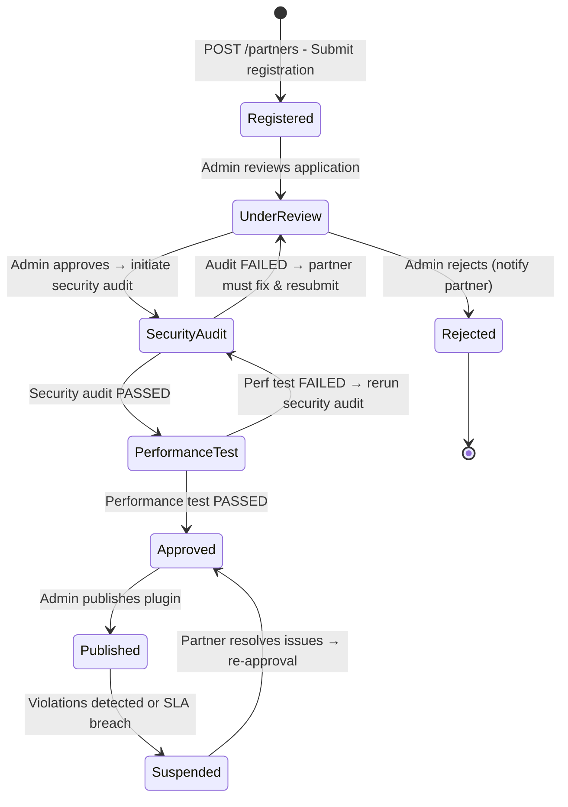
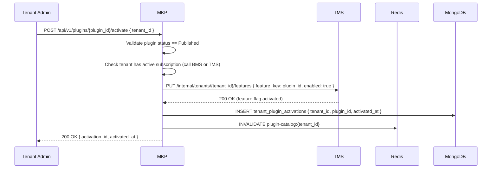
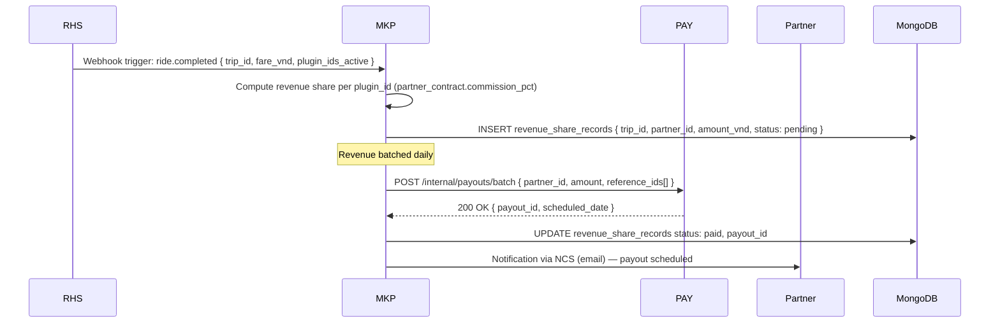

# Software Requirements Specification (SRS)
# MKP — Marketplace & Integration Hub

**Module**: MKP — Marketplace & Integration Hub  
**Parent Work Package**: WP-TBD (to be assigned in MASTER_PLAN)  
**Source**: Derived from `PRD.md` §4.8, §4.9 and `ARCHITECTURE_SPEC.md` §12  
**Technology**: Java 17+ / Spring Boot 3.x  
**Database**: MongoDB (`mkp_db`) + MinIO (plugin assets)  
**Cache**: Redis (plugin catalog, tenant-plugin associations)  
**Events**: None produced directly; interacts with TMS (plugin activation), PAY (payouts)  
**Version**: 1.0.0 | **Date**: 2026-03-06  

---

## 1. Introduction

MKP is the platform's ecosystem extension layer. It allows third-party partners to register, certify, and publish plugins/integrations that extend platform capabilities. Fleet operators (tenants) discover and activate these integrations from the catalog. Revenue from partner integrations is tracked and paid out via the PAY service. MKP enforces a strict security audit and performance test gate before any plugin goes live (BL-009).

### 1.1 Scope

| In Scope | Out of Scope |
|----------|-------------|
| Partner lifecycle management (registration → audit → publication) | Payment processing (delegated to PAY) |
| Plugin catalog with Redis caching | Ride hailing (RHS) |
| Security audit gate before publication (BL-009) | Analytics (ABI) |
| Performance test gate before publication | Notification dispatch (NCS) |
| Tenant plugin activation (via TMS) | |
| Pre-built connector management (Insurance, Accessibility, Corporate Travel, Mapping) | |
| Revenue share computation | |
| Partner payouts orchestration (via PAY) | |

---

## 2. Functional Flow Diagrams

### 2.1 Partner Onboarding & Plugin Publication (BL-009)



### 2.2 Tenant Plugin Activation



### 2.3 Revenue Share and Payout Flow



---

## 3. Detailed Requirement Specifications

### 3.1 Feature: Partner Registration & Lifecycle (FR-MKP-001 through FR-MKP-006)

**Description**: Partners (third-party businesses) submit their integration for review and publication on the marketplace.

#### 3.1.1 Partner Schema (MongoDB `partners` collection)

```json
{
  "_id": "ObjectId",
  "partner_id": "uuid-v4 (indexed, unique)",
  "company_name": "string (min 2, max 200 chars)",
  "company_registration_number": "string",
  "primary_contact_email": "string (email format; unique)",
  "primary_contact_phone": "string (E.164 format)",
  "website_url": "string (HTTPS only)",
  "country_code": "string (ISO 3166-1 alpha-2)",
  "status": "enum[Registered|UnderReview|SecurityAudit|PerformanceTest|Approved|Published|Suspended|Rejected]",
  "rejection_reason": "string (when status=Rejected)",
  "suspension_reason": "string (when status=Suspended)",
  "audit_reports": [
    {
      "audit_type": "enum[security|performance]",
      "audited_by": "string",
      "result": "enum[passed|failed]",
      "findings": "string",
      "audited_at": "ISODate"
    }
  ],
  "contract": {
    "commission_pct": "decimal (0.00–100.00)",
    "payout_schedule": "enum[daily|weekly|monthly]",
    "bank_account": {
      "bank_name": "string",
      "account_number": "string (encrypted AES-256)",
      "account_holder": "string"
    },
    "effective_date": "ISODate"
  },
  "created_at": "ISODate",
  "updated_at": "ISODate"
}
```

#### 3.1.2 Partner Registration API

`POST /api/v1/partners`  
**Auth**: JWT (Partner self-registration)

**Request**:
```json
{
  "company_name": "string",
  "company_registration_number": "string",
  "primary_contact_email": "string",
  "primary_contact_phone": "string",
  "website_url": "string",
  "country_code": "string"
}
```

**Validation Rules**:
| Field | Rule | Error |
|-------|------|-------|
| `company_name` | 2–200 chars; not blank | HTTP 400 `INVALID_COMPANY_NAME` |
| `primary_contact_email` | Valid email; unique across partners | HTTP 409 `EMAIL_ALREADY_REGISTERED` |
| `primary_contact_phone` | E.164 regex: `^\+[1-9]\d{7,14}$` | HTTP 400 `INVALID_PHONE_FORMAT` |
| `website_url` | Must start with `https://`; DNS resolves | HTTP 400 `INVALID_WEBSITE_URL` |
| `country_code` | ISO 3166-1 alpha-2 (2 uppercase letters) | HTTP 400 `INVALID_COUNTRY_CODE` |

**Response (HTTP 201)**:
```json
{
  "partner_id": "uuid",
  "status": "Registered",
  "created_at": "ISO8601",
  "message": "Your registration is under review. You will be notified via email."
}
```

#### 3.1.3 Status Transition APIs (Admin)

`PUT /api/v1/admin/partners/{partner_id}/status`  
**Auth**: JWT (Platform Admin role)

```json
{
  "new_status": "enum[UnderReview|SecurityAudit|PerformanceTest|Approved|Published|Suspended|Rejected]",
  "reason": "string (required for Rejected, Suspended)",
  "audit_result": {
    "audit_type": "security|performance",
    "result": "passed|failed",
    "findings": "string"
  }
}
```

**Validation**:
| Transition | Allowed? | Rule |
|-----------|---------|------|
| `Registered → UnderReview` | Yes | Admin review initiated |
| `UnderReview → SecurityAudit` | Yes | Admin approves application |
| `SecurityAudit → PerformanceTest` | Yes only if | audit_result.result == `passed` |
| `SecurityAudit → UnderReview` | Yes if | audit_result.result == `failed` |
| `PerformanceTest → Approved` | Yes only if | perf result == `passed` |
| `Approved → Published` | Yes | Admin publishes |
| `Published → Suspended` | Yes | Violations detected |
| `Any → Rejected` | Yes | With rejection_reason |

**Invalid transition → HTTP 409 `INVALID_STATUS_TRANSITION`** with message `Cannot transition from {current} to {requested}`.

---

### 3.2 Feature: Plugin Management (FR-MKP-010 through FR-MKP-015)

**Description**: Partners register their plugin/integration details and provide technical specifications.

#### 3.2.1 Plugin Schema (MongoDB `plugins` collection)

```json
{
  "_id": "ObjectId",
  "plugin_id": "uuid-v4",
  "partner_id": "string (FK to partners)",
  "name": "string (max 100 chars)",
  "description": "string (max 2000 chars)",
  "category": "enum[insurance|accessibility|corporate_travel|mapping_analytics|telematics|custom]",
  "version": "string (semver: 1.0.0)",
  "api_endpoint": "string (HTTPS URL to partner's API)",
  "webhook_events": ["ride.started", "ride.completed"],
  "required_permissions": ["ride_data_read", "location_read"],
  "pricing_model": "enum[free|per_ride|monthly_flat|revenue_share]",
  "per_ride_fee_vnd": "decimal (if pricing_model=per_ride)",
  "monthly_fee_vnd": "decimal (if pricing_model=monthly_flat)",
  "status": "enum[Draft|Pending|Published|Suspended]",
  "documentation_url": "string",
  "logo_url": "string (MinIO public URL)",
  "screenshots": ["string (MinIO public URLs)"],
  "compatibility": {
    "min_platform_version": "string (semver)",
    "supported_vehicle_types": ["sedan", "suv"]
  },
  "created_at": "ISODate",
  "updated_at": "ISODate"
}
```

#### 3.2.2 Plugin Catalog API (Tenant Discovery)

`GET /api/v1/plugins`  
**Auth**: JWT (Tenant Admin or Rider)  
**Cache**: Redis key `plugin-catalog:{tenant_id}` with TTL 5 minutes

| Param | Type | Description |
|-------|------|-------------|
| `category` | enum | Filter by plugin category |
| `pricing_model` | enum | Filter by pricing model |
| `search` | string | Full-text search on name + description (max 100 chars) |
| `page` | int | Default 1; min 1 |
| `size` | int | Default 20; max 100 |

**Response**:
```json
{
  "plugins": [
    {
      "plugin_id": "uuid",
      "name": "VNPT Insurance Per-Ride",
      "category": "insurance",
      "partner": { "partner_id": "...", "company_name": "VNPT Insurance" },
      "pricing_model": "per_ride",
      "per_ride_fee_vnd": 5000,
      "status": "Published",
      "logo_url": "https://minio.../logo.png"
    }
  ],
  "total": 15,
  "page": 1,
  "size": 20
}
```

#### 3.2.3 Pre-Built Connectors

The following connectors ship as first-party plugins (no security audit required — maintained by platform team):

| Connector | Category | Trigger | Action |
|-----------|---------|---------|--------|
| **VNPT Insurance** | `insurance` | `ride.started` webhook | Create per-ride insurance policy; attach policy_id to trip |
| **Accessibility Support** | `accessibility` | Rider profile (wheelchair flag) | Match with AV-equipped vehicles |
| **SAP Concur** | `corporate_travel` | `ride.completed` webhook | Submit expense to Concur |
| **TripActions** | `corporate_travel` | `ride.completed` webhook | Log travel to TripActions |
| **HERE Maps** | `mapping_analytics` | On-demand API | Provide HD maps and traffic data |

Pre-built connectors: `status = Published`, partner_id = `vnpt-platform`.

---

### 3.3 Feature: Tenant Plugin Activation (FR-MKP-020)

**Description**: Tenant admins activate/deactivate plugins for their fleet.

#### 3.3.1 Activation Schema (MongoDB `tenant_plugin_activations`)

```json
{
  "activation_id": "uuid-v4",
  "tenant_id": "string (indexed)",
  "plugin_id": "string (indexed)",
  "activated_by": "string (admin user_id)",
  "activated_at": "ISODate",
  "deactivated_at": "ISODate (null if active)",
  "status": "enum[active|inactive]",
  "config": { "custom_param": "value" }
}
```

#### 3.3.2 Activation / Deactivation APIs

`POST /api/v1/plugins/{plugin_id}/activate`  
**Auth**: JWT (Tenant Admin)

```json
{ "tenant_id": "string", "config": { "optional_custom_config": "..." } }
```

**Validation**:
| Rule | Error |
|------|-------|
| `plugin_id` must exist and have `status = Published` | HTTP 404 `PLUGIN_NOT_FOUND` or HTTP 409 `PLUGIN_NOT_PUBLISHED` |
| Tenant must not have already activated this plugin | HTTP 409 `PLUGIN_ALREADY_ACTIVATED` |
| Tenant subscription must be active (check via TMS/BMS) | HTTP 402 `SUBSCRIPTION_REQUIRED` |

`DELETE /api/v1/plugins/{plugin_id}/activate`  
**Auth**: JWT (Tenant Admin)
→ Sets `status = inactive` in `tenant_plugin_activations`, invalidates Redis cache.

#### 3.3.3 Redis Cache Management

```
Key pattern: plugin-catalog:{tenant_id}
TTL: 300 seconds (5 minutes)
Invalidated: On activation, deactivation, or plugin status change
Content: JSON array of activated plugin details for the tenant
```

---

### 3.4 Feature: Revenue Share & Partner Payouts (FR-MKP-030, FR-MKP-031)

**Description**: For per-ride pricing, MKP computes revenue share and batches payouts via PAY.

#### 3.4.1 Revenue Share Computation

**Trigger**: Receive `ride.completed` webhook from RHS (via Kafka event or HTTP callback)  
**Logic**:
```
for each plugin_id active for tenant_id:
  plugin = load plugin from MongoDB
  if plugin.pricing_model == 'per_ride':
    share_amount = plugin.per_ride_fee_vnd
  elif plugin.pricing_model == 'revenue_share':
    share_amount = trip.final_fare * partner.contract.commission_pct / 100
  
  INSERT revenue_share_records {
    trip_id, plugin_id, partner_id, tenant_id,
    amount_vnd: share_amount, currency: "VND",
    status: "pending", earned_at: now()
  }
```

#### 3.4.2 Payout Batching Job

Scheduled by: Spring `@Scheduled` CRON  
CRON: Per `partner.contract.payout_schedule` (daily=`0 2 * * *`, weekly=`0 2 * * MON`, monthly=`0 2 1 * *`)

**Logic**:
```
pending_records = SELECT FROM revenue_share_records 
                  WHERE partner_id = X AND status = 'pending'
                  AND earned_at <= now() - payout_schedule_interval

total_amount = SUM(pending_records.amount_vnd)
if total_amount >= MINIMUM_PAYOUT_THRESHOLD (50,000 VND):
  payout_response = PAY.createBatchPayout({
    partner_id, total_amount, currency: 'VND',
    reference_ids: pending_records.map(r => r.record_id)
  })
  UPDATE revenue_share_records 
    SET status='paid', payout_id=payout_response.payout_id
    WHERE record_id IN pending_records
```

**Minimum payout threshold**: 50,000 VND (carry forward to next cycle if below threshold)

#### 3.4.3 Revenue Share Schema (MongoDB `revenue_share_records`)

```json
{
  "record_id": "uuid-v4",
  "trip_id": "string",
  "plugin_id": "string",
  "partner_id": "string (indexed)",
  "tenant_id": "string (indexed, BL-001)",
  "amount_vnd": "decimal",
  "currency": "VND",
  "status": "enum[pending|paid|cancelled]",
  "payout_id": "string (FK to PAY, null until paid)",
  "earned_at": "ISODate",
  "paid_at": "ISODate (null until paid)"
}
```

---

## 4. API Contracts Summary

| Method | Endpoint | Auth | Description |
|--------|----------|------|-------------|
| `POST` | `/api/v1/partners` | JWT (Partner) | Register new partner |
| `GET` | `/api/v1/partners/{partner_id}` | JWT (Partner / Admin) | Get partner details |
| `PUT` | `/api/v1/admin/partners/{id}/status` | JWT (Admin) | Update partner lifecycle status |
| `POST` | `/api/v1/plugins` | JWT (Partner) | Register new plugin |
| `GET` | `/api/v1/plugins` | JWT (Any) | List published plugins (catalog) |
| `GET` | `/api/v1/plugins/{plugin_id}` | JWT (Any) | Get plugin details |
| `PUT` | `/api/v1/plugins/{plugin_id}` | JWT (Partner) | Update plugin (creates new Draft version) |
| `POST` | `/api/v1/plugins/{plugin_id}/activate` | JWT (Tenant Admin) | Activate plugin for tenant |
| `DELETE` | `/api/v1/plugins/{plugin_id}/activate` | JWT (Tenant Admin) | Deactivate plugin |
| `GET` | `/api/v1/plugins/{plugin_id}/activations` | JWT (Admin) | List all tenant activations |
| `GET` | `/api/v1/revenue-share` | JWT (Partner) | View partner's revenue share records |
| `GET` | `/api/v1/admin/revenue-share/payouts` | JWT (Admin) | View payout schedule |

---

## 5. Data Model (MongoDB — mkp_db)

| Collection | Key Indexes | Purpose |
|-----------|-------------|---------|
| `partners` | `{ partner_id: 1 }` unique, `{ primary_contact_email: 1 }` unique | Partner registry |
| `plugins` | `{ plugin_id: 1 }` unique, `{ partner_id: 1, status: 1 }` | Plugin catalog |
| `tenant_plugin_activations` | `{ tenant_id: 1, plugin_id: 1 }` unique, `{ tenant_id: 1, status: 1 }` | Activation records |
| `revenue_share_records` | `{ partner_id: 1, status: 1, earned_at: -1 }`, `{ trip_id: 1 }` | Revenue tracking |
| `audit_records` | `{ partner_id: 1, audit_type: 1, audited_at: -1 }` | Audit trail |

All queries include `tenant_id` filter where applicable (BL-001 compliance).

---

## 6. Non-Functional Requirements

| NFR | Requirement |
|-----|-------------|
| Plugin catalog query | P95 < 200ms (Redis cache hit) |
| Cache miss (fallback) | P95 < 500ms (MongoDB query) |
| Payout batch job | Complete within 10 minutes for 10,000 records |
| BL-009 enforcement | Zero plugins published without audit_result = passed for BOTH security AND performance |
| Bank account encryption | AES-256 at rest; decrypted only in PAY payout context |
| Revenue record integrity | INSERT-only; no UPDATE to amount or trip_id (immutable revenue records) |

---

## 7. Acceptance Criteria

| # | Criterion | Test Type |
|---|-----------|-----------|
| AC-MKP-001 | Plugin cannot be Published without passing security AND performance audit (BL-009) | Unit test + API test |
| AC-MKP-002 | Invalid status transition rejected with HTTP 409 | Unit test |
| AC-MKP-003 | Plugin catalog returned from Redis cache within 200ms | Performance test |
| AC-MKP-004 | Cache invalidated when plugin is activated or deactivated | Integration test |
| AC-MKP-005 | Revenue share computed correctly for per_ride and revenue_share pricing models | Unit test |
| AC-MKP-006 | Payout batch job sends correct total to PAY service | Integration test |
| AC-MKP-007 | Tenant A cannot see/activate tenant B's plugin activations | Security test (BL-001) |
| AC-MKP-008 | Bank account number stored encrypted; decrypted value not logged | Security test |
| AC-MKP-009 | Webhook URL rejected if pointing to internal IP range (SSRF prevention) | Unit test |
| AC-MKP-010 | Pre-built connectors (Insurance, Accessibility, Corporate Travel) present in Published state | Integration test |

---

*SRS v1.0.0 — MKP Marketplace & Integration Hub | VNPT AV Platform Services Provider Group*
