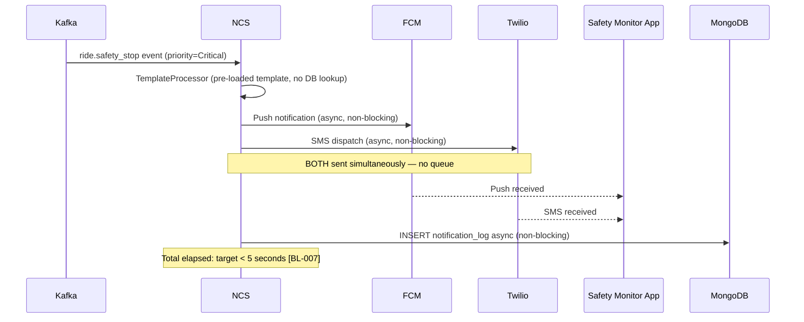
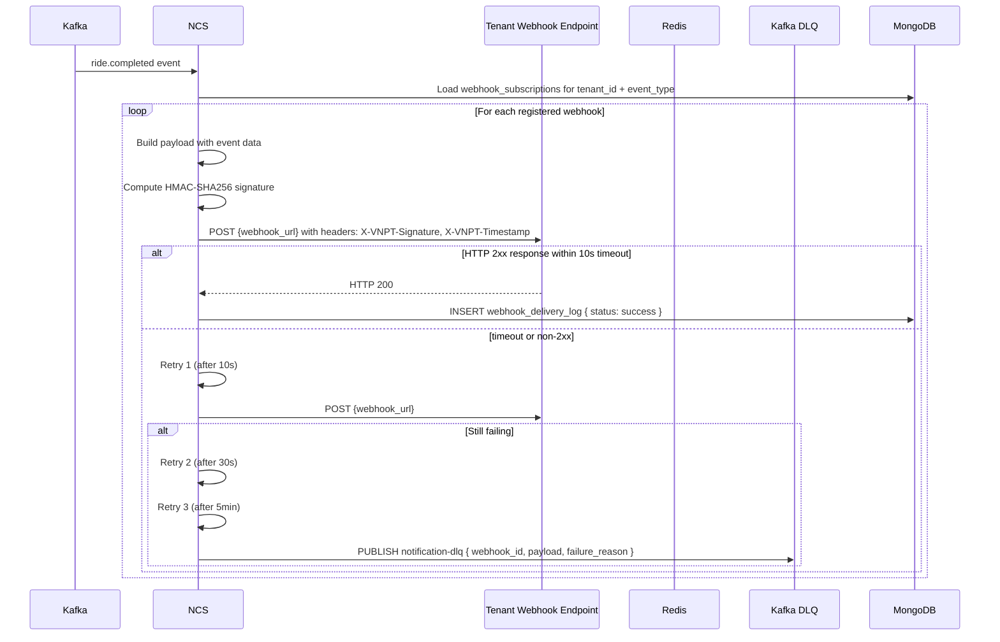

# Software Requirements Specification (SRS)
# NCS — Notification & Communication Service (Hệ Thống Thông Báo)

**Module**: NCS — Notification & Communication Service  
**Parent Work Package**: WP-TBD (to be assigned in MASTER_PLAN)  
**Source**: Derived from `PRD.md` §4.6, §4.9 and `ARCHITECTURE_SPEC.md` §10  
**Technology**: Java 17+ / Spring Boot 3.x  
**Database**: MongoDB (`ncs_db`) | Cache: Redis | Events: Kafka (consumer + DLQ producer)  
**Version**: 1.0.0 | **Date**: 2026-03-06  

---

## 1. Introduction

NCS is the unified communication hub of the platform. It consumes events from ALL Kafka topics and intelligently routes notifications to the appropriate delivery channel(s) based on priority, user preferences, and tenant configuration. NCS manages notification templates (with i18n), ensures reliable delivery with exponential backoff retry, implements Dead Letter Queue for failures, and handles enterprise webhook delivery with HMAC signatures.

### 1.1 Scope

| In Scope | Out of Scope |
|----------|-------------|
| Multi-channel routing (Push/SMS/Email/In-app/Webhook) | Event generation (done by source services) |
| Template management with i18n | Payment processing |
| Priority-based channel selection | Fare computation |
| User preference & quiet hours management | Mobile app push infrastructure (FCM/APNs — just client) |
| Exponential backoff retry | |
| Dead Letter Queue (Kafka DLQ topic) | |
| Enterprise webhook delivery with HMAC | |
| A/B testing for notification content | |
| Deduplication and rate limiting | |

---

## 2. Functional Flow Diagrams

### 2.1 Notification Routing Pipeline

```mermaid
flowchart TD
    A[Kafka Consumer Group: ncs-dispatcher] --> B[Deserialize event]
    B --> C[NotificationRouter.route event_type → priority + channels]
    C --> D[TemplateProcessor: load template by event_type + locale]
    D --> E[Variable substitution: Mustache rendering]
    E --> F[UserPreferenceService: check opt-out, quiet hours, frequency cap]
    F --> G{User opted out from ALL channels?}
    G -->|Yes| H[SKIP — log as skipped, update delivery_status]
    G -->|No| I[Redis Deduplication: CHECK dedup_key TTL 1h]
    I --> J{Duplicate notification?}
    J -->|Yes| K[SKIP — idempotent delivery]
    J -->|No| L[Redis Rate Limiter: check frequency cap per user per channel]
    L --> M{Rate limit exceeded?}
    M -->|Yes| N[DEFER to next available window]
    M -->|No| O{Channels selected}
    O --> P[FCM/APNs Adapter - Push]
    O --> Q[Twilio Adapter - SMS]
    O --> R[SendGrid Adapter - Email]
    O --> S[In-App Store - MongoDB]
    O --> T[WebhookDispatcher - HMAC]
    P & Q & R --> U{Delivery success?}
    U -->|Yes| V[UPDATE notification_log: status=sent]
    U -->|No| W[RetryScheduler: exponential backoff 2s → 4s → 8s]
    W --> X{Max retries exhausted?}
    X -->|Yes| Y[Kafka PUBLISH notification-dlq[notification.failed]]
    X -->|No| Z[Retry delivery]
    Z --> U
```

### 2.2 Critical Alert Flow (BL-007 — < 5 seconds end-to-end)



### 2.3 Enterprise Webhook Delivery



---

## 3. Detailed Requirement Specifications

### 3.1 Feature: Multi-Channel Routing (FR-NCS-001, FR-NCS-002)

**Description**: NCS consumes events from Kafka and routes to the correct channels based on event priority.

#### 3.1.1 Event-to-Priority Mapping

| Event Type | Priority | Channels | Delivery SLA |
|-----------|---------|----------|-------------|
| `ride.safety_stop` | CRITICAL | Push (FCM/APNs) + SMS (Twilio) simultaneously | < 5 seconds (BL-007) |
| `vehicle.emergency` | CRITICAL | Push + SMS | < 5 seconds |
| `vehicle.arrived` | HIGH | Push only | < 10 seconds |
| `ride.matched` | HIGH | Push only | < 10 seconds |
| `ride.completed` | MEDIUM | Email + Push | < 60 seconds |
| `invoice.created` | MEDIUM | Email + Push | < 60 seconds |
| `quota.warning` | MEDIUM | Email + In-app | < 60 seconds |
| `payment.refunded` | MEDIUM | Push + Email | < 60 seconds |
| `promotion.new` | LOW | Email or In-app | Best effort (< 1 hour) |
| `newsletter` | LOW | Email | Best effort |
| `budget.forecast_alert` | LOW | Email + In-app | Best effort |

#### 3.1.2 Channel Priority Override

- User can opt out of any channel globally or per event type.
- Quiet hours: notifications in MEDIUM/LOW priority MUST be deferred until after quiet hours.
- CRITICAL notifications MUST be sent regardless of quiet hours.
- If user opted out of Push → fallback to In-app for HIGH priority.

#### 3.1.3 Channel Adapter Implementations

**FCM/APNs Push**:
- Library: Firebase Admin SDK (Java)
- Token: `rider.device_token` (stored in `rider_devices` collection)
- Payload: `{ notification: { title, body }, data: { event_type, trip_id, ... } }`
- Response codes: 200 (success), `REGISTRATION_TOKEN_NOT_REGISTERED` (stale token → delete)

**Twilio SMS**:
- API: Twilio REST API v2
- From number: Tenant-configured short code or long number
- Timeout: 5 seconds per request
- Retry: Built-in (NCS outer retry handles Twilio failures)

**SendGrid Email**:
- API: SendGrid REST v3
- Template: Dynamic template with Handlebars variables
- From: `noreply@{tenant.custom_domain or vnpt-av.com}`
- Tracking: Open/click tracking enabled for MEDIUM/LOW priority

**In-App**:
- Stored in MongoDB `inapp_notifications` collection
- Rider retrieves via `GET /api/v1/notifications?unread=true`
- TTL: 30 days (TTL index on `created_at`)

---

### 3.2 Feature: Template Engine (FR-NCS-010, FR-NCS-011, FR-NCS-012)

**Description**: CRUD notification templates with i18n support and variable substitution.

#### 3.2.1 Template Schema (MongoDB)

```json
{
  "_id": "ObjectId",
  "template_id": "uuid-v4",
  "tenant_id": "string (null = platform default)",
  "event_type": "string (e.g., ride.completed)",
  "channel": "enum[push|sms|email|inapp]",
  "locale": "string (IETF BCP 47, e.g., vi-VN, en-US)",
  "name": "string",
  "subject": "string (email only; Handlebars supported)",
  "title": "string (push/inapp; Handlebars supported)",
  "body": "string (Handlebars template)",
  "html_body": "string (email only; sanitized HTML)",
  "ab_test_group": "enum[A|B|null]",
  "is_active": "boolean",
  "created_by": "string",
  "created_at": "ISODate",
  "updated_at": "ISODate"
}
```

#### 3.2.2 Template Variable Substitution (FR-NCS-011)

Templating engine: **Handlebars** (Java: `com.github.jknack:handlebars`)

**Standard variables available**:
```
{{ rider_name }}       — Full name of rider
{{ trip_id }}          — Trip identifier
{{ eta_minutes }}      — Estimated minutes
{{ final_fare }}       — Formatted currency amount
{{ vehicle_id }}       — Vehicle identifier
{{ pickup_address }}   — Human-readable pickup address
{{ dropoff_address }}  — Human-readable dropoff
{{ invoice_id }}       — Invoice identifier
{{ invoice_total }}    — Invoice total amount
{{ company_name }}     — Tenant company name (for B2B notifications)
{{ support_email }}    — Tenant support email
```

**Template Resolution Order**:
1. Tenant-specific template for `event_type + channel + locale`.
2. Tenant-specific template for `event_type + channel` (any locale).
3. Platform default template for `event_type + channel + locale`.
4. Platform default template for `event_type + channel + en-US` (fallback locale).
5. If none found → log error; skip notification; alert ops.

#### 3.2.3 A/B Testing (FR-NCS-012)

- Templates can be marked `ab_test_group = A or B`.
- `NotificationRouter` assigns users to A/B groups: `hash(user_id) % 2 == 0 → A, else → B`.
- ABI consumes `notification_sent` events and tracks open/click rates per A/B group.
- A/B results reviewed by Platform Admin; winning variant promoted.

#### 3.2.4 Template CRUD Validation

| Field | Validation |
|-------|-----------|
| `event_type` | Must match known event types enum |
| `locale` | Must match IETF BCP 47; validate against Java `Locale.forLanguageTag()` |
| `body` | Max 2000 chars for push/SMS; max 100KB for email HTML |
| `subject` | Max 200 chars |
| `html_body` | Sanitized with OWASP Java HTML Sanitizer; `<script>` tags rejected |

---

### 3.3 Feature: User Preferences & Privacy (FR-NCS-020)

**Description**: Riders control their notification preferences per channel and configure quiet hours.

#### 3.3.1 User Preference Schema

```json
{
  "preference_id": "uuid-v4",
  "rider_id": "string (indexed)",
  "tenant_id": "string (indexed)",
  "channel_preferences": {
    "push": "boolean (default true)",
    "sms": "boolean (default true)",
    "email": "boolean (default true)",
    "inapp": "boolean (default true)"
  },
  "event_type_preferences": {
    "promotion.new": { "push": false, "email": true },
    "newsletter": { "push": false, "email": false }
  },
  "quiet_hours": {
    "enabled": "boolean",
    "start_time": "string HH:MM (24h, e.g., 22:00)",
    "end_time": "string HH:MM (e.g., 07:00)",
    "timezone": "string IANA timezone"
  },
  "frequency_caps": {
    "max_push_per_day": "int32 (default 20)",
    "max_sms_per_day": "int32 (default 5)"
  }
}
```

#### 3.3.2 Quiet Hours Logic

```
if preference.quiet_hours.enabled:
  current_time = now in rider's timezone
  if current_time in [start_time, end_time]:
    if priority == CRITICAL:
      SEND immediately (override quiet hours — BL-007)
    if priority == HIGH:
      SEND push only (no SMS during quiet hours)
    if priority in [MEDIUM, LOW]:
      DEFER until end_time
```

---

### 3.4 Feature: Reliable Delivery (FR-NCS-030, FR-NCS-031, FR-NCS-032)

**Description**: Ensures notifications are delivered with retry and DLQ fallback.

#### 3.4.1 Retry Strategy

| Attempt | Delay | Total Elapsed |
|---------|-------|--------------|
| 1st attempt | Immediate | 0s |
| 2nd attempt (retry 1) | 2 seconds | 2s |
| 3rd attempt (retry 2) | 4 seconds | 6s |
| 4th attempt (retry 3) | 8 seconds | 14s |
| All retries exhausted | → DLQ | 14s+ |

**Spring Retry Config**:
```java
@Retryable(
    value = NotificationDeliveryException.class,
    maxAttempts = 3,
    backoff = @Backoff(delay = 2000, multiplier = 2.0, maxDelay = 8000)
)
```

#### 3.4.2 Deduplication (FR-NCS-032)

```
dedup_key = SHA256({event_id}:{user_id}:{channel})
Redis: SET dedup_key "1" EX 3600 NX
If SET returns null (key exists) → notification already sent → SKIP
```

#### 3.4.3 Rate Limiting (FR-NCS-032)

```
Rate limit check (Redis):
  push_count = INCR rate:push:{rider_id}:{YYYY-MM-DD}  EXPIRE 86400
  sms_count  = INCR rate:sms:{rider_id}:{YYYY-MM-DD}   EXPIRE 86400
  if push_count > preference.max_push_per_day → SKIP this push (log)
  if sms_count > preference.max_sms_per_day → SKIP this SMS (log)
```

#### 3.4.4 Dead Letter Queue

- Kafka topic: `notification-dlq` (6 partitions, 14-day retention)
- DLQ payload: `{ notification_id, event_type, user_id, tenant_id, channel, failure_reason, attempts, last_attempt_at }`
- DLQ retry worker: separate consumer group; processes DLQ every 1 hour.
- Max DLQ retries: 3 additional attempts. If still fails → alert ops via PagerDuty.

---

### 3.5 Feature: Enterprise Webhooks (FR-NCS-040, FR-NCS-041)

**Description**: Tenants can subscribe to platform events and receive HTTP callbacks with HMAC authentication.

#### 3.5.1 Webhook Subscription Schema

```json
{
  "webhook_id": "uuid-v4",
  "tenant_id": "string (indexed)",
  "url": "string (HTTPS only; validated)",
  "event_types": ["ride.completed", "payment.captured", "invoice.created"],
  "secret_key": "string (stored as bcrypt hash; shown to tenant only once)",
  "is_active": "boolean",
  "failure_count": "int32",
  "last_success_at": "ISODate",
  "created_at": "ISODate"
}
```

#### 3.5.2 HMAC Signature Generation (FR-NCS-041)

```java
// Header: X-VNPT-Signature: sha256={hmac_hex}
// Header: X-VNPT-Timestamp: {unix_timestamp_ms}

String payload = unix_timestamp_ms + "." + json_body_string;
Mac mac = Mac.getInstance("HmacSHA256");
mac.init(new SecretKeySpec(webhook_secret_key.getBytes(), "HmacSHA256"));
byte[] hmacBytes = mac.doFinal(payload.getBytes(StandardCharsets.UTF_8));
String signature = "sha256=" + Hex.encodeHexString(hmacBytes);
```

**Tenant-side validation**: Verify `X-VNPT-Signature` against recomputed HMAC. Reject if timestamp outside ±5 minutes.

#### 3.5.3 Webhook URL Validation

- MUST be HTTPS (HTTP rejected with HTTP 400 `INSECURE_WEBHOOK_URL`).
- MUST not point to internal IP ranges (10.x, 172.16.x, 192.168.x) — SSRF prevention.
- TMS/Platform Admin can whitelist specific IP ranges.

#### 3.5.4 Webhook Auto-Disable

- If webhook fails > 50 consecutive times → `is_active = false`; notify tenant admin via email.
- Tenant must re-enable webhook after fixing their endpoint.

---

## 4. API Contracts

### 4.1 Internal APIs (consumed by other services)

NCS is primarily event-driven (Kafka consumer), but exposes these internal APIs:

| Method | Endpoint | Auth | Description |
|--------|----------|------|-------------|
| `POST` | `/internal/notifications/send` | JWT (service-account) | Direct send (bypass Kafka for urgent) |

### 4.2 User-Facing APIs

| Method | Endpoint | Auth | Description |
|--------|----------|------|-------------|
| `GET` | `/api/v1/notifications` | JWT (Rider) | List in-app notifications |
| `PUT` | `/api/v1/notifications/{id}/read` | JWT (Rider) | Mark as read |
| `GET/PUT` | `/api/v1/notification-preferences` | JWT (Rider) | Get/update preferences |

### 4.3 Admin APIs

| Method | Endpoint | Auth | Description |
|--------|----------|------|-------------|
| `GET/POST/PUT/DELETE` | `/api/v1/templates` | JWT (Admin) | Manage notification templates |
| `GET/POST/PUT/DELETE` | `/api/v1/webhooks` | JWT (Tenant Admin) | Manage webhook subscriptions |
| `GET` | `/api/v1/webhook-deliveries` | JWT (Tenant Admin) | View webhook delivery history |

---

## 5. Data Model (MongoDB — ncs_db)

| Collection | Key Indexes | Purpose |
|-----------|-------------|---------|
| `notification_logs` | `{ tenant_id: 1, user_id: 1, created_at: -1 }` | Delivery audit |
| `inapp_notifications` | `{ rider_id: 1, read: 1, created_at: -1 }` + TTL 30d | In-app messages |
| `notification_templates` | `{ tenant_id: 1, event_type: 1, channel: 1, locale: 1 }` | Template storage |
| `user_preferences` | `{ rider_id: 1, tenant_id: 1 }` unique | Per-user preferences |
| `webhook_subscriptions` | `{ tenant_id: 1, is_active: 1 }` | Webhook registry |
| `webhook_delivery_logs` | `{ webhook_id: 1, created_at: -1 }` | Webhook audit |

---

## 6. Kafka Consumers & Topics

| Topic (consumed) | Consumer Group | Action |
|----------------|----------------|--------|
| `ride-events` | `ncs-dispatcher` | Route trip notifications (state changes, safety, completion) |
| `payment-events` | `ncs-dispatcher` | Payment receipts, refund notices |
| `billing-events` | `ncs-dispatcher` | Invoice created, quota warnings |
| `tenant-events` | `ncs-dispatcher` | Welcome email on `tenant.created` |
| `fare-events` | `ncs-dispatcher` | Upfront fare confirmation |
| `notification-dlq` | `ncs-dlq-worker` | DLQ retry processing |

**DLQ Produced to**: `notification-dlq` topic when all retries exhausted.

---

## 7. Non-Functional Requirements

| NFR | Requirement | Implementation |
|-----|-------------|----------------|
| Critical alert delivery | < 5 seconds end-to-end (BL-007) | Bypass queue; synchronous FCM + Twilio call |
| High priority | < 10 seconds | Fast path in NotificationRouter |
| Kafka consumer lag | < 1 second | 3 NCS replicas, each with 8 consumer threads |
| Deduplication | 100% — no duplicate notifications | Redis SET NX dedup key |
| HMAC verification | 100% on all webhooks | Always sign, never skip |
| Retry exhaustion | Goes to DLQ within 14 seconds | Spring Retry: 3 attempts, 2s/4s/8s backoff |

---

## 8. Acceptance Criteria

| # | Criterion | Test Type |
|---|-----------|-----------|
| AC-NCS-001 | Critical safety alert delivered via Push + SMS simultaneously within 5 seconds | Performance test (BL-007) |
| AC-NCS-002 | Rider opted out of Push does not receive push notifications | Unit test |
| AC-NCS-003 | Notifications deferred during quiet hours (non-Critical) | Unit test |
| AC-NCS-004 | Duplicate event does not send duplicate notification (dedup) | Integration test |
| AC-NCS-005 | Retry with exponential backoff fires 3 times then goes to DLQ | Integration test |
| AC-NCS-006 | Template renders variables correctly ({{rider_name}}, {{final_fare}}) | Unit test |
| AC-NCS-007 | Webhook delivery includes valid HMAC-SHA256 signature | Unit test (BL-008 adjacent) |
| AC-NCS-008 | Webhook auto-disabled after 50 consecutive failures | Integration test |
| AC-NCS-009 | A/B test groups consistently assigned (same user always in same group) | Unit test |
| AC-NCS-010 | Rate limit prevents > 20 push notifications per day to same rider | Unit test |

---

*SRS v1.0.0 — NCS Notification & Communication Service | VNPT AV Platform Services Provider Group*
