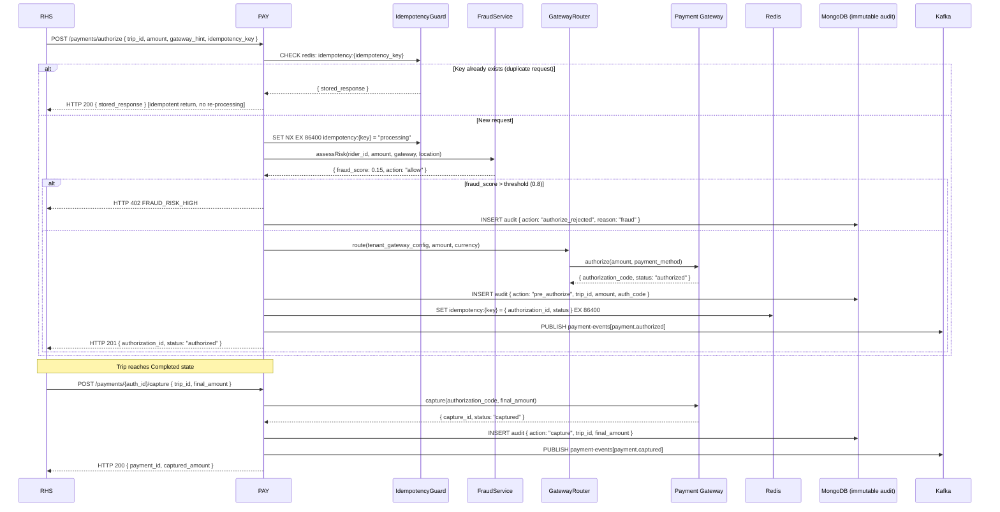
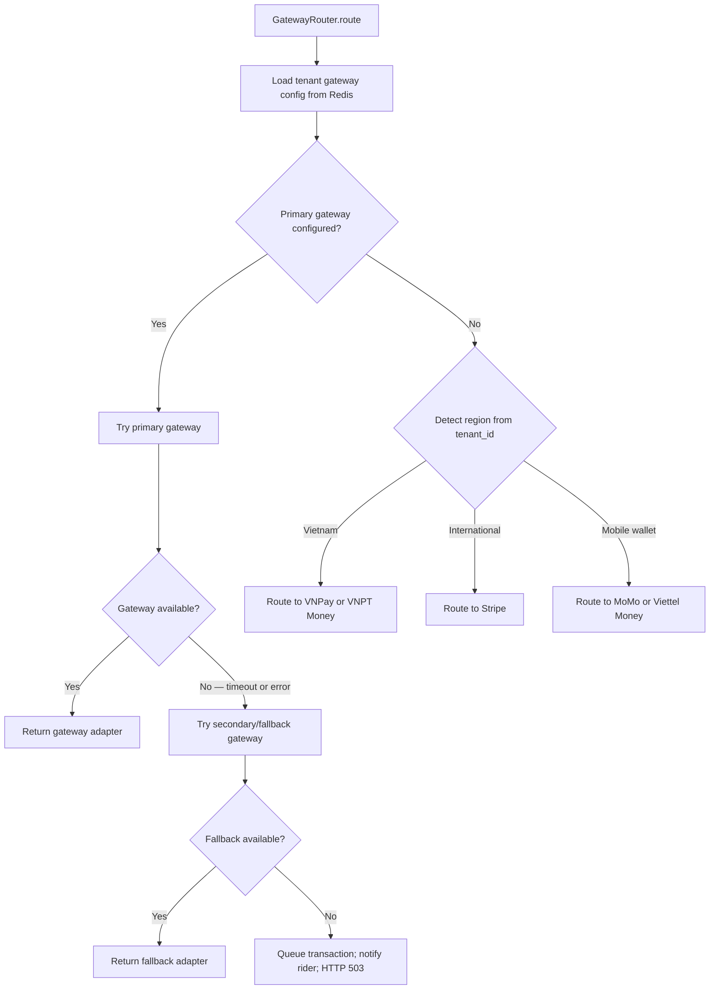
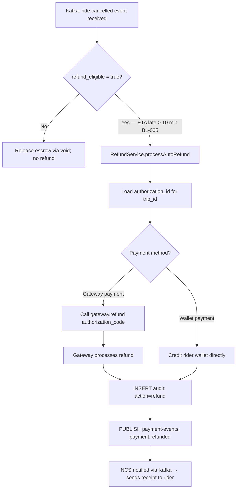

# Software Requirements Specification (SRS)
# PAY — Payment Processing (Hệ Thống Xử Lý Thanh Toán)

**Module**: PAY — Payment Processing  
**Parent Work Package**: WP-TBD (to be assigned in MASTER_PLAN)  
**Source**: Derived from `PRD.md` §4.4, §4.9 and `ARCHITECTURE_SPEC.md` §8  
**Technology**: Java 17+ / Spring Boot 3.x  
**Database**: MongoDB (`pay_db`, PCI-DSS isolated) | Cache: Redis | Events: Kafka  
**Compliance**: PCI-DSS SAQ-D  
**Version**: 1.0.0 | **Date**: 2026-03-06  

---

## 1. Introduction

PAY is the financial backbone of the platform. It processes all monetary transactions through a multi-gateway routing strategy, enforces the escrow payment model, manages rider wallets, detects fraud in real-time, handles refunds and payouts, supports multi-currency, and maintains an immutable audit trail for every financial operation.

**Critical Security Note**: PAY is deployed in a dedicated Kubernetes namespace (`pay-namespace`) with NetworkPolicy restricting access. Card data is NEVER stored — tokenization is delegated to gateway vaults. All PAY operations write to immutable audit logs (INSERT-only).

### 1.1 Scope

| In Scope | Out of Scope |
|----------|-------------|
| Payment gateway routing (5 gateways) | Fare calculation (FPE) |
| Escrow: pre-authorize → capture | Invoice generation (BMS) |
| Idempotency key management | Subscription management (BMS) |
| Rider e-wallet | Notification sending (NCS) |
| Refund processing (full/partial) | |
| Partner payout scheduling | |
| Fraud detection (rule + ML) | |
| Multi-currency conversion | |
| Immutable financial audit log | |

---

## 2. Functional Flow Diagrams

### 2.1 Escrow Payment Lifecycle (BL-003, BL-004)



### 2.2 Gateway Routing Strategy



### 2.3 Auto-Refund Flow (BL-005)



---

## 3. Detailed Requirement Specifications

### 3.1 Feature: Multi-Gateway Transaction Routing (FR-PAY-001, FR-PAY-002)

**Description**: PAY routes transactions to one of 5 supported payment gateways using a strategy pattern. Each gateway is wrapped in an adapter implementing a unified `PaymentGatewayPort` interface.

#### 3.1.1 Gateway Adapters

| Gateway | Adapter Class | Supported Operations | Region |
|---------|-------------|---------------------|--------|
| Stripe | `StripeAdapter` | authorize, capture, void, refund | International |
| VNPay | `VNPayAdapter` | authorize, capture, void, refund | Vietnam |
| MoMo | `MoMoAdapter` | charge (no authorize/capture), refund | Vietnam |
| VNPT Money | `VNPTMoneyAdapter` | authorize, capture, void, refund | Vietnam |
| Viettel Money | `ViettelMoneyAdapter` | charge, refund | Vietnam |

**Note**: MoMo and Viettel Money do NOT support pre-authorization. For these gateways, the "escrow" model is simulated by holding funds in rider wallet during trip.

#### 3.1.2 PaymentGatewayPort Interface (Java)

```java
public interface PaymentGatewayPort {
    AuthorizationResult authorize(AuthorizeRequest request);
    CaptureResult capture(CaptureRequest request);
    VoidResult void_(VoidRequest request);
    RefundResult refund(RefundRequest request);
    GatewayType getType();
    boolean isAvailable();
}
```

#### 3.1.3 Gateway Selection Rules

1. Tenant config has `primary_gateway` and `fallback_gateway` settings (stored in TMS, cached in Redis).
2. If primary gateway returns error or times out (timeout: 10 seconds) → try fallback.
3. If both fail → queue transaction in Redis (TTL 1h) → notify rider via NCS → retry on next available gateway.
4. Transaction is NEVER double-charged: idempotency key prevents re-execution.

#### 3.1.4 Idempotency Key Management (BL-004)

```
Key: idempotency:{idempotency_key_uuid}
Value: JSON { status: "processing|completed", response: {...} }
TTL: 86400 seconds (24 hours)
Redis command: SET NX EX 86400 (atomic, prevents race condition)

On duplicate request:
  - If value = "processing" → wait 500ms → retry (up to 3 times) → return 429 if still processing
  - If value = "completed" → return stored response immediately (HTTP 200)
```

---

### 3.2 Feature: Escrow Model (FR-PAY-003)

**Description**: Funds are pre-authorized at booking time and only captured when the trip reaches `Completed` status.

#### 3.2.1 Business Logic

1. `authorize()` is called by RHS immediately after AV matching. Amount = `upfront_fare` from FPE.
2. `capture()` is triggered ONLY when `ride.completed` Kafka event is received by PAY.
3. Capture amount = `final_fare` from FPE finalize call (could differ from upfront due to fare split adjustments, but for upfront pricing = same as locked fare).
4. `void()` is called when trip is `Cancelled` (refund_eligible = false).
5. **BL-003**: PAY MUST reject any `capture()` call if trip status is NOT `Completed`. Validation: call RHS GET /trips/{trip_id} to verify status before capture.

#### 3.2.2 Authorization Expiry

- Gateway authorizations expire after 7 days (standard industry).
- If trip is not completed within 7 days → auto-void authorization + cancel trip + notify rider.
- Scheduler job: runs daily, identifies authorizations older than 6 days → alert ops.

---

### 3.3 Feature: Rider Wallet (FR-PAY-010, FR-PAY-011)

**Description**: Internal e-wallet for riders supporting top-up, balance check, and auto-top-up.

#### 3.3.1 Wallet MongoDB Schema

```json
{
  "_id": "ObjectId",
  "wallet_id": "uuid-v4",
  "tenant_id": "string (indexed)",
  "rider_id": "string (unique per tenant, indexed)",
  "balance": "Decimal128",
  "currency": "string",
  "auto_topup_enabled": "boolean",
  "auto_topup_threshold": "Decimal128",
  "auto_topup_amount": "Decimal128",
  "encrypted_payment_token": "string (AES-256-GCM encrypted gateway token)",
  "payment_method_type": "enum[card|bank_account|gateway_wallet]",
  "created_at": "ISODate",
  "updated_at": "ISODate"
}
```

#### 3.3.2 PCI-DSS Compliance

- Card number, CVV, expiry: **NEVER stored**. Only gateway-issued token stored.
- `encrypted_payment_token` is AES-256-GCM encrypted with a KMS-managed key.
- Decryption only occurs at time of gateway call (ephemeral in memory, not logged).
- All wallet balance changes → INSERT to immutable `wallet_audit_logs` collection.

#### 3.3.3 Wallet Top-Up Flow

1. `POST /wallets/topup { amount, payment_method_token, idempotency_key }`.
2. IdempotencyGuard checks Redis.
3. FraudDetectionService assesses top-up request.
4. GatewayRouter charges `amount` to payment method.
5. On success: atomically increment `wallet.balance` (MongoDB findAndModify).
6. INSERT audit log: `{ action: "topup", amount, gateway, transaction_id }`.
7. Return `{ wallet_id, new_balance, transaction_id }`.

#### 3.3.4 Wallet Deduction for Trips

- If rider's primary payment = wallet: deduct `upfront_fare` from wallet at booking time (instead of gateway authorization).
- If `wallet.balance < upfront_fare` → HTTP 402 `INSUFFICIENT_WALLET_BALANCE`.
- Auto-top-up: if `balance < auto_topup_threshold AND auto_topup_enabled` → trigger top-up from saved payment method before trip.

---

### 3.4 Feature: Refund Processing (FR-PAY-020)

**Description**: Full or partial refunds processed based on business rules and policies.

#### 3.4.1 Refund Types

| Type | Trigger | Amount | Method |
|------|---------|--------|--------|
| Auto-refund | ETA late > 10 min (BL-005) | Full amount | Original payment method |
| Partial-refund | Cancellation after dispatch | `captured_amount - cancellation_fee` | Original method |
| Manual refund | Admin override | Custom amount | Original or wallet credit |
| Service refund | Trip quality issue | Percentage or flat | Wallet credit |

#### 3.4.2 Refund Business Logic

1. Refund `amount ≤ original_transaction.amount` always. HTTP 422 if over-refund attempted.
2. If original payment was gateway → call `gateway.refund(gateway_transaction_id, refund_amount)`.
3. If original payment was wallet → credit `wallet.balance` atomically.
4. INSERT audit: `{ action: "refund", original_transaction_id, refund_amount, refund_reason, actor_id }`.
5. Publish `payment-events[payment.refunded]` → NCS sends receipt.
6. Stripe refund processing: 5–10 business days; VNPay: 1–3 days.

---

### 3.5 Feature: Fraud Detection (FR-PAY-030, FR-PAY-031)

**Description**: Two-layer fraud detection combining rule-based checks and ML scoring.

#### 3.5.1 Rule-Based Checks (Synchronous, < 5ms)

| Rule | Condition | Action |
|------|-----------|--------|
| Blacklist | `rider_id` or `card_token` in blacklist set (Redis SET) | Reject immediately |
| Velocity — amount | > 3 transactions > 500,000 VND in last 1 hour | Hold for review |
| Velocity — attempts | > 10 payment attempts in last 10 minutes | Reject for 30 min |
| Geo-anomaly | Transaction country ≠ rider registered country | Flag; require 3DS |
| Unusual time | Transaction between 02:00–04:00 UTC | Flag |

#### 3.5.2 ML Scoring (Asynchronous, < 500ms)

- External Python microservice: `POST /fraud/score { rider_id, amount, gateway, location, time_of_day, transaction_history_summary }`
- Response: `{ score: 0.0–1.0, features: [...] }`
- Timeout: 500ms. If timeout → default score = 0.5 (allow with monitoring).
- Score thresholds:
  - 0.0–0.3: `allow`
  - 0.3–0.6: `allow` + flag for monitoring
  - 0.6–0.8: `hold` for manual review (24h window)
  - 0.8–1.0: `reject`

#### 3.5.3 Fraud Action Handling

- `hold`: Transaction stored with `status = held`; ops team alerted via PagerDuty.
- `reject`: HTTP 402 `TRANSACTION_REJECTED_FRAUD`; INSERT audit; rider notified via NCS.
- Held transactions: ops reviews within 24h; can `approve` (auto-capture) or `decline` (auto-void).

---

### 3.6 Feature: Partner Payouts (FR-PAY-021)

**Description**: Revenue share payouts to enterprise tenants and marketplace partners.

#### 3.6.1 Payout Scheduling

- Weekly cron: Every Monday 02:00 UTC.
- `PayoutScheduler` queries FPE for `{ tenant_revenue_share }` aggregated for the week.
- For each tenant with revenue_share > minimum_payout_threshold (100,000 VND):
  - Create payout record
  - Call gateway.payout(bank_account_details, amount)
  - INSERT audit: `{ action: "payout", tenant_id, amount, gateway, reference_id }`
- MKP also calls `POST /payouts` for marketplace partner commissions.

#### 3.6.2 Payout Schema

```json
{
  "payout_id": "uuid-v4",
  "tenant_id": "string",
  "amount": "Decimal128",
  "currency": "string",
  "payout_period_start": "ISODate",
  "payout_period_end": "ISODate",
  "status": "enum[pending|processing|completed|failed]",
  "gateway_reference": "string",
  "bank_account_last4": "string",
  "scheduled_at": "ISODate",
  "completed_at": "ISODate"
}
```

---

### 3.7 Feature: Multi-Currency (FR-PAY-040)

**Description**: Automatic currency conversion with 1-hour cached exchange rates.

#### 3.7.1 Currency Conversion Flow

1. FX rates fetched from external provider (e.g., Fixer.io or VCB API) every 1 hour.
2. Rates cached in Redis: `fx_rate:{from}:{to}` TTL 3600s.
3. On payment: `converted_amount = original_amount × fx_rate × (1 + conversion_fee_percent/100)`.
4. `conversion_fee_percent` = 1.5% default (configurable per tenant).

**Supported Currencies**: VND, USD, SGD, EUR, GBP, THB, MYR, IDR.

---

## 4. API Contracts

### 4.1 Core Payment APIs

| Method | Endpoint | Auth | Description |
|--------|----------|------|-------------|
| `POST` | `/api/v1/payments/authorize` | JWT (service-account) | Pre-authorize escrow |
| `POST` | `/api/v1/payments/{id}/capture` | JWT (service-account) | Capture authorized payment |
| `POST` | `/api/v1/payments/{id}/void` | JWT (service-account) | Release escrow |
| `POST` | `/api/v1/payments/{id}/refund` | JWT (service-account or Admin) | Full or partial refund |
| `GET` | `/api/v1/payments/{id}` | JWT (Admin) | Get payment details |

**POST /payments/authorize Request**:
```json
{
  "trip_id": "uuid",
  "tenant_id": "string",
  "rider_id": "string",
  "amount": 45000,
  "currency": "VND",
  "payment_method": "wallet|gateway",
  "gateway_hint": "vnpay",
  "idempotency_key": "uuid-v4"
}
```

**Response 201**:
```json
{
  "authorization_id": "uuid-v4",
  "transaction_id": "uuid-v4",
  "status": "authorized",
  "gateway": "vnpay",
  "amount": 45000,
  "currency": "VND"
}
```

### 4.2 Wallet APIs

| Method | Endpoint | Auth | Description |
|--------|----------|------|-------------|
| `GET` | `/api/v1/wallets/{rider_id}` | JWT (Rider own) | Get wallet balance |
| `POST` | `/api/v1/wallets/topup` | JWT (Rider) | Top up wallet |
| `PUT` | `/api/v1/wallets/auto-topup` | JWT (Rider) | Configure auto-top-up |

**GET /wallets/{rider_id} Response**:
```json
{
  "wallet_id": "uuid",
  "balance": 250000,
  "currency": "VND",
  "auto_topup_enabled": true,
  "auto_topup_threshold": 50000,
  "payment_method_type": "card",
  "last_four": "4242"
}
```

---

## 5. Data Model

### 5.1 MongoDB Collections (pay_db — PCI-DSS isolated namespace)

#### `payment_transactions`

```json
{
  "_id": "ObjectId",
  "transaction_id": "uuid-v4",
  "tenant_id": "string (indexed)",
  "trip_id": "string (indexed, nullable)",
  "invoice_id": "string (indexed, nullable)",
  "rider_id": "string (indexed)",
  "amount": "Decimal128",
  "currency": "string",
  "gateway": "enum[stripe|vnpay|momo|vnpt_money|viettel_money|wallet]",
  "gateway_transaction_id": "string",
  "authorization_id": "string (nullable)",
  "status": "enum[pending|authorized|captured|voided|refunded|failed|held]",
  "idempotency_key": "string (unique index)",
  "fraud_score": "double (nullable)",
  "fraud_action": "enum[allow|hold|reject]",
  "audit_immutable": true,
  "actor_id": "string",
  "actor_role": "string",
  "created_at": "ISODate",
  "captured_at": "ISODate",
  "refunded_at": "ISODate"
}
```

**MongoDB Validator** (enforces immutability, BL-008):
```javascript
db.createCollection("payment_transactions", {
  validator: {
    $jsonSchema: { bsonType: "object", required: ["audit_immutable"],
      properties: { audit_immutable: { enum: [true] } }
    }
  }
})
// Plus: deny all update/delete operations via database user permissions
```

#### Other Collections

| Collection | Key Fields | Purpose |
|-----------|-----------|---------|
| `wallets` | `{ tenant_id: 1, rider_id: 1 }` unique | Rider e-wallets |
| `wallet_audit_logs` | `{ wallet_id: 1, created_at: -1 }` | Immutable wallet history |
| `payouts` | `{ tenant_id: 1, status: 1, scheduled_at: 1 }` | Partner payouts |
| `fraud_blacklist` | `{ entity_type: 1, entity_id: 1 }` | Blacklisted riders/cards |

---

## 6. Kafka Events

| Topic | Event Key | Payload | Consumers |
|-------|-----------|---------|-----------|
| `payment-events` | `payment.authorized` | `transaction_id, trip_id, tenant_id, amount, gateway` | ABI |
| `payment-events` | `payment.captured` | `transaction_id, trip_id, final_amount, timestamp` | BMS, ABI, NCS |
| `payment-events` | `payment.voided` | `transaction_id, trip_id, reason` | ABI, NCS |
| `payment-events` | `payment.refunded` | `transaction_id, refund_amount, reason, rider_id` | NCS, ABI |
| `payment-events` | `payment.failed` | `transaction_id, error_code, gateway, timestamp` | NCS, ABI |

---

## 7. Non-Functional Requirements

| NFR | Requirement | Implementation |
|-----|-------------|----------------|
| Authorization latency | < 2s P95 (gateway-dependent) | 10s gateway timeout with circuit breaker |
| Duplicate prevention | 100% | Redis SET NX idempotency key |
| Fraud check | < 500ms (ML) + < 5ms (rules) | Parallel execution; ML async |
| Audit log | 100% tamper-proof | MongoDB INSERT-only + immutable validator |
| Payment data encryption | AES-256-GCM at rest | KMS-managed keys |
| PCI-DSS isolation | Separate K8s namespace | NetworkPolicy + dedicated pay-namespace |
| Payout accuracy | 100% correct amounts | Decimal128 arithmetic; no floats |

---

## 8. Acceptance Criteria

| # | Criterion | Test Type |
|---|-----------|-----------|
| AC-PAY-001 | Duplicate payment with same idempotency_key returns original response (no re-charge) | Integration test (BL-004) |
| AC-PAY-002 | Capture only succeeds when trip status = Completed | Integration test (BL-003) |
| AC-PAY-003 | Auto-refund triggered correctly when ETA late > 10 min | Integration test (BL-005) |
| AC-PAY-004 | Fraud blacklist rejects transaction immediately | Unit test |
| AC-PAY-005 | ML fraud score > 0.8 results in rejection | Integration test (mock ML) |
| AC-PAY-006 | Wallet balance updated atomically (no partial updates) | Concurrency test |
| AC-PAY-007 | All payment operations create immutable audit log INSERT | Integration test (BL-008) |
| AC-PAY-008 | No UPDATE/DELETE on payment_transactions collection | DB constraint test |
| AC-PAY-009 | Gateway fallback triggered when primary times out | Integration test |
| AC-PAY-010 | Weekly payout schedule executes and creates correct payout records | Integration test |

---

*SRS v1.0.0 — PAY Payment Processing | VNPT AV Platform Services Provider Group*
