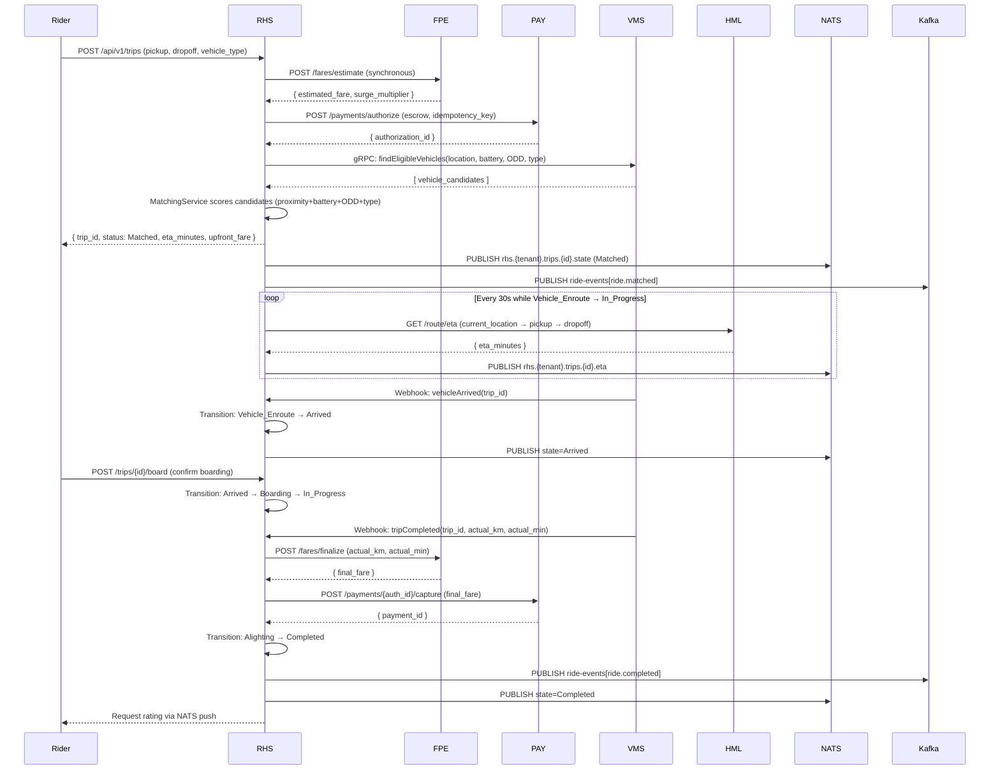
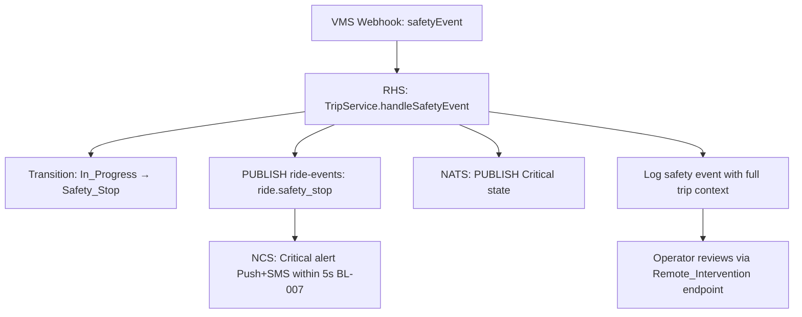

# Software Requirements Specification (SRS)
# RHS — Ride-Hailing Service (Dịch Vụ Đặt Xe Tự Hành)

**Module**: RHS — Ride-Hailing Service  
**Parent Work Package**: WP-TBD (to be assigned in MASTER_PLAN)  
**Source**: Derived from `PRD.md` §4.1, §4.9, §8 and `ARCHITECTURE_SPEC.md` §5  
**Technology**: Java 17+ / Spring Boot 3.x  
**Database**: MongoDB (`rhs_db`) | Cache: Redis | Events: Kafka + NATS  
**Version**: 1.0.0 | **Date**: 2026-03-06  

---

## 1. Introduction

RHS is the central orchestrator of the ride lifecycle. It manages every stage from a passenger's booking request through to trip completion and post-trip rating. RHS is the **single source of truth** for trip state and coordinates with FPE (pricing), PAY (escrow payment), NCS (notifications), VMS (vehicle dispatch), and HML (map data).

### 1.1 Scope

| In Scope | Out of Scope |
|----------|-------------|
| Trip booking (on-demand & scheduled) | VMS vehicle telemetry ingestion |
| AV-aware matching algorithm | HML map tile serving |
| ETA engine (ML + fallback) | Native mobile app |
| Ride pooling (v1.0: max 2 passengers) | UAV drone rides (v2.0) |
| Post-trip rating collection | Driver/human operator management |
| Trip state machine (11 states) | Fleet dispatch hardware integration |

### 1.2 User Personas

| Persona | Interaction |
|---------|-------------|
| **Passenger (Rider)** | Books, tracks, cancels trips; submits ratings |
| **Safety Monitor** | Reads real-time trip state; receives Critical safety alerts |
| **Platform Admin** | Views all trips across tenants for audit/support |
| **Tenant Admin** | Configures cancellation policies, views tenant trip analytics |
| **Service Account (PAY, FPE)** | Internal API calls for fare confirmation and payment capture |

---

## 2. Functional Flow Diagrams

### 2.1 Happy Path — End-to-End Ride Flow



### 2.2 Cancellation Flow

```mermaid
flowchart TD
    A[Rider: POST /trips/{id}/cancel] --> B{Current State?}
    B -->|Requested| C[Cancel: No charge]
    B -->|Matched| D{Vehicle already dispatched?}
    D -->|No| E[Cancel: No charge; release escrow]
    D -->|Yes| F[Apply cancellation fee per tenant policy]
    B -->|Vehicle_Enroute| G{ETA late > 10 min?}
    G -->|Yes| H[Cancel: Auto-refund BL-005; release escrow minus late fee]
    G -->|No| I[Charge cancellation fee; release remaining escrow]
    B -->|In_Progress or later| J[HTTP 422: Cannot cancel in-progress trip]
    C --> K[PUBLISH ride.cancelled to Kafka]
    E --> K
    F --> K
    H --> K
    I --> K
    K --> L[PAY: void or partial capture escrow]
    L --> M[NCS: Send cancellation receipt]
```

### 2.3 Safety Stop Flow



### 2.4 AV-Aware Matching Algorithm

```mermaid
flowchart TD
    A[MatchingService.match] --> B[Call VMS gRPC: getAvailableVehicles in radius]
    B --> C[Filter: ODD zone compatibility — vehicle must be licensed for pickup zone]
    C --> D[Filter: battery_level >= minimum_threshold for route distance]
    D --> E[Filter: vehicle_type matches rider request]
    E --> F[Score each candidate: weight_proximity×P + weight_battery×B + weight_type×T]
    F --> G{Candidates available?}
    G -->|Yes| H[Select top-scored vehicle]
    H --> I[Cache match result: Redis key match:{trip_id} TTL 30s]
    I --> J[Return matched vehicle_id]
    G -->|No| K[HTTP 503: No ODD-compatible vehicle available EC-007]
```

---

## 3. Detailed Requirement Specifications

### 3.1 Feature: Trip Booking (FR-RHS-001, FR-RHS-002)

**Description**: Passengers can request on-demand or scheduled AV rides. The system creates a trip record and initiates the matching workflow.

**User Story**: As a Passenger, I want to book an AV ride immediately or for a future time, so that I can travel to my destination.

**Pre-conditions**:
- Rider authenticated with valid JWT (`role = rider`)
- `tenant_id` present in JWT claims
- Rider wallet/payment method configured (PAY pre-check)

**Post-conditions**:
- Trip record created in MongoDB with `status = Requested`
- Escrow pre-authorized in PAY
- Vehicle matched and trip moves to `status = Matched`
- Rider receives NATS push notification with ETA

#### 3.1.1 Inputs & Validations

| Field | Type | Required | Validation Rules | Error Code | Error Message |
|-------|------|----------|------------------|------------|---------------|
| `pickup_lat` | double | Yes | Range: -90.0 to 90.0 | 400 | "pickup_lat must be between -90 and 90" |
| `pickup_lng` | double | Yes | Range: -180.0 to 180.0 | 400 | "pickup_lng must be between -180 and 180" |
| `dropoff_lat` | double | Yes | Range: -90.0 to 90.0 | 400 | "dropoff_lat must be between -90 and 90" |
| `dropoff_lng` | double | Yes | Range: -180.0 to 180.0 | 400 | "dropoff_lng must be between -180 and 180" |
| `vehicle_type` | string | No | Enum: `["standard", "premium", "accessible"]`; default = "standard" | 400 | "Invalid vehicle_type. Must be one of: standard, premium, accessible" |
| `scheduled_at` | ISO 8601 datetime | No | Must be > `now + 15 minutes` if provided | 400 | "scheduled_at must be at least 15 minutes in the future" |
| `idempotency_key` | UUID v4 | Yes (header) | Header: `X-Idempotency-Key`; UUID v4 format | 400 | "X-Idempotency-Key must be a valid UUID v4" |

#### 3.1.2 Business Logic & Rules

1. **BL-001**: `tenant_id` extracted from JWT MUST be injected into the trip record. Any trip creation without `tenant_id` MUST be rejected with HTTP 403.
2. **Escrow First**: RHS MUST call PAY `/payments/authorize` BEFORE calling VMS for matching. If PAY returns error, trip creation is aborted.
3. **Idempotency**: If a trip with the same `rider_id` + `idempotency_key` already exists, return the existing trip (HTTP 200), do not create duplicate.
4. **Scheduled Ride**: If `scheduled_at` is provided, trip status starts as `Requested` and matching is deferred until `scheduled_at - 10 minutes`.
5. **ODD Enforcement**: MatchingService MUST verify vehicle ODD certification covers the pickup zone. Violation → HTTP 503 (EC-007).
6. **Concurrent Booking (EC-002)**: Use MongoDB optimistic locking (`version` field) on vehicle assignment. If conflict detected → HTTP 409, retry matching with next candidate.

#### 3.1.3 Edge Cases & Error Handling

| Scenario | System Behavior |
|----------|----------------|
| No vehicle with compatible ODD/battery | HTTP 503 `NO_VEHICLE_AVAILABLE`; escrow voided immediately; no charge |
| PAY pre-authorize fails | HTTP 402 `PAYMENT_AUTHORIZATION_FAILED`; trip not created |
| Rider has active trip (not completed/cancelled) | HTTP 409 `ACTIVE_TRIP_EXISTS`; return existing trip_id |
| Pickup and dropoff are identical | HTTP 400 `INVALID_ROUTE`; minimum distance 0.1 km required |
| ML ETA service timeout (> 3s) | Fallback to rule-based ETA (distance/avg_speed); log degradation (EC-004) |

---

### 3.2 Feature: Trip State Machine (FR-RHS-002)

**Description**: The trip lifecycle is governed by a strict 11-state machine. Only valid transitions are permitted.

#### 3.2.1 Valid State Transitions

| From State | To State | Trigger | Actor |
|-----------|----------|---------|-------|
| `Requested` | `Matched` | MatchingService assigns vehicle | RHS (internal) |
| `Requested` | `Cancelled` | Rider cancels | Rider API |
| `Matched` | `Vehicle_Enroute` | VMS webhook: vehicle dispatched | VMS |
| `Matched` | `Cancelled` | Rider cancels; trigger BL-005 check | Rider API |
| `Vehicle_Enroute` | `Arrived` | VMS webhook: vehicle within 50m of pickup | VMS |
| `Vehicle_Enroute` | `Cancelled` | ETA late > 10 min → auto-refund (BL-005) | RHS scheduler |
| `Arrived` | `Boarding` | Rider confirms boarding via API | Rider API |
| `Boarding` | `In_Progress` | VMS webhook: trip started | VMS |
| `In_Progress` | `Alighting` | VMS webhook: arrived at destination | VMS |
| `In_Progress` | `Safety_Stop` | VMS safety event webhook | VMS |
| `In_Progress` | `Remote_Intervention` | Platform Admin override | Admin API |
| `Alighting` | `Completed` | Rider exits vehicle (VMS sensor/confirmation) | VMS |

**Invalid Transition Rule**: Any attempt to transition to an invalid state MUST return HTTP 422 `INVALID_STATE_TRANSITION` with message: "Cannot transition trip from `{current_state}` to `{requested_state}`".

#### 3.2.2 Business Logic

1. Every state transition MUST: (a) update `status` in MongoDB, (b) update `updated_at` timestamp, (c) publish to Kafka `ride-events`, (d) push to NATS.
2. Transition from `Alighting` → `Completed` MUST trigger: FPE finalize fare → PAY capture → NCS receipt notification.
3. `Safety_Stop` state: NCS MUST receive event within 1 second; NCS MUST deliver Critical alert (Push + SMS) within 5 seconds total (BL-007).

---

### 3.3 Feature: Trip Cancellation (FR-RHS-003)

**Description**: Riders can cancel trips before the vehicle begins boarding. Cancellation may incur a fee based on tenant policy.

#### 3.3.1 Inputs & Validations

| Field | Type | Required | Validation | Error |
|-------|------|----------|------------|-------|
| `trip_id` | UUID | Yes (path param) | Must exist and belong to rider's `tenant_id` | 404 `TRIP_NOT_FOUND` |
| `reason` | string | No | Max 500 chars | 400 |

#### 3.3.2 Business Logic

1. Fetch tenant cancellation policy from TMS (cached in Redis).
2. If `status` is `In_Progress`, `Alighting`, `Completed`, `Safety_Stop`, or `Remote_Intervention` → HTTP 422 `CANNOT_CANCEL`.
3. Calculate cancellation fee: `fee = policy.base_fee + policy.per_minute_rate × minutes_since_match` if vehicle already dispatched.
4. Call PAY: if `cancellation_fee = 0`, void authorization. If `fee > 0`, capture `cancellation_fee` then release remainder.
5. **BL-005**: If cancellation is due to ETA late > 10 minutes → `refund_eligible = true`; PAY auto-refund full amount.

---

### 3.4 Feature: Ride History API (FR-RHS-004)

**Description**: Riders can retrieve their paginated trip history.

#### 3.4.1 API Specification

- **Endpoint**: `GET /api/v1/trips`
- **Query Params**: `page` (int, default=0), `size` (int, default=20, max=100), `status` (optional filter), `from_date` (ISO 8601), `to_date` (ISO 8601)
- **Response**: `{ trips: [TripSummary], total: int, page: int, size: int }`
- **Auth**: JWT (Rider) — returns ONLY trips belonging to `rider_id` from JWT + `tenant_id`
- **MongoDB Query**: `{ tenant_id: X, rider_id: Y, status: Z?, created_at: {$gte: from, $lte: to} }` with compound index `{ tenant_id: 1, rider_id: 1, created_at: -1 }`

---

### 3.5 Feature: AV-Aware Matching (FR-RHS-010, FR-RHS-011)

**Description**: The matching algorithm selects the optimal vehicle based on four weighted factors.

#### 3.5.1 Matching Scoring Algorithm

```
Score(vehicle) = w1 × ProximityScore + w2 × BatteryScore + w3 × ODDScore + w4 × TypeScore

Where:
  ProximityScore = max(0, 1 - distance_km / MAX_RADIUS_KM)   // Normalized [0,1]
  BatteryScore = vehicle.battery_percent / 100               // [0,1]
  ODDScore = vehicle.odd_zones.contains(pickup_zone) ? 1 : 0  // Binary
  TypeScore = (vehicle.type == request.vehicle_type) ? 1 : 0  // Binary

Weights (v1.0): w1=0.4, w2=0.2, w3=0.3, w4=0.1
MAX_RADIUS_KM = 15 (configurable per tenant)
```

**Disqualification Rules**:
- `ODDScore = 0` → vehicle is INELIGIBLE (hard filter, regardless of score)
- `battery_level < minimum_for_route` → vehicle is INELIGIBLE
  - `minimum_for_route = estimated_km × 2 × BATTERY_CONSUMPTION_RATE + SAFETY_RESERVE_20%`

#### 3.5.2 Redis Caching

- Cache key: `match:{trip_id}:{attempt_number}`
- TTL: 30 seconds (match result held during escrow pre-authorization)
- On cache miss: re-run algorithm

---

### 3.6 Feature: ETA Engine (FR-RHS-020, FR-RHS-021)

**Description**: The ETA engine provides accurate time predictions using an ML model, with a rule-based fallback.

#### 3.6.1 ETA Computation

**Primary (ML)**: HTTP POST to external Python microservice `/eta/predict`
- Input: `{ origin_lat, origin_lng, dest_lat, dest_lng, time_of_day, day_of_week, vehicle_speed_profile_id }`
- Timeout: 3 seconds
- Expected response: `{ eta_minutes: int, confidence: float }`

**Fallback (Rule-based, EC-004)**:
```
eta_minutes = ceil(distance_km / avg_speed_kmh × 60) + buffer_minutes
avg_speed_kmh = 30 (urban default, configurable per zone)
buffer_minutes = 3
```

**NATS Publication**:
- Subject: `rhs.{tenant_id}.trips.{trip_id}.eta`
- Interval: Every 30 seconds while trip is in `Vehicle_Enroute`, `Arrived`, `Boarding`, `In_Progress`
- Payload: `{ trip_id, eta_minutes, updated_at, source: "ml|rule_based" }`

---

### 3.7 Feature: Ride Pooling (FR-RHS-030, FR-RHS-031)

**Description**: Passengers sharing similar routes can be pooled into one vehicle (v1.0: max 2 passengers).

#### 3.7.1 Pooling Algorithm

1. When a trip is `Requested` with `pool_requested = true`, PoolingService checks for open pool groups:
   - Same `tenant_id`
   - Pickup within 1.5 km of existing pool group's pickup
   - Dropoff within 3 km of existing pool group's dropoff
   - Pool group not yet in `Vehicle_Enroute` state
2. If compatible pool group found: assign `pool_group_id`, recalculate route (minimize total detour).
3. Detour constraint: total added detour per passenger ≤ 20% of their direct route (configurable).
4. v1.0 limit: Maximum 2 passengers per pool group.

#### 3.7.2 Fare Split on Pooling

- After pooling, RHS calls FPE `/fares/split` with `{ trip_ids: [A, B], route_km: combined_km }`
- FPE returns `{ fare_A, fare_B }` (pro-rata by distance fraction)

---

### 3.8 Feature: Rating Service (FR-RHS-040, FR-RHS-041)

**Description**: After trip completion, riders rate the vehicle on three criteria.

#### 3.8.1 Inputs & Validations

| Field | Type | Required | Validation | Error |
|-------|------|----------|------------|-------|
| `trip_id` | UUID | Yes (path) | Trip must be `Completed` and belong to rider | 404 / 422 |
| `cleanliness` | int | Yes | Range: 1–5 | 400 "cleanliness must be 1–5" |
| `safety` | int | Yes | Range: 1–5 | 400 "safety must be 1–5" |
| `comfort` | int | Yes | Range: 1–5 | 400 "comfort must be 1–5" |
| `comment` | string | No | Max 1000 chars | 400 |

#### 3.8.2 Business Logic

1. Rating window: rider can only submit rating within 48 hours of `completed_at`.
2. Only one rating per trip per rider allowed (idempotent endpoint: if rating exists, return existing).
3. After rating saved: publish `ride-events { action: "rated", vehicle_id, avg_score }` to Kafka.
4. VMS consumes this event to update vehicle quality score.

---

## 4. API Contracts (Complete)

### 4.1 POST /api/v1/trips

**Auth**: JWT Bearer (role: `rider`)

**Request Body**:
```json
{
  "pickup_lat": -6.2088,
  "pickup_lng": 106.8456,
  "dropoff_lat": -6.1751,
  "dropoff_lng": 106.8272,
  "vehicle_type": "standard",
  "scheduled_at": "2026-03-10T09:00:00Z",
  "pool_requested": false
}
```

**Response 201**:
```json
{
  "trip_id": "uuid-v4",
  "status": "Matched",
  "eta_minutes": 7,
  "matched_vehicle_id": "VH-001",
  "upfront_fare": {
    "amount": 45000,
    "currency": "VND",
    "surge_multiplier": 1.2
  },
  "authorization_id": "auth-uuid"
}
```

**Error Responses**:
| HTTP | Error Code | Scenario |
|------|-----------|---------|
| 400 | `VALIDATION_ERROR` | Invalid lat/lng/vehicle_type |
| 401 | `UNAUTHORIZED` | Missing/expired JWT |
| 402 | `PAYMENT_AUTHORIZATION_FAILED` | PAY escrow failed |
| 403 | `FORBIDDEN` | Missing tenant_id in JWT |
| 409 | `ACTIVE_TRIP_EXISTS` | Rider has ongoing trip |
| 422 | `NO_VEHICLE_AVAILABLE` | No ODD-compatible vehicle |
| 503 | `MATCHING_SERVICE_UNAVAILABLE` | VMS unreachable |

### 4.2 GET /api/v1/trips/{trip_id}

**Auth**: JWT Bearer (rider sees own trip; admin sees any trip in tenant)

**Response 200**:
```json
{
  "trip_id": "uuid-v4",
  "status": "In_Progress",
  "eta_minutes": 4,
  "current_location": { "lat": -6.19, "lng": 106.83 },
  "pickup": { "lat": -6.2088, "lng": 106.8456, "address": "..." },
  "dropoff": { "lat": -6.1751, "lng": 106.8272, "address": "..." },
  "upfront_fare": { "amount": 45000, "currency": "VND" },
  "vehicle_id": "VH-001",
  "pool_group_id": null,
  "created_at": "2026-03-06T03:00:00Z"
}
```

### 4.3 POST /api/v1/trips/{trip_id}/cancel

**Auth**: JWT Bearer (rider)  
**Response 200**: `{ "trip_id": "...", "status": "Cancelled", "refund_amount": 0, "cancellation_fee": 5000 }`  
**Error**: 422 `CANNOT_CANCEL` if trip is In_Progress or later.

### 4.4 POST /api/v1/trips/{trip_id}/rating

**Auth**: JWT Bearer (rider)  
**Response 201**: `{ "rating_id": "...", "average_score": 4.3 }`

### 4.5 GET /api/v1/trips (Ride History)

**Auth**: JWT Bearer (rider)  
**Query**: `?page=0&size=20&status=Completed&from_date=2026-01-01&to_date=2026-03-31`  
**Response 200**: `{ "trips": [...], "total": 47, "page": 0, "size": 20 }`

---

## 5. Data Model

### 5.1 MongoDB Collection: `trips` (rhs_db)

```json
{
  "_id": "ObjectId",
  "trip_id": "uuid-v4 (unique index)",
  "tenant_id": "string (mandatory index)",
  "rider_id": "string (indexed)",
  "vehicle_id": "string (indexed, null until Matched)",
  "status": "enum[Requested|Matched|Vehicle_Enroute|Arrived|Boarding|In_Progress|Alighting|Completed|Cancelled|Safety_Stop|Remote_Intervention]",
  "pickup": { "lat": "double", "lng": "double", "address": "string", "zone_id": "string" },
  "dropoff": { "lat": "double", "lng": "double", "address": "string" },
  "upfront_fare": "Decimal128",
  "final_fare": "Decimal128 (null until finalized)",
  "currency": "string (ISO 4217, default VND)",
  "vehicle_type": "string",
  "scheduled_at": "ISODate (null for on-demand)",
  "pool_requested": "boolean",
  "pool_group_id": "string (null if not pooled)",
  "authorization_id": "string (PAY escrow)",
  "payment_id": "string (null until captured)",
  "idempotency_key": "string (unique index, 48h TTL cleanup)",
  "eta_minutes": "int32",
  "matched_at": "ISODate",
  "enroute_at": "ISODate",
  "arrived_at": "ISODate",
  "started_at": "ISODate",
  "completed_at": "ISODate",
  "cancelled_at": "ISODate",
  "cancellation_reason": "string",
  "cancellation_fee": "Decimal128",
  "refund_amount": "Decimal128",
  "safety_event_at": "ISODate",
  "actual_distance_km": "double",
  "actual_duration_min": "int32",
  "ratings": [{
    "cleanliness": "int (1-5)",
    "safety": "int (1-5)",
    "comfort": "int (1-5)",
    "comment": "string",
    "rated_at": "ISODate"
  }],
  "version": "int64 (optimistic lock)",
  "created_at": "ISODate",
  "updated_at": "ISODate"
}
```

**Indexes**:
- `{ tenant_id: 1, rider_id: 1, created_at: -1 }` — ride history pagination
- `{ tenant_id: 1, status: 1 }` — status filtering
- `{ tenant_id: 1, vehicle_id: 1, status: 1 }` — vehicle active trip check
- `{ scheduled_at: 1 }` sparse — scheduled ride dispatcher
- `{ trip_id: 1 }` unique
- `{ idempotency_key: 1 }` unique sparse

### 5.2 Redis Keys

| Key Pattern | Type | TTL | Purpose |
|------------|------|-----|---------|
| `match:{trip_id}:{attempt}` | String | 30s | Cached match result |
| `eta:{trip_id}` | String | 60s | Last computed ETA |
| `active_trip:{rider_id}:{tenant_id}` | String | Session | Prevent duplicate booking |

---

## 6. Kafka Events

| Topic | Event Key | Payload Fields | Consumers |
|-------|-----------|---------------|-----------|
| `ride-events` | `ride.requested` | `trip_id, tenant_id, rider_id, pickup, dropoff, vehicle_type, timestamp` | NCS, ABI |
| `ride-events` | `ride.matched` | `trip_id, tenant_id, vehicle_id, eta_minutes, upfront_fare, timestamp` | PAY, NCS, ABI |
| `ride-events` | `ride.state_changed` | `trip_id, tenant_id, from_state, to_state, timestamp` | NCS, ABI |
| `ride-events` | `ride.completed` | `trip_id, tenant_id, rider_id, final_fare, actual_km, actual_min, timestamp` | PAY, ABI, NCS |
| `ride-events` | `ride.cancelled` | `trip_id, tenant_id, reason, refund_eligible, cancellation_fee, timestamp` | PAY, ABI, NCS |
| `ride-events` | `ride.safety_stop` | `trip_id, tenant_id, vehicle_id, location, timestamp` | NCS (Critical), ABI |
| `ride-events` | `ride.rated` | `trip_id, tenant_id, vehicle_id, avg_score, timestamp` | VMS (via ABI) |

---

## 7. Non-Functional Requirements (Service-Specific)

| NFR | Requirement | Implementation |
|-----|-------------|----------------|
| Trip state transition | < 1 second after event | Async Kafka publish post-DB write |
| ETA response | < 3 seconds (ML) / < 200ms (rule-based) | 3s timeout → fallback |
| Matching result | < 500ms P95 | Redis cache + gRPC to VMS |
| Ride history API | < 200ms P95 | Compound index + pagination |
| Concurrent trips | ≥ 10,000 simultaneous | 3–10 HPA replicas |
| NATS push delivery | < 100ms to mobile | NATS direct subject publish |
| Data isolation | All queries include tenant_id | `BaseMongoRepository.withTenant()` |

---

## 8. Security Requirements

1. JWT MUST contain `sub` (rider_id), `tenant_id`, `roles` claims.
2. Riders can ONLY access trips where `rider_id` matches JWT `sub`.
3. Tenant Admins can view all trips within their `tenant_id`.
4. Cross-tenant access → HTTP 403 (validated by `TenantContextFilter`).
5. Trip `authorization_id` and `payment_id` MUST NOT be returned to Rider in list API (only in detail).

---

## 9. Acceptance Criteria (Definition of Done)

| # | Criterion | Test Type |
|---|-----------|-----------|
| AC-RHS-001 | Passenger can book on-demand ride and receive matched vehicle within 500ms | Integration test |
| AC-RHS-002 | Trip state machine transitions correctly through all 11 states | Unit test (state machine) |
| AC-RHS-003 | AV-Aware matching rejects vehicle with invalid ODD zone | Unit test |
| AC-RHS-004 | Rider cannot book if active trip exists (409 returned) | Integration test |
| AC-RHS-005 | ETA falls back to rule-based when ML service times out | Unit test (mock) |
| AC-RHS-006 | ETA published to NATS every 30s during active trip | Integration test |
| AC-RHS-007 | Safety_Stop triggers Kafka event within 1 second | Performance test |
| AC-RHS-008 | Ride pooling assigns same vehicle to 2 compatible trips | Integration test |
| AC-RHS-009 | Rating only accepted for Completed trips within 48h | Unit test |
| AC-RHS-010 | Cross-tenant trip access returns 403 | Security test |
| AC-RHS-011 | Duplicate trip booking with same idempotency_key returns existing trip | Integration test |
| AC-RHS-012 | Auto-refund triggered when cancellation ETA late > 10 min | Integration test |

---

*SRS v1.0.0 — RHS Ride-Hailing Service | VNPT AV Platform Services Provider Group*
